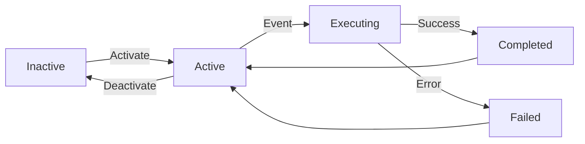

# N8N Concepts and Principles

Understanding core N8N concepts in the context of Basil workflows.

## What is a Workflow?

A **workflow** is a sequence of automated tasks (nodes) that execute when triggered by an event. In Basil, workflows handle:

- Document processing and AI analysis
- Event-driven updates to folders and watchfiles
- Real-time communication between services
- Scheduled data synchronization
- External API integrations

### Workflow Lifecycle



## Core Components

### 1. Nodes

**Nodes** are individual units of work in a workflow. Each node performs a specific action:

- Fetch data from an API
- Process data with AI
- Store results in a database
- Send messages to RabbitMQ
- Make decisions based on conditions

**Node Properties:**

- **ID**: Unique identifier (auto-generated)
- **Name**: Human-readable label following [naming convention](./naming-convention.md)
- **Type**: Node category (HTTP Request, AI Agent, Condition, etc.)
- **Parameters**: Configuration specific to the node type
- **Credentials**: Secure authentication data (encrypted)

### 2. Connections

**Connections** link nodes together to define execution flow:

```
Node A → Node B → Node C
```

**Connection Types:**

**Sequential**: One node executes after another

```
Trigger_RabbitMQ → HTTP_API_GetFolder → Output_Final
```

**Conditional**: Branching based on conditions

```
Trigger_Webhook
  → Condition_IsValid
    → [True] → Process_Valid
    → [False] → Process_Invalid
```

**Parallel**: Multiple nodes execute simultaneously

```
Trigger_Schedule
  → HTTP_API_GetUsers
  → HTTP_API_GetFolders (parallel)
  → Merge_Results
```

### 3. Triggers

**Triggers** start workflow execution. Basil uses several trigger types:

#### Manual Trigger

Execute workflows on-demand via UI or CLI.

**Use cases**: Testing, one-off operations, manual tasks

#### Webhook Trigger

HTTP endpoints that receive external requests.

**Node name**: `Trigger_Webhook`
**Use cases**: External integrations, chat interfaces, API endpoints

#### RabbitMQ Trigger

Listen to message queues for events.

**Node name**: `Trigger_RabbitMQ`
**Use cases**: Event-driven processing, asynchronous tasks, domain events

**Common Basil queues:**

- `document.uploaded` - New document processing
- `folder.updated` - Folder state changes
- `watchfile.created` - New watchfile classification
- `chat.message` - Chat message handling

#### Schedule Trigger

Time-based execution (cron-like).

**Node name**: `Trigger_Schedule`
**Use cases**: Daily reports, periodic synchronization, cleanup tasks

#### Sub-workflow Trigger

Called by other workflows.

**Node name**: `Trigger_Subworkflow`
**Use cases**: Reusable logic, workflow composition, modularity

### 4. Execution Model

N8N workflows execute **node by node** in sequence:

1. **Trigger activates** workflow
2. **Each node processes** input data
3. **Output data flows** to next node
4. **Workflow completes** or errors

**Data Flow:**

```javascript
// Trigger output
{
  "folderId": 123,
  "action": "update"
}

// After HTTP Request node
{
  "id": 123,
  "name": "Research Folder",
  "state": "NEEDS_ANALYZED"
}

// After LLM node
{
  "id": 123,
  "name": "Research Folder",
  "summary": "Generated AI summary..."
}
```

**Accessing Data:**

- `$json` - Current node input
- `$node["NodeName"].json` - Specific node output
- `$items` - All input items (for loops)
- `{{ $json.field }}` - Expression syntax

## Node Types in Basil

### Trigger Nodes

**Prefix**: `Trigger_`

Start workflow execution.

**Available in Basil:**

- `Trigger_RabbitMQ` - Message queue events
- `Trigger_Webhook` - HTTP endpoints
- `Trigger_Schedule` - Time-based execution
- `Trigger_Subworkflow` - Called by parent workflow

### Logic Nodes

**Prefix**: `Condition_`

Make decisions and branch execution.

**Examples:**

- `Condition_IsFirstUpdate` - Check if first folder update
- `Condition_IsRelevant` - Validate AI relevance score
- `Condition_FromConversation` - Check message origin
- `Condition_HasAttachments` - Verify document presence

**Condition Syntax:**

```javascript
// Simple comparison
{
  {
    $json.score > 0.8
  }
}

// Complex logic
{
  {
    $json.state === 'NEEDS_ANALYZED' && $json.documents.length > 0
  }
}

// Check node output
{
  {
    $node['LLM_Validator_Primary'].json.isValid === true
  }
}
```

### LLM Nodes

**Prefix**: `LLM_[Role]_[Type]`

Interact with AI language models (Google Gemini, OpenAI, etc.).

**Types:**

- `LLM_[Role]_Primary` - Main AI call
- `LLM_[Role]_Fallback` - Backup if primary fails
- `LLM_[Role]_Parser` - Parse AI responses

**Example Chain:**

```
LLM_Validator_Primary
  → [Error] → LLM_Validator_Fallback
  → LLM_Validator_Parser
  → Parser_Validator_Structured
```

**Configuration:**

- **Model**: `gemini-1.5-flash`, `gpt-4`, etc.
- **Temperature**: 0.0 (deterministic) to 1.0 (creative)
- **Max Tokens**: Response length limit
- **System Prompt**: Instructions and context
- **User Prompt**: Actual query with dynamic data

### AI Agent Nodes

**Prefix**: `Agent_[Role]_[Domain]`

Complex AI operations with specialized prompts and multi-step logic.

**Examples:**

- `Agent_Validator_ReferenceSubject` - Validate reference subject relevance
- `Agent_Generator_ReferenceSubject` - Generate new reference subjects
- `Agent_Classifier_Document` - Classify document categories

**Agent Features:**

- Advanced prompt engineering (Twig templates)
- Structured JSON schema validation
- Multi-turn conversation handling
- Context management

### Parser Nodes

**Prefix**: `Parser_[Role]_[Type]`

Extract and structure data from AI responses.

**Types:**

- `Parser_Validator_Structured` - Parse validation results
- `Parser_Generator_Structured` - Parse generation results
- `Parser_JSON_Extractor` - Extract JSON from text

**Why Parsers?**

LLM responses may contain extra text:

```
Here's the result:
{"valid": true, "score": 0.95}
I hope this helps!
```

Parser extracts only JSON:

```json
{ "valid": true, "score": 0.95 }
```

### HTTP Nodes

**Prefix**: `HTTP_[Service]_[Action]`

Call external APIs and services.

**Examples:**

- `HTTP_API_GetFolder` - Fetch folder from Symfony API
- `HTTP_API_UpdateDocument` - Update document metadata
- `HTTP_OpenSearch_Search` - Search in OpenSearch

**Configuration:**

- **Method**: GET, POST, PUT, DELETE
- **URL**: `https://api/api/folders/{{ $json.id }}`
- **Headers**: Authentication, content type
- **Body**: Request payload (JSON)
- **Authentication**: Bearer token, basic auth, API key

### Database Nodes

**Prefix**: `DB_[Entity]_[Operation]`

Direct database operations (use sparingly - prefer API).

**Examples:**

- `DB_Folder_Query` - Query folders
- `DB_User_Update` - Update user record

**⚠️ Warning**: Direct DB access bypasses business logic. Use HTTP API when possible.

### Message Queue Nodes

**Prefix**: `RabbitMQ_[Action]`

Publish and consume RabbitMQ messages.

**Examples:**

- `RabbitMQ_UpdateReferenceSubject` - Publish update event
- `RabbitMQ_SendSystemMessage` - Send system notification
- `RabbitMQ_PublishEvent` - Publish domain event

**RabbitMQ vs HTTP API:**

- **RabbitMQ**: Asynchronous, event-driven, decoupled
- **HTTP API**: Synchronous, request-response, direct

### Feedback Nodes

**Prefix**: `Feedback_[State]`

Provide workflow status and results.

**Examples:**

- `Feedback_Success` - Success state data
- `Feedback_Error` - Error details
- `Feedback_NotRelevant` - Validation failure data

**Use Set nodes** to prepare feedback structure:

```json
{
  "status": "success",
  "result": "{{ $json.generatedText }}",
  "metadata": {
    "confidence": "{{ $json.score }}",
    "model": "gemini-1.5-flash"
  }
}
```

### Output Nodes

**Prefix**: `Output_[Type]`

Final workflow output.

**Examples:**

- `Output_Final` - Main workflow result
- `Output_JSON` - JSON API response
- `Output_Error` - Error response

## Error Handling

### Error Outputs

Nodes can have **Error Outputs** to handle failures gracefully:

```
LLM_Validator_Primary
  → [Success] → Next_Node
  → [Error] → LLM_Validator_Fallback
```

**Enable Error Output:**

1. Click node
2. Settings tab → Enable "Continue on Fail"
3. Connect error output (red dot) to fallback node

### Error Workflow

Set a **global error workflow** to catch all unhandled errors:

1. Create error handling workflow
2. Workflow Settings → Error Workflow → Select workflow
3. Errors trigger this workflow with context

### Retry Logic

Configure retries for transient failures:

**Settings:**

- **Retry on Fail**: Enable/disable
- **Max Tries**: Number of retry attempts (default: 3)
- **Wait Between Tries**: Delay in ms (default: 1000)

## Credentials Management

Sensitive data (API keys, passwords) is stored as **Credentials**:

**Credential Types in Basil:**

- `RabbitMQ` - Queue connection
- `PostgreSQL` - Database access
- `HTTP API` - Bearer tokens
- `Google AI` - API keys

**Security:**

- Encrypted at rest (AES-256)
- Never in workflow JSON
- Scoped to workflows or global
- Supports environment variables

**Create Credentials:**

1. Credentials menu → Add Credential
2. Select type
3. Enter details
4. Save

**Use Credentials:**

1. Configure node
2. Credential dropdown → Select saved credential
3. Test connection

## Expressions and Code

### Expressions

Dynamic data manipulation using `{{ }}` syntax:

```javascript
// Access data
{
  {
    $json.folderName
  }
}

// Call functions
{
  {
    $json.createdAt.toDate()
  }
}

// Conditional
{
  {
    $json.score > 0.8 ? 'valid' : 'invalid'
  }
}

// Array operations
{
  {
    $json.documents.map((d) => d.name)
  }
}
```

### Code Node

Run custom JavaScript for complex logic:

**Prefix**: `Code_[Purpose]`

```javascript
// Access input
const items = $input.all()

// Process
const results = items.map((item) => ({
  id: item.json.id,
  processed: true,
  timestamp: new Date().toISOString(),
}))

// Return
return results
```

## Workflow Organization

### Sub-workflows

Break complex workflows into reusable modules:

**Main Workflow:**

```
Trigger_RabbitMQ
  → SubWorkflow_ValidateDocument
  → SubWorkflow_ProcessDocument
  → Output_Final
```

**Benefits:**

- Modularity
- Reusability
- Maintainability
- Testing isolation

### Workflow Naming

Follow consistent naming:

- **Main workflows**: `[Domain] - [Purpose]`
  - Example: `WatchFile Builder - Update reference subject`
- **Sub-workflows**: `[Domain] - [Sub-purpose] (Sub)`
  - Example: `Document - Validation (Sub)`

## Performance Considerations

### Execution Modes

**Sequential**: Nodes execute one after another (default)
**Parallel**: Multiple branches execute simultaneously

**Enable Parallel:**

- Add multiple connections from one node
- Each branch runs independently
- Use Merge node to combine results

### Data Size

**Limit data passed between nodes:**

- Filter unnecessary fields early
- Use pagination for large datasets
- Stream large files instead of loading in memory

### Caching

**N8N doesn't cache by default.**

Implement caching:

- Store results in Redis/Database
- Check cache before expensive operations
- Set TTL for cache invalidation

## Testing Workflows

### Manual Testing

1. **Save workflow** (Ctrl+S)
2. Click **"Execute Workflow"** (top right)
3. Provide test data
4. Review execution results

### Production Testing

1. **Test mode toggle** (pin icon)
2. Execute with production data
3. Results don't affect production systems
4. Review before deploying

### Debug Mode

Enable detailed logging:

1. Workflow Settings → Enable "Save Execution Progress"
2. View intermediate node outputs
3. Check execution timeline

## Next Steps

- **[Naming Convention](./naming-convention.md)** - Standard node naming
- **[Best Practices](./best-practices.md)** - Error handling, performance
- **[Workflow Testing](./workflow-testing.md)** - Test your workflows
- **[Workflow Validation](./workflow-validation.md)** - Validate workflow configuration

## Resources

- **[N8N Expressions](https://docs.n8n.io/code/expressions/)** - Dynamic data manipulation
- **[N8N Nodes](https://docs.n8n.io/integrations/)** - All available nodes
- **[Error Handling](https://docs.n8n.io/flow-logic/error-handling/)** - Official error handling guide
