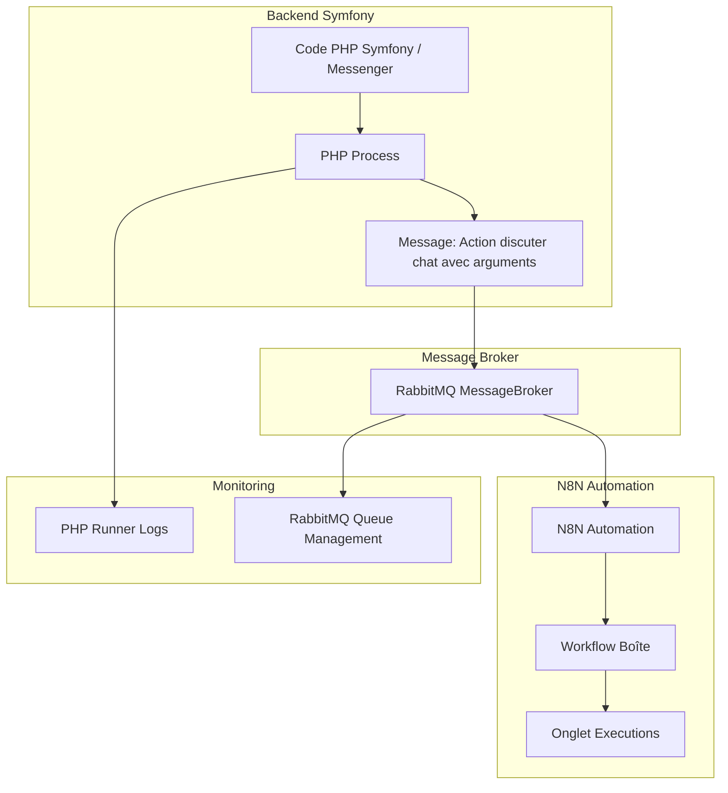
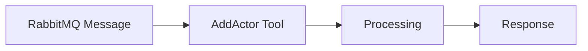
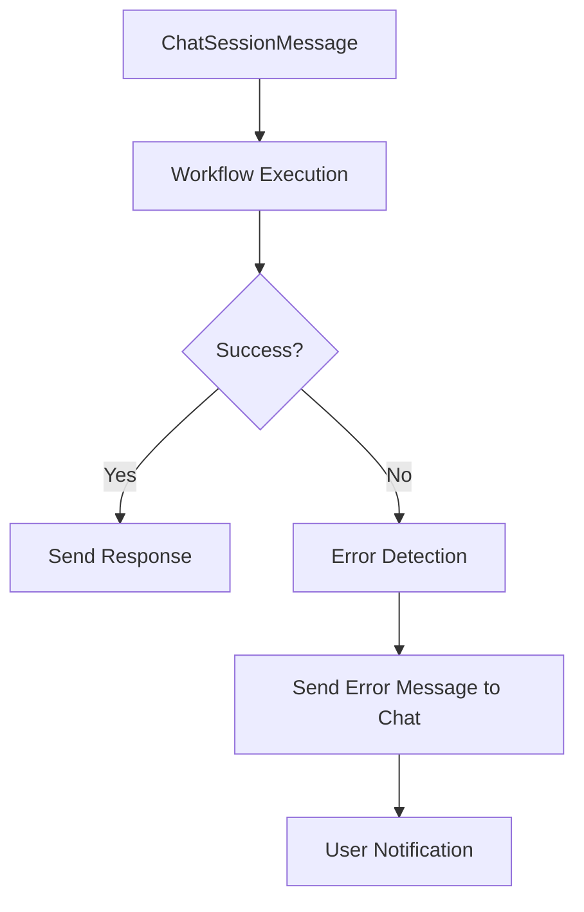

# n8n Integration

## Reminder

Always check that your global `.env.dist` file is the same than `.env`.

## Overview

This document describes the integration of n8n workflow automation platform into our application stack. n8n is configured to run as a containerized service with PostgreSQL database integration, automatic user setup, and proper reverse proxy setup.

## Prerequisites

### Configuration

Before starting n8n, you need to:

1. Configure your environment:
    - Copy the required variables from `.env.dist` to your `.env` file:

    ```bash
    # n8n configuration (only N8N_SERVER_NAME is required in .env.dist)
    N8N_SERVER_NAME=n8n.basil.local

    # Optional - these have defaults but can be customized:
    N8N_DEFAULT_EMAIL=basil@chapsvision.com
    N8N_DEFAULT_PASSWORD=Basil300425!
    N8N_DEFAULT_FIRSTNAME=Basil
    N8N_DEFAULT_LASTNAME=Target
    N8N_ENCRYPTION_KEY=!ChangeThisN8nEncryptionKey!
    N8N_USER_MANAGEMENT_JWT_SECRET=!ChangeThisN8nUserManagementJWTSecretKey!
    ```

2. Add the following entry to your hosts file (`/etc/hosts` on Linux/Mac or `C:\Windows\System32\drivers\etc\hosts` on Windows):

```
127.0.0.1 n8n.basil.local
```

3. Clean up existing certificates:
    - Remove any existing certificate files for n8n in the `certs/` directory:

    ```bash
    rm certs/basil.local-*.pem
    ```

    - Generate new certificates by following these steps:

    ```bash
    # 1. Stop all services
    docker compose down
    # docker compose down -v might be needed

    # 2. Run the certificate generation script
    ./certs/self-signed-generator.sh

    # 3. Start the services again
    docker compose up
    ```

## Docker Compose Configuration

### Main Configuration (compose.yaml)

The n8n services are defined using a shared template `x-n8n` with the following key configurations:

```yaml
x-n8n: &service-n8n
    image: n8nio/n8n:latest
    environment:
        - N8N_HOST=${N8N_SERVER_NAME:-n8n.localhost}
        - N8N_PORT=5678
        - N8N_PROTOCOL=https
        - WEBHOOK_URL=https://${N8N_SERVER_NAME:-n8n.localhost}/
        - GENERIC_TIMEZONE=Europe/Paris
        - N8N_METRICS=true
        - N8N_DEFAULT_BINARY_DATA_MODE=filesystem
        - N8N_ENFORCE_SETTINGS_FILE_PERMISSIONS=true
        - N8N_RUNNERS_ENABLED=true
        - N8N_PROXY_HOPS=1

        # Security & isolation settings
        - N8N_DIAGNOSTICS_ENABLED=false
        - N8N_VERSION_NOTIFICATIONS_ENABLED=false
        - N8N_TEMPLATES_ENABLED=false

        # Database configuration
        - DB_TYPE=postgresdb
        - DB_POSTGRESDB_HOST=database
        - DB_POSTGRESDB_DATABASE=${N8N_DB_NAME:-n8n_db}
        - DB_POSTGRESDB_USER=${N8N_DB_USER:-n8n_user}
        - DB_POSTGRESDB_PASSWORD=${N8N_DB_PASSWORD:-!ChangeMeN8nDbPass!}

        # Security keys
        - N8N_ENCRYPTION_KEY=${N8N_ENCRYPTION_KEY:-!ChangeThisN8nEncryptionKey!}
        - N8N_USER_MANAGEMENT_JWT_SECRET=${N8N_USER_MANAGEMENT_JWT_SECRET:-!ChangeThisN8nUserManagementJWTSecretKey!}

        # Default user configuration
        - N8N_DEFAULT_EMAIL=${N8N_DEFAULT_EMAIL:-basil@chapsvision.com}
        - N8N_DEFAULT_PASSWORD=${N8N_DEFAULT_PASSWORD:-Basil300425!}
        - N8N_DEFAULT_FIRSTNAME=${N8N_DEFAULT_FIRSTNAME:-Basil}
        - N8N_DEFAULT_LASTNAME=${N8N_DEFAULT_LASTNAME:-Target}
```

### Services

The setup includes two main services:

1. **n8n-import**: Handles initial import of credentials and workflows
2. **n8n**: The main n8n application service

### Development Override (compose.override.yaml)

The development environment adds additional configuration:

```yaml
services:
    n8n:
        volumes:
            - ./certs:/opt/custom-certificates:ro
            - ./docker/n8n/entrypoint.sh:/basil-entrypoint.sh:ro
        environment:
            - N8N_SMTP_HOST=mailpit
            - N8N_SMTP_PORT=1025
            - N8N_SMTP_SSL=false
            - N8N_SMTP_USER=
            - N8N_SMTP_PASS=
            - N8N_SMTP_SENDER=${N8N_DEFAULT_EMAIL:-basil@chapsvision.com}
        entrypoint: ['/basil-entrypoint.sh']
```

## Automatic User Setup

The system now includes automatic user setup through a custom entrypoint script (`/docker/n8n/entrypoint.sh`). This script:

1. Starts n8n in the background
2. Waits for the HTTP API to be ready
3. Automatically creates a default user with the configured credentials
4. Handles cases where the user already exists

The default user is created using the environment variables:

- `N8N_DEFAULT_EMAIL`
- `N8N_DEFAULT_PASSWORD`
- `N8N_DEFAULT_FIRSTNAME`
- `N8N_DEFAULT_LASTNAME`

## Workflows and Credentials Management

### Directory Structure

```
docker/n8n/
├── credentials/     # Place credential files here (.json)
├── workflows/       # Place workflow files here (.json)
└── entrypoint.sh   # Custom entrypoint script
```

### Automatic Import

The `n8n-import` service automatically imports:

- All credential files from `docker/n8n/credentials/`
- All workflow files from `docker/n8n/workflows/`

This import runs once during container startup and must complete successfully before the main n8n service starts.

### Adding Workflows and Credentials

1. Export workflows/credentials from n8n UI in JSON format
2. Place workflow files in `docker/n8n/workflows/`
3. Place credential files in `docker/n8n/credentials/`
4. Restart the services to import new files

**Note**: The `docker/n8n/credentials/.gitignore` file excludes credential files from version control for security.

### Importing Credentials from Passbolt

For credentials stored in Passbolt (such as external resource credentials), follow these steps:

#### Development Environment

1. **Access Passbolt**: Open Passbolt and navigate to the entry named [N8N Credentials File](https://passbolt.localnet/app/passwords/view/5eab8ef7-9ed8-4bc3-ae17-eb264039f67f)
2. **Copy Content**: Copy the entire content of the note from the Passbolt entry
3. **Create JSON File**: Create a new `.json` file in the `docker/n8n/credentials/` directory
4. **Paste Content**: Paste the copied content into the JSON file
5. **Save File**: Save the file with an appropriate name (e.g., `external-resource-credentials.json`)
6. **Restart Services**: Run the following commands to restart the services and import the new credentials:

```bash
docker compose up n8n-import
```

#### Staging Environment Synchronization

**CRITICAL**: For staging environments to function properly, the credentials must also be synchronized with the GitLab CI/CD system:

1. **Update GitLab CI Variable**: The same credentials content from Passbolt must be stored in the GitLab CI/CD variable `N8N_CREDENTIALS_FILE`
    - Navigate to your GitLab project → Settings → CI/CD → Variables
    - Update the `N8N_CREDENTIALS_FILE` variable with the exact same JSON content from Passbolt
    - Ensure the variable is marked as "File" type and "Masked" for security

2. **Automatic Staging Deployment**: During staging deployment, the CI pipeline automatically copies these credentials:

    ```bash
    cat "$N8N_CREDENTIALS_FILE" > deploy-artifact/docker/n8n/credentials/basil-credentials.json
    ```

3. **Synchronization Requirement**:
    - **Both sources must be kept in sync**: Passbolt entry AND GitLab CI variable
    - Any credential updates must be applied to BOTH locations
    - Failure to synchronize will result in **non-functional n8n workflows in staging**

**Warning**: If credentials are updated in Passbolt but not in the GitLab CI variable (or vice versa), staging deployments will have outdated or missing credentials, causing workflow failures.

**Important**: Ensure the JSON content from Passbolt is valid JSON format before saving. The `n8n-import` service will automatically import all credential files during startup.

## n8n-API Communication

The n8n platform communicates with the API through two main channels: RabbitMQ for asynchronous processing and HTTP webhooks for direct communication.

### RabbitMQ Communication

#### API → n8n (Commands)

The API sends commands to n8n via the `agent_commands` RabbitMQ queue:

1. **Command Structure**: Commands are sent as `TriggerAgentAction` objects containing:
    - `name`: The action name (e.g., "ExtractActorsFromWatchFile")
    - `data`: Action-specific data payload
    - `responseType`: Expected response type class
    - `watchFileId`: Associated watch file identifier
    - `userId`: User identifier (optional)
    - `triggeredAt`: Timestamp

2. **Message Format**: Messages are serialized as JSON and include Symfony Messenger stamps for routing context.

3. **n8n Processing**: n8n workflows listen to the `agent_commands` queue and:
    - Parse the incoming JSON message
    - Extract command parameters (name, data, watchFileId, responseType)
    - Filter by command name to trigger specific workflows
    - Process the command using AI agents and external tools
    - Generate structured responses

#### n8n → API (Responses)

n8n sends responses back to the API via the `agent_responses` RabbitMQ queue:

1. **Response Structure**: Responses include:
    - `data`: The processed result data
    - `watchFileId`: Original watch file identifier
    - Headers: Message type and Symfony Messenger stamps for proper routing

2. **Message Headers**: Responses include specific headers:
    - `type`: The response type class name
    - `X-Message-Stamp-Symfony\Component\Messenger\Stamp\BusNameStamp`: Bus routing information
    - `X-Message-Stamp-Symfony\Component\Messenger\Stamp\RouterContextStamp`: Router context information

### Webhook Communication

#### n8n → API (Webhooks)

n8n can send direct HTTP requests to the API via webhooks:

1. **Endpoint**: `/api/webhook/n8n` (POST method)
2. **Security**: Messages must include proper headers for authentication and routing
3. **Message Type**: Specified via `X-Message-Type` header containing the full class name
4. **Processing**: The API deserializes the message and dispatches it to the appropriate handler

##### Security Authentication

The webhook endpoint is protected by the `N8NTokenAuthenticator` which performs multiple security checks:

1. **IP Address Validation**: Only requests from configured allowed IP addresses are accepted
2. **API Token Authentication**: Requests must include a valid `X-API-TOKEN` header
3. **HMAC Signature Verification**: Requests must include a valid `X-Signature` header with HMAC-SHA256 signature
4. **Virtual User Creation**: Successful authentication creates a virtual user with `ROLE_N8N` role

**Required Headers for Webhook Requests:**

- `X-API-TOKEN`: The shared token for API authentication
- `X-Signature`: HMAC-SHA256 signature of the request payload
- `X-Message-Type`: Full class name of the message being sent
- `Content-Type`: Must be `application/json`

**Signature Generation:**
The signature is calculated using HMAC-SHA256 with the request payload and a secret key:

```php
$signature = hash_hmac('sha256', $payload, $secretKey);
```

**Configuration Requirements:**

- `N8N_SHARED_TOKEN`: Shared token for API authentication
- `N8N_SECRET_KEY`: Secret key for HMAC signature generation
- `N8N_ALLOWED_IPS`: Comma-separated list of allowed IP addresses

### Example Workflow: Detect Actors

The `detect-actors.json` workflow demonstrates the complete communication cycle:

1. **Trigger**: Listens to `agent_commands` queue for "ExtractActorsFromWatchFile" commands
2. **Processing**: Uses AI agents with Wikipedia tools to analyze market intelligence queries
3. **Output**: Generates structured actor recommendations with relevance scores
4. **Response**: Sends results to `agent_responses` queue with proper headers

### Configuration

#### RabbitMQ Queues

The system uses two main queues:

- `agent_commands`: For API → n8n communication
- `agent_responses`: For n8n → API communication

#### Messenger Configuration

The API's messenger configuration routes messages appropriately:

```yaml
routing:
    'App\Application\Agent\TriggerAgentAction': agent_commands
```

#### Security Considerations

1. **Message Validation**: All incoming messages are validated for proper class existence
2. **Error Handling**: Failed message processing is logged and proper error responses are returned
3. **Authentication**: Webhook endpoints require proper authentication headers
4. **Message Stamps**: Symfony Messenger stamps ensure proper message routing and context preservation

### Development Workflow

1. **Create Commands**: Define new `TriggerAgentAction` commands in the API
2. **Implement Workflows**: Create corresponding n8n workflows that listen for specific command names
3. **Test Communication**: Use the messenger test tools to verify message flow
4. **Monitor Logs**: Check both API and n8n logs for communication issues

## Database Integration

The database initialization has been improved with better error handling and security:

```bash
# The n8n database setup includes:
- User creation with proper permissions
- Database creation with full privileges
- Schema permissions configuration
- Sequence permissions for auto-incrementing fields
```

## Reverse Proxy Configuration

The n8n service is exposed through a reverse proxy configuration in the Caddyfile:

```caddyfile
{$N8N_SERVER_NAME:-n8n.localhost} {
    reverse_proxy n8n:5678
}
```

## Environment Variables

### Required Environment Variables

- `N8N_SERVER_NAME`: The hostname for n8n (required in .env)

### Optional Environment Variables (with defaults)

- `N8N_DEFAULT_EMAIL`: Default user email (default: basil@chapsvision.com)
- `N8N_DEFAULT_PASSWORD`: Default user password (default: Basil300425!)
- `N8N_DEFAULT_FIRSTNAME`: Default user first name (default: Basil)
- `N8N_DEFAULT_LASTNAME`: Default user last name (default: Target)
- `N8N_ENCRYPTION_KEY`: Encryption key for sensitive data (default: !ChangeThisN8nEncryptionKey!)
- `N8N_USER_MANAGEMENT_JWT_SECRET`: JWT secret for user management (default: !ChangeThisN8nUserManagementJWTSecretKey!)
- `N8N_DB_NAME`: Database name (default: n8n_db)
- `N8N_DB_USER`: Database user (default: n8n_user)
- `N8N_DB_PASSWORD`: Database password (default: !ChangeMeN8nDbPass!)

### Webhook Security Environment Variables

- `N8N_SHARED_TOKEN`: Shared token for API authentication (required for webhook security)
- `N8N_SECRET_KEY`: Secret key for HMAC signature generation (required for webhook security)
- `N8N_ALLOWED_IPS`: Comma-separated list of allowed IP addresses for webhook requests (required for webhook security)

## Accessing n8n

The n8n interface is accessible at:

- Development: https://n8n.basil.local
- Production: https://n8n.{your-domain}

## Default Login for Developers

The system automatically creates a default user with the configured credentials:

- **Username:** basil@chapsvision.com (or configured value)
- **Password:** Basil300425! (or configured value)

If the user already exists, the system will skip user creation and display a message indicating how to reset if needed.

## Health Checks

The main n8n service includes health checks:

```yaml
healthcheck:
    test: ['CMD', 'wget', '--spider', 'http://127.0.0.1:5678/healthz/readiness']
```

This ensures the service is fully ready before other dependent services start.

## Data Persistence

n8n data is persisted using a Docker volume:

```yaml
volumes:
    n8n_data:
```

This ensures that workflows, user data, and configurations are preserved across container restarts.

## Security Configuration

The setup includes several security enhancements:

1. **Isolation settings**: Disabled diagnostics, version notifications, and templates
2. **Custom certificates**: Support for custom CA certificates in `/opt/custom-certificates`
3. **Proxy configuration**: Properly configured for reverse proxy setup
4. **File permissions**: Enforced settings file permissions
5. **Database security**: Isolated database user with minimal required permissions

## Troubleshooting

### User Creation Issues

If user creation fails or you need to reset:

1. Stop the services: `docker compose down`
2. Remove the n8n data volume: `docker volume rm basil_n8n_data`
3. Reset the database (optional): Drop and recreate the n8n database
4. Restart services: `docker compose up`

### Import Issues

If workflows or credentials fail to import:

1. Check file formats (must be valid JSON)
2. Verify file permissions in the `docker/n8n/` directories
3. Check the `n8n-import` service logs: `docker compose logs n8n-import`

### Connection Issues

If n8n cannot connect to the database:

1. Verify database service is healthy: `docker compose ps database`
2. Check database credentials in environment variables
3. Ensure the n8n database and user exist

## n8n Orchestrator Router Architecture

### Overview

The n8n Orchestrator Router is an intelligent orchestration system that uses n8n as a workflow platform to route and process AI agent commands asynchronously. This architecture decouples AI task processing from the main backend, providing scalability, monitoring, and resilience.

### Architecture Components

#### 1. Message Flow and Monitoring



#### 2. Orchestrator Flow

The orchestrator processes messages through the following steps:

1. **Message Reception**: Receives messages from backend code via RabbitMQ
2. **Deserialization**: Unserializes received data and extracts `command_name`
3. **Intelligent Routing**: Routes to appropriate workflow based on command name
4. **Specialized Execution**: Each n8n workflow processes the corresponding AI task
5. **Error Handling**: Detects workflow or infrastructure errors and sends appropriate notifications

#### 3. Workflow Router

The Workflow Router uses a switch mechanism to route commands:

- `ChatSessionMessage` → Chat message processing workflow
- `ClassifyWatchFileType` → File classification workflow
- `DetectActor` → Actor detection workflow
- Other commands → Additional specialized workflows

### ChatSessionMessage Workflow

#### Key Features

- **Optimized Existing Logic**: Preserves all previous functionality while selecting only essential tools
- **Enhanced Tool Descriptions**: Each tool has clear descriptions that aid usage and simplify operation
- **Modified Prompts**: Integrated tool management (AddSource, AddActor, ...)
- **Language Management**: Uses conversation-defined language instead of automatic detection

#### Available Tools

```php
// Main tools in the prompt
- AddSource: Add new sources
- AddActor: Add actors
- RenameWatchFile: Rename watch files
- UpdateReferenceSubject: Update reference subject
// ... other tools as needed
```

### Tool Workflows (AddActor, AddSource...)

#### Architecture

- **Simple Workflows**: Single RabbitMQ message with data
- **Renamed**: Workflows prefixed with "tool"

**AddActor Tool Flow:**



### Error Handling and Resilience

#### Error Levels

1. **Workflow Error**: Problem in n8n workflow execution
2. **Infrastructure Error**: Problem at infrastructure level
3. **Validation Error**: Invalid or missing data

#### ChatSessionMessage Error Handling



#### User Error Messages

- **Notification**: "We have an error, we cannot process your request"
- **Transparency**: User is informed of the problem
- **Experience**: Maintains conversation continuity

### Monitoring and Management

#### PHP Runner Logs

```bash
# Monitor PHP runner logs
docker compose logs -f runner
```

#### RabbitMQ Queue Management

```bash
# List available queues
docker compose exec rabbitmq rabbitmqctl list_queues

# Purge messages from specific queue
docker compose exec rabbitmq rabbitmqctl purge_queue agent_responses
```

#### n8n Execution Monitoring

- **Executions Tab**: Real-time workflow execution monitoring
- **Workflow Logs**: Detailed execution logs for debugging
- **Error Tracking**: Comprehensive error reporting and handling

### Example Workflow: Complete Flow

#### Scenario: Adding an Actor via Chat

1. **User**: "Add EDF as an actor in this watch file"
2. **Backend**: Creates a `ChatSessionMessageAgent`
3. **RabbitMQ**: Transmits message to n8n
4. **Orchestrator**: Routes to ChatSessionMessage workflow
5. **AI**: Analyzes request and uses AddActor tool
6. **AddActor Tool**: Processes actor addition
7. **Response**: Confirmation sent to chat

#### Scenario: Error Handling

1. **User**: Complex request
2. **Workflow**: Fails
3. **Detection**: Error identified
4. **Notification**: Error message sent to chat
5. **User**: Informed of the problem

### Configuration

#### RabbitMQ Queues

- **Input Queue**: `agent_commands` (API → n8n)
- **Output Queue**: `agent_responses` (n8n → API)
