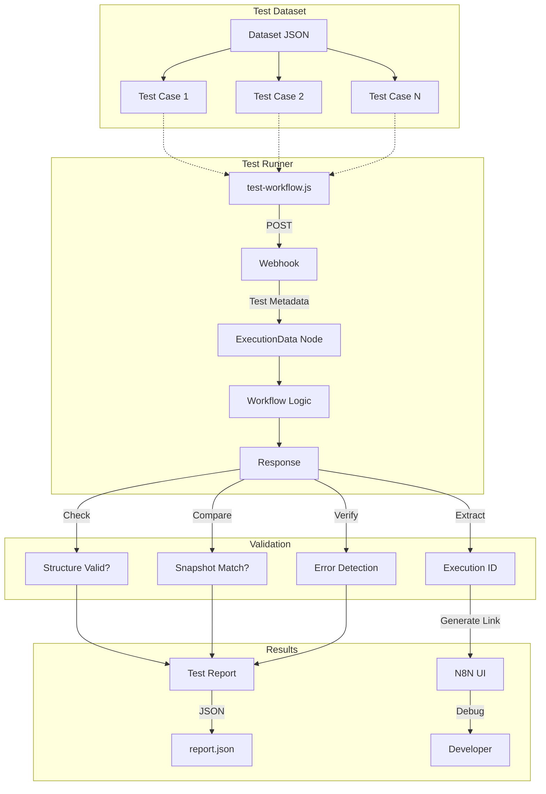

# N8N Workflow Testing

Automated testing framework for N8N workflows using webhook-based execution and snapshot validation.

## Overview

The N8N test runner provides:

- ✅ **Automated Execution**: Trigger workflows via webhooks with test datasets
- ✅ **Snapshot Testing**: Jest-like snapshot validation with field normalization
- ✅ **Performance Monitoring**: Track response times and throughput
- ✅ **Execution Tracking**: Direct links to N8N UI for debugging
- ✅ **Flexible Validation**: Generic validation or custom JSON schemas
- ✅ **Detailed Reporting**: JSON reports with comprehensive statistics

### Testing Architecture



## Prerequisites

Before creating tests for a workflow, ensure you have:

1. N8N instance running and accessible
2. Node.js installed in the N8N container
3. Test runner dependencies installed (`task n8n:test:setup`)

## Workflow Testing Standards

### Required Conventions

All testable N8N workflows **MUST** follow these conventions:

#### 1. Response Format

**All workflows must return a standardized response structure:**

```json
{
    "success": true,
    "message": "The reference subject has been correctly updated",
    "context": {
        "execution": {
            "id": "12345"
        },
        "timestamp": "2025-11-15T10:30:00Z"
    },
    "messageId": null,
    "conversationId": "1f0ba909-5099-6980-8667-497ced82fa8d",
    "watchFileId": "1f0ba909-4cda-666e-9b4c-497ced82fa8d"
}
```

**Required Fields:**

| Field                  | Type    | Required       | Description                           |
| ---------------------- | ------- | -------------- | ------------------------------------- |
| `success`              | boolean | ✅ Yes         | Indicates workflow success or failure |
| `message`              | string  | ✅ Yes         | Human-readable result description     |
| `context.execution.id` | string  | ✅ Yes         | N8N execution ID for tracking         |
| `context.timestamp`    | string  | ⚠️ Recommended | Execution timestamp (ISO 8601)        |

**Error Response Example:**

```json
{
    "success": false,
    "message": "The reference subject \"...\" does not seem relevant for this WatchFile, check the analyse for more detail.",
    "context": {
        "execution": {
            "id": "12346"
        },
        "timestamp": "2025-11-15T10:31:00Z"
    },
    "messageId": null,
    "conversationId": "conv-003",
    "watchFileId": "c3d4e5f6-a7b8-6c7d-0e1f-2a3b4c5d6e7f"
}
```

#### 2. Node Naming

Follow the [Naming Convention](./naming-convention.md) for all nodes:

```
✅ Required Format: Domain_Role_Action

Examples:
- Webhook_Trigger_TestInput
- Set_Format_Response
- ExecutionData_Store_TestMetadata
- Response_Return_Success
- Response_Return_Error
```

#### 3. Workflow Configuration

**Settings to Configure:**

| Setting                     | Value            | Location                       | Purpose                   |
| --------------------------- | ---------------- | ------------------------------ | ------------------------- |
| **Timeout**                 | 300000ms (5 min) | Workflow Settings → Executions | Prevent hanging workflows |
| **Save Execution Progress** | `save`           | Workflow Settings → Executions | Enable execution tracking |
| **Error Workflow**          | _(optional)_     | Workflow Settings → Executions | Global error handler      |

**How to Configure:**

1. Open workflow in N8N
2. Click **Workflow Settings** (gear icon)
3. Navigate to **Executions** tab
4. Set:
    - **Timeout**: `300` (seconds)
    - **Save Execution Progress**: ✅ Enabled

## Setting Up a Workflow for Testing

### Step 1: Add Test Webhook Trigger

Add a webhook node to receive test requests:

**Node Configuration:**

- **Node Name**: `Webhook_Trigger_TestInput`
- **HTTP Method**: `POST`
- **Path**: `webhook/{workflow-name}` (e.g., `webhook/test-reference-subject`)
- **Response Mode**: `lastNode` (wait for workflow completion)
- **Response Data**: `allEntries` (return all node outputs)

**Configuration Example:**

```json
{
    "httpMethod": "POST",
    "path": "2af49e2a-e460-4b87-bc21-81df5be9d831",
    "responseMode": "lastNode",
    "responseData": "allEntries"
}
```

### Step 2: Add Input Normalization (Optional)

If your production trigger uses RabbitMQ or other formats, add a Set node to normalize test inputs:

**Node Name**: `Set_Format_TestInput`

**Purpose**: Transform webhook payload to match production data structure

**Example Transformation:**

```javascript
// Input from webhook
{
  "_testMetadata": { ... },
  "watchFile": { ... },
  "referenceSubject": "..."
}

// Transform to production format
{
  "watchFile": {{ $json.watchFile }},
  "language": "{{ $json.language }}",
  "referenceSubject": "{{ $json.referenceSubject }}"
}
```

### Step 3: Add Execution Metadata Node

**Critical for test tracking**: Add a node to save test metadata to execution data.

**Node Name**: `ExecutionData_Store_TestMetadata`

**Node Type**: `Edit Fields (Set)` or custom code

**Configuration:**

```json
{
    "dataToSave": {
        "values": [
            {
                "key": "runId",
                "value": "={{ $json._testMetadata.runId }}"
            },
            {
                "key": "testCaseId",
                "value": "={{ $json._testMetadata.testCaseId }}"
            },
            {
                "key": "testCaseName",
                "value": "={{ $json._testMetadata.testCaseName }}"
            },
            {
                "key": "datasetFile",
                "value": "={{ $json._testMetadata.datasetFile }}"
            }
        ]
    }
}
```

**Where to Place**: Right after webhook trigger, before main workflow logic

**Purpose**:

- Filter executions by test run in N8N UI
- Debug specific test cases
- Track test coverage over time

### Step 4: Connect to Main Workflow Logic

Connect the test input nodes to your existing workflow:

```
Webhook_Trigger_TestInput
  → Set_Format_TestInput (optional)
  → ExecutionData_Store_TestMetadata
  → [Your Main Workflow Logic]
  → Response_Return_Success
```

### Step 5: Ensure Response Nodes Include Execution ID

**Final response node must include `context.execution.id`:**

```javascript
// In Set_Format_Response or final node
{
  "success": true,
  "message": "...",
  "context": {
    "execution": {{ $execution.toJsonString() }},
    "prevNode": {{ $prevNode.toJsonString() }},
    "timestamp": "{{ $now }}"
  },
  // ... other fields
}
```

## Creating Test Datasets

### Dataset Structure

Create JSON files in `docker/n8n/tests/datasets/`:

```json
{
    "version": "1.0",
    "metadata": {
        "workflowId": "7uS3PqE9HezIqOd1",
        "workflowName": "WatchFile Builder - Update reference subject",
        "description": "Evaluation dataset for reference subject update workflow",
        "createdAt": "2025-11-14T23:00:00Z",
        "snapshotNormalization": {
            "removeFields": [
                "*.context.execution",
                "*.context.timestamp",
                "referenceSubject.context"
            ]
        }
    },
    "testCases": [
        {
            "testCaseId": "TC-001",
            "name": "First creation - Empty WatchFile",
            "description": "Creating the first reference subject for a new watchfile",
            "expectedBehavior": "The workflow must generate a complete structured subject",
            "expectedOutput": "Success with generated referenceSubject",
            "priority": "high",
            "input": {
                "watchFile": {
                    /* ... */
                },
                "language": "en",
                "referenceSubject": "Monitor competitors in Market Intelligence..."
            },
            "snapshot": [
                {
                    "referenceSubject": {
                        "success": true,
                        "message": "The reference subject has been correctly updated",
                        "messageId": null,
                        "conversationId": "...",
                        "watchFileId": "..."
                    }
                }
            ]
        }
    ]
}
```

### Dataset Fields

#### Metadata Section

| Field                                | Type   | Required       | Description                                |
| ------------------------------------ | ------ | -------------- | ------------------------------------------ |
| `workflowId`                         | string | ✅ Yes         | N8N workflow ID (auto-fetches webhook URL) |
| `workflowName`                       | string | ⚠️ Recommended | Human-readable workflow name               |
| `description`                        | string | ⚠️ Recommended | Dataset purpose                            |
| `snapshotNormalization.removeFields` | array  | ❌ No          | Fields to ignore in snapshot comparison    |

#### Test Case Fields

| Field              | Type         | Required       | Description                             |
| ------------------ | ------------ | -------------- | --------------------------------------- |
| `testCaseId`       | string       | ✅ Yes         | Unique test identifier (e.g., `TC-001`) |
| `name`             | string       | ✅ Yes         | Short test description                  |
| `description`      | string       | ⚠️ Recommended | Detailed test purpose                   |
| `expectedBehavior` | string       | ⚠️ Recommended | Expected workflow behavior              |
| `expectedOutput`   | string       | ✅ Yes         | `Success`, `Error`, or description      |
| `priority`         | string       | ❌ No          | `high`, `medium`, `low`                 |
| `input`            | object       | ✅ Yes         | Payload sent to webhook                 |
| `snapshot`         | array/object | ⚠️ Recommended | Expected normalized response            |

### Snapshot Normalization

**Problem**: Volatile fields (timestamps, execution IDs) cause snapshot failures.

**Solution**: Configure field removal patterns in dataset metadata.

**Default Normalized Fields:**

```javascript
;[
    '*.context.execution', // Execution metadata (all top-level keys)
    '*.context.timestamp', // Execution timestamp
    '*.context.messageId', // Message identifier
    '*.context.conversationId', // Conversation identifier
    '_testMetadata', // Test runner metadata
]
```

**Custom Normalization:**

```json
{
    "metadata": {
        "snapshotNormalization": {
            "removeFields": [
                "*.context.execution", // Wildcard: all top-level objects
                "result.generatedAt", // Nested path
                "_internal", // Top-level field
                "*.metadata.processingTime" // Nested with wildcard
            ]
        }
    }
}
```

**Pattern Syntax:**

- `fieldName` - Remove top-level field
- `*.fieldName` - Remove field from all top-level objects (wildcard)
- `parent.child` - Remove nested field
- `*.parent.child` - Remove nested field from all top-level objects

## Running Tests

### Using Taskfile (Recommended)

```bash
# First time setup
task n8n:test:setup

# Run specific test case
task n8n:test -- reference-subject-workflow-evaluation.json --case TC-003

# Run with verbose output
task n8n:test -- reference-subject-workflow-evaluation.json --verbose

# Update snapshots after intentional changes
task n8n:test -- reference-subject-workflow-evaluation.json --update-snapshots
```

### Direct Command

```bash
# From inside N8N container
cd /tests
node test-workflow.js datasets/reference-subject-workflow-evaluation.json --verbose

# From host
docker compose exec --workdir /tests n8n node test-workflow.js \
  datasets/reference-subject-workflow-evaluation.json \
  --case TC-001 \
  --verbose
```

### Test Options

| Option                 | Alias    | Description                            | Default                           |
| ---------------------- | -------- | -------------------------------------- | --------------------------------- |
| `--workflow-id <id>`   | -        | N8N workflow ID (auto-fetches webhook) | From dataset                      |
| `--webhook-url <url>`  | -        | Override webhook URL                   | Auto-detected                     |
| `--n8n-base-url <url>` | -        | N8N API base URL                       | `http://127.0.0.1:5678`           |
| `--timeout <ms>`       | -        | Request timeout                        | `300000` (5min)                   |
| `--parallel`           | -        | Run tests in parallel                  | Sequential                        |
| `--verbose`            | -        | Detailed logging                       | Disabled                          |
| `--update-snapshots`   | `-u`     | Update failed snapshots                | Disabled                          |
| `--test-case <id>`     | `--case` | Run single test case                   | All cases                         |
| `--output <file>`      | -        | Report output path                     | `/tests/reports/test-report.json` |

## Test Execution Flow

### 1. Webhook Request

```json
POST http://127.0.0.1:5678/webhook/2af49e2a-e460-4b87-bc21-81df5be9d831

{
  "_testMetadata": {
    "runId": "test-1763243143106-r9t4m1y",
    "testCaseId": "TC-001",
    "testCaseName": "First creation - Empty WatchFile",
    "timestamp": "2025-11-15T00:12:34.567Z",
    "source": "n8n-test-runner",
    "datasetFile": "reference-subject-workflow-evaluation.json"
  },
  "watchFile": { /* test input */ },
  "language": "en",
  "referenceSubject": "..."
}
```

### 2. Workflow Execution

1. Webhook receives request
2. ExecutionData node saves test metadata
3. Main workflow logic executes
4. Response node returns standardized format

### 3. Response Validation

1. **Structure Check**: Valid JSON with required fields
2. **Error Detection**: `success: false` or error fields
3. **Snapshot Comparison**: Normalized response vs saved snapshot
4. **Expected Output Match**: Response type matches expected

### 4. Result Reporting

**Console Output:**

```
▶ Running: TC-001 - First creation - Empty WatchFile
  ✓ PASSED (2381ms)
    N8N Execution: https://n8n.basil.local/workflow/7uS3PqE9HezIqOd1/executions/146
    Response Size: 1.59 KB
    📸 Snapshot: matches
```

**JSON Report:**

```json
{
    "timestamp": "2025-11-15T10:30:00Z",
    "summary": {
        "total": 5,
        "passed": 4,
        "failed": 1,
        "successRate": 80.0
    },
    "results": [
        {
            "testCaseId": "TC-001",
            "passed": true,
            "executionId": "146",
            "executionUrl": "https://n8n.basil.local/workflow/.../executions/146",
            "metrics": {
                "responseTime": 2381,
                "structureCompliance": true,
                "isError": false
            }
        }
    ]
}
```

## Debugging Failed Tests

### 1. Check Execution in N8N UI

Click the execution link in console output:

```
N8N Execution: https://n8n.basil.local/workflow/7uS3PqE9HezIqOd1/executions/146
```

**In N8N UI:**

- View node outputs at each step
- Check error messages
- Inspect execution timeline
- Verify input data transformation

### 2. Filter by Test Run

Use test metadata to filter executions:

1. Open N8N → Executions
2. Click **Filter**
3. Add filter: `Custom Data` → `runId` → `test-1763243143106-r9t4m1y`

### 3. Common Failure Reasons

| Failure Message                  | Cause                                       | Solution                                                              |
| -------------------------------- | ------------------------------------------- | --------------------------------------------------------------------- |
| `Snapshot: 13 differences`       | Response includes volatile fields           | Add fields to `snapshotNormalization.removeFields`                    |
| `Expected success but got error` | Workflow returned `success: false`          | Check workflow logic, fix error handling                              |
| `Expected error but got success` | Test expects failure but workflow succeeded | Update `expectedOutput` or test input                                 |
| `Invalid response structure`     | Response missing required fields            | Ensure response includes `success`, `message`, `context.execution.id` |
| `Timeout after 300000ms`         | Workflow too slow                           | Optimize workflow or increase `--timeout`                             |

### 4. Update Snapshots

After intentional workflow changes:

```bash
# Review changes first
task n8n:test -- my-dataset.json --verbose

# Update snapshots
task n8n:test -- my-dataset.json --update-snapshots

# Verify
task n8n:test -- my-dataset.json
```

## Best Practices

### Test Design

✅ **DO:**

- Test happy path and error cases
- Use realistic input data
- Document expected behavior clearly
- Keep test cases focused (one scenario per test)
- Include edge cases (empty data, malformed input)

❌ **DON'T:**

- Hardcode volatile data in snapshots
- Skip error testing
- Create overly complex test inputs
- Test multiple scenarios in one test case

### Dataset Organization

```
docker/n8n/tests/datasets/
├── reference-subject-workflow-evaluation.json  # Main test suite
├── reference-subject-edge-cases.json           # Edge cases
├── reference-subject-performance.json          # Performance tests
└── README.md                                    # Dataset documentation
```

### Naming Conventions

**Dataset Files:**

```
{workflow-purpose}-{test-type}.json

Examples:
- reference-subject-workflow-evaluation.json
- document-summary-error-handling.json
- classification-performance-tests.json
```

**Test Case IDs:**

```
TC-{number}

Examples:
- TC-001, TC-002, TC-003 (sequential)
```

### Snapshot Maintenance

1. **Review before updating**: Always check what changed
2. **Update selectively**: Use `--case TC-XXX` to update specific tests
3. **Commit snapshots**: Version control snapshots with code
4. **Document changes**: Explain snapshot updates in commit messages

## Troubleshooting

### Connection Refused

**Error**: `ECONNREFUSED 127.0.0.1:5678`

**Solution**: Ensure N8N is running

```bash
docker compose up -d n8n
curl http://127.0.0.1:5678/webhook/test
```

### Missing Execution ID

**Warning**: `⚠ WARNING: Execution ID not found in response`

**Solution**: Add execution ID to response:

```json
{
    "context": {
        "execution": {
            "id": "{{ $execution.id }}"
        }
    }
}
```

### Snapshot Differences

**Issue**: Snapshots fail after workflow changes

**Solution**:

1. Review changes: `task n8n:test -- dataset.json --verbose`
2. If intentional: `task n8n:test -- dataset.json -u`
3. If not intentional: Fix workflow logic

### Workflow Not Found

**Error**: `Workflow 7uS3PqE9HezIqOd1 not found`

**Solution**:

1. Verify workflow ID in N8N UI
2. Update `metadata.workflowId` in dataset
3. Check N8N API key configuration

## Examples

See complete examples:

- **Dataset**: `docker/n8n/tests/datasets/*.json`
- **Test Runner**: `docker/n8n/tests/test-workflow.js`
- **Workflow**: N8N UI → "WatchFile Builder - Update reference subject"

## Related Documentation

- [N8N Best Practices](./best-practices.md) - Error handling, naming conventions
- [Naming Convention](./naming-convention.md) - Node naming standards
- [Workflow Overview](../workflow-overview.md) - Workflow architecture
