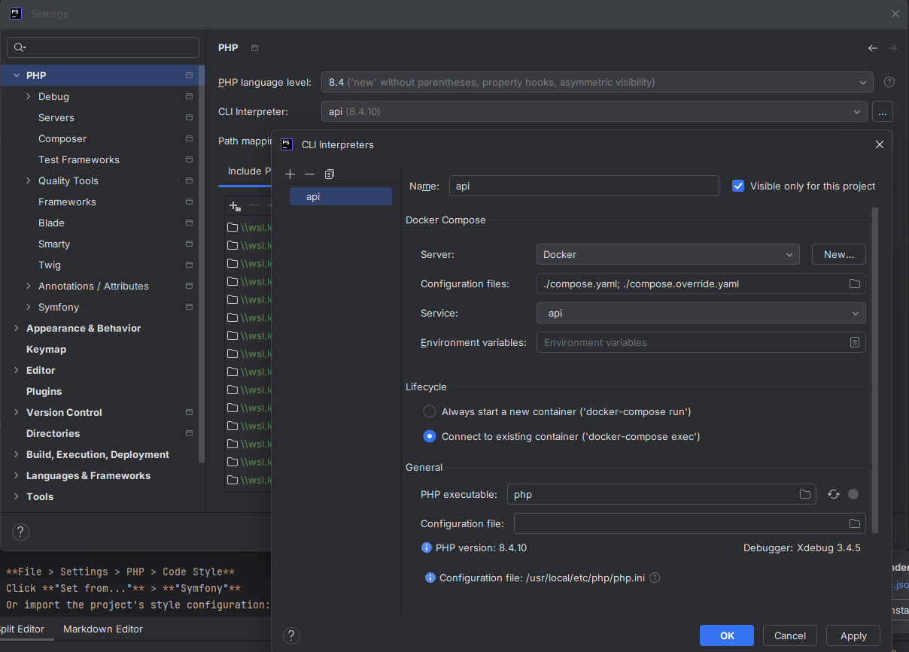
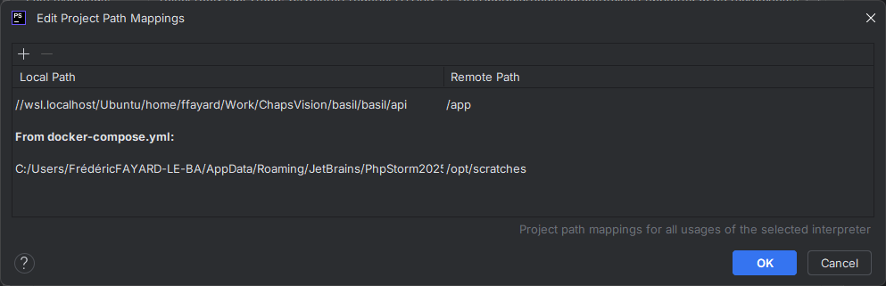

# PhpStorm Setup Guide

This guide covers configuring PhpStorm IDE for optimal development with the Basil project, including Docker integration, debugging, and code quality tools.

## 🚀 Initial Setup

### Project Import

1. **Open PhpStorm**
2. **File > Open** and select the Basil project root directory
3. When prompted, choose **"Yes"** to configure the project as a Symfony project
4. PhpStorm will index the project files (this may take a few minutes)

### Configure Project Structure

1. **File > Settings** (Ctrl+Alt+S on Windows/Linux, Cmd+, on macOS)
2. Navigate to **Directories**
3. Ensure the following directories are marked correctly:
   - `.cache` - Excluded
   - `.npm` - Excluded
   - `.yarn` - Excluded
   - `api/.cache` - Excluded
   - `api/.phpunit.cache` - Excluded
   - `api/src` - Sources
   - `api/tests` - Tests
   - `api/var` - Excluded
   - `api/vendor` - Excluded
   - `pwa/.yarn` - Excluded
   - `pwa/node_modules` - Excluded
   - `pwa/.nuxt` - Excluded
   - `pwa/.output` - Excluded
   - `pwa/.yarn` - Excluded

## 🐳 Docker Integration

### Docker Plugin

1. **File > Settings > Plugins**
2. Ensure **Docker** plugin is enabled
3. Restart PhpStorm if the plugin was just installed

### Docker Configuration

1. **File > Settings > Build, Execution, Deployment > Docker**
2. Click **"+"** to add a new Docker configuration
3. Choose your Docker connection:
   - **Windows/macOS**: Docker Desktop (usually auto-detected)
   - **Linux**: Unix socket at `unix:///var/run/docker.sock`
4. Test the connection - you should see "Connection successful"

### Docker Compose Integration

1. **View > Tool Windows > Services** (or Alt+8)
2. Click **"+"** > **Docker Compose**
3. Select the `compose.yaml` file in your project root
4. You should see all services listed in the Services tool window

## 🐘 PHP Configuration

### PHP Interpreter Setup

1. **File > Settings > PHP**
2. Click **"..."** next to CLI Interpreter
3. Click **"+"** > **From Docker, Vagrant, VM, WSL, Remote...**
4. Select **Docker Compose**
5. Configure as follows:
   - **Server**: Select your Docker server
   - **Configuration files**: `./compose.yaml`
   - **Service**: `api`
   - **Lifecycle**: Select `Connect to existing container`
   - **Environment variables**: (leave empty or add custom vars)
6. Click **OK** and wait for PhpStorm to configure the interpreter
7. Verify the interpreter shows PHP 8.4 with Xdebug



8. Add mapping for path resolution:
   - Click **"..."** next to the path mappings
   - **Path mappings**: Map `{project}/api` to `/app` in the container
   - Click **OK** to save



### Composer Configuration

1. **File > Settings > PHP > Composer**
2. Set **Path to composer.json**: `api/composer.json`
3. Set **CLI Interpreter**: Use the Docker interpreter you just configured
4. Click **"Update"** to refresh dependencies

### Code Style Configuration

1. **File > Settings > PHP > Code Style**
2. Click **"Set from..."** > **"Symfony"**
3. Or import the project's style configuration:
   - **File > Settings > Editor > Code Style > PHP**
   - Click **"Import Scheme"** > **"EditorConfig"**
   - Select `.editorconfig` from the project root

## 🔧 Framework Integration

### Symfony Plugin

1. **File > Settings > Plugins**
2. Install **"Symfony Support"** plugin if not already installed
3. Restart PhpStorm

### Symfony Configuration

1. **File > Settings > PHP > Frameworks > Symfony**
2. Enable **"Enable plugin for this project"**
3. Set **Web Directory**: `api/public`
4. Set **App Directory**: `api`
5. PhpStorm should auto-detect Symfony installation

## 🗄️ Database Configuration

### Database Connection

1. **View > Tool Windows > Database** (or double-click the database icon)
2. Click **"+"** > **Data Source** > **PostgreSQL**
3. Configure connection:
   - **Host**: `localhost`
   - **Port**: `5432`
   - **Database**: `basil`
   - **User**: `basil`
   - **Password**: (from your `.env` file)
4. Click **"Test Connection"** to verify
5. Click **OK** to save

### Doctrine Integration

1. **File > Settings > PHP > Frameworks > Doctrine**
2. Enable **"Enable plugin for this project"**
3. PhpStorm should auto-detect Doctrine configuration
4. Set **Entity path**: `api/src/Entity`

## 🐛 Debugging Configuration

### Xdebug Configuration

1. **File > Settings > PHP > Debug**
2. Set **Debug port**: `9003,9000` (default for Xdebug 3)
3. Set **Max simultaneous connections**: `3`

### Debug Configuration

1. **Run > Edit Configurations**
2. Click **"+"** > **PHP Web Page**
3. Configure:
   - **Name**: `Basil Debug`
   - **Server**: Click **"..."** to create new server
     - **Name**: `Basil Local`
     - **Host**: `basil.local`
     - **Port**: `443`
     - **Debugger**: `Xdebug`
     - **Use path mappings**: Check this box
     - Map `{project}/api` to `/app`
   - **Start URL**: `/`
4. Click **OK** to save

### Browser Debugging

1. Install browser extension:
   - **Chrome**: [Xdebug helper](https://chrome.google.com/webstore/detail/xdebug-helper/eadndfjplgieldjbigjakmdgkmoaaaoc)
   - **Firefox**: [Xdebug Helper](https://addons.mozilla.org/en-US/firefox/addon/xdebug-helper-for-firefox/)

2. **Configure IDE Key**:
   - Extension settings > IDE Key: `PHPSTORM`

### Start Debugging

1. Set breakpoints in your PHP code
2. Click **"Start Listening for PHP Debug Connections"**
3. In browser, enable Xdebug extension
4. Navigate to your application
5. PhpStorm should break at your breakpoints

## 🎨 Frontend Development

### Node.js Interpreter

1. **File > Settings > Languages & Frameworks > Node.js**
2. Set **Node interpreter**: `/usr/local/bin/node` (or your system path)
3. Set **Package manager**: `npm` or `yarn`

### Vue.js Support

1. **File > Settings > Plugins**
2. Install **"Vue.js"** plugin
3. Restart PhpStorm

### Vue.js Configuration

1. **File > Settings > Languages & Frameworks > Vue.js**
2. Enable **"Enable Vue.js"**
3. Set **Vue service**: Auto (let PhpStorm detect)

### TypeScript Configuration

1. **File > Settings > Languages & Frameworks > TypeScript**
2. Enable **"TypeScript Language Service"**
3. Set **Node interpreter**: Use the same as above
4. Set **TypeScript**: Auto-detect or specify version

### ESLint Configuration

1. **File > Settings > Languages & Frameworks > ESLint**
2. Enable **"Automatic ESLint configuration"**
3. Set **Node interpreter**: Use the configured Node.js interpreter
4. PhpStorm should auto-detect ESLint configuration

### Prettier Configuration

1. **File > Settings > Languages & Frameworks > Prettier**
2. Set **Node interpreter**: Use the configured Node.js interpreter
3. Set **Prettier package**: Auto-detect
4. Enable **"On 'Reformat Code' action"**
5. Enable **"On save"** (recommended)

## 🧪 Testing Configuration

### PHPUnit Configuration

1. **File > Settings > PHP > Test Frameworks**
2. Click **"+"** > **PHPUnit by Remote Interpreter**
3. Select your Docker PHP interpreter
4. Set **Path to phpunit.phar**: `/app/vendor/bin/phpunit`
5. Set **Default configuration file**: `/app/phpunit.dist.xml`

### Run PHPUnit Tests

1. **Run > Edit Configurations**
2. Click **"+"** > **PHPUnit**
3. Configure:
   - **Name**: `API Tests`
   - **Test scope**: `Defined in the configuration file`
   - **Interpreter**: Your Docker interpreter
4. Run tests with **Run > Run 'API Tests'**

### JavaScript/Vue Testing

1. **File > Settings > Languages & Frameworks > JavaScript > Test Frameworks**
2. Select **Vitest** (if available) or **Jest**
3. Configure test runner for the `pwa` directory

## 🔍 Code Quality Tools

### PHP CodeSniffer (via ECS)

1. **File > Settings > PHP > Quality Tools > PHP CS Fixer**
2. Configure via Docker interpreter
3. Set **Configuration**: `api/ecs.php`
4. Enable **"Show applied rules"**

### PHPStan Configuration

1. **File > Settings > PHP > Quality Tools > PHPStan**
2. Configure via Docker interpreter
3. Set **Configuration file**: `api/phpstan.dist.neon`
4. Set **Level**: Use configuration file setting

### Code Inspections

1. **File > Settings > Editor > Inspections**
2. Enable PHP-specific inspections:
   - **PHP > Code style issues**
   - **PHP > Error handling**
   - **PHP > Probable bugs**
   - **PHP > Performance**

## 📁 File Templates

### Symfony Entity Template

1. **File > Settings > Editor > File and Code Templates**
2. Click **"+"** to create new template
3. **Name**: `Symfony Entity`
4. **Extension**: `php`
5. **Content**:

```php
<?php

declare(strict_types=1);

namespace App\Entity;

use ApiPlatform\Metadata\ApiResource;
use Doctrine\ORM\Mapping as ORM;
use Symfony\Component\Serializer\Annotation\Groups;

#[ORM\Entity]
#[ApiResource]
class ${NAME}
{
    #[ORM\Id]
    #[ORM\GeneratedValue]
    #[ORM\Column]
    #[Groups(['${ENTITY_LOWER}:read'])]
    private ?int $id = null;

    public function getId(): ?int
    {
        return $this->id;
    }
}
```

### Vue Component Template

1. **File > Settings > Editor > File and Code Templates**
2. Click **"+"** to create new template
3. **Name**: `Vue Component`
4. **Extension**: `vue`
5. **Content**:

```vue
<template>
  <div class="${COMPONENT_KEBAB}">
    <!-- Component content -->
  </div>
</template>

<script setup lang="ts">
interface Props {
  // Define props here
}

interface Emits {
  // Define emits here
}

const props = defineProps<Props>()
const emit = defineEmits<Emits>()

// Component logic here
</script>

<style scoped>
.${COMPONENT_KEBAB} {
  /* Component styles */
}
</style>
```

## 🎯 Productivity Tips

### Live Templates

Create custom live templates for common patterns:

1. **File > Settings > Editor > Live Templates**
2. Create templates for:
   - Symfony controllers
   - API Platform resources
   - Vue composables
   - Test methods

### Useful Keyboard Shortcuts

**General:**

- `Ctrl+Shift+A` (Cmd+Shift+A) - Find Action
- `Ctrl+Shift+N` (Cmd+Shift+O) - Go to File
- `Ctrl+N` (Cmd+O) - Go to Class
- `Ctrl+Shift+F` (Cmd+Shift+F) - Find in Files

**Debugging:**

- `F8` - Step Over
- `F7` - Step Into
- `Shift+F8` - Step Out
- `F9` - Resume Program
- `Ctrl+F8` (Cmd+F8) - Toggle Breakpoint

**Refactoring:**

- `Shift+F6` - Rename
- `Ctrl+Alt+M` (Cmd+Alt+M) - Extract Method
- `Ctrl+Alt+V` (Cmd+Alt+V) - Extract Variable
- `Ctrl+Alt+N` (Cmd+Alt+N) - Inline

### Code Navigation

**Navigate to:**

- `Ctrl+B` (Cmd+B) - Go to Declaration
- `Ctrl+Alt+B` (Cmd+Alt+B) - Go to Implementation
- `Ctrl+U` (Cmd+U) - Go to Super Method
- `Alt+F7` (Alt+F7) - Find Usages

### Version Control Integration

1. **File > Settings > Version Control > Git**
2. Verify Git executable path
3. Enable **"Auto-update if push of the current branch was rejected"**
4. Configure **"Update method"**: Merge or Rebase

## 🔧 Performance Optimization

### IDE Performance

1. **Help > Edit Custom VM Options**
2. Add/modify these options:

```
-Xmx4096m
-XX:ReservedCodeCacheSize=1024m
-XX:InitialCodeCacheSize=64m
-XX:CompileThreshold=1500
-XX:CICompilerCount=2
-Djdk.http.auth.tunneling.disabledSchemes=""
```

### Exclude Directories

1. **File > Settings > Project > Project Structure**
2. Mark as **Excluded**:
   - `api/var/`
   - `api/vendor/`
   - `pwa/node_modules/`
   - `pwa/.nuxt/`
   - `pwa/.output/`
   - `.git/`

## 🛠️ Plugin Recommendations

### Essential Plugins

- **Symfony Support** - Framework integration
- **PHP Annotations** - Annotation support
- **Docker** - Container management
- **Vue.js** - Vue development
- **.env files support** - Environment file syntax
- **Prettier** - Code formatting
- **GitToolBox** - Enhanced Git integration

### Useful Plugins

- **Markdown** - Documentation editing
- **Database Tools and SQL** - Database management
- **HTTP Client** - API testing
- **Rainbow Brackets** - Bracket matching
- **Indent Rainbow** - Indentation visualization
- **Key Promoter X** - Keyboard shortcut learning

## 🐛 Troubleshooting

### Common Issues

**Docker Interpreter Not Working:**

1. Ensure Docker is running
2. Verify Docker connection in settings
3. Rebuild Docker interpreter configuration
4. Check container is running: `docker compose ps`

**Xdebug Not Connecting:**

1. Verify port 9003 is not blocked
2. Check Xdebug is installed: `docker compose exec api php -m | grep xdebug`
3. Verify path mappings in server configuration
4. Ensure "Listen for Debug Connections" is enabled

**Performance Issues:**

1. Increase memory allocation in VM options
2. Exclude unnecessary directories
3. Disable unused plugins
4. Clear caches: **File > Invalidate Caches and Restart**

**Database Connection Issues:**

1. Verify PostgreSQL container is running
2. Check connection parameters match `.env` file
3. Ensure port 5432 is accessible
4. Test connection from terminal: `docker compose exec postgres psql -U basil -d basil`

### Reset Configuration

If PhpStorm becomes unstable:

1. **File > Invalidate Caches and Restart**
2. Delete PhpStorm configuration directory:
   - Windows: `%APPDATA%\JetBrains\PhpStorm{version}`
   - macOS: `~/Library/Preferences/PhpStorm{version}`
   - Linux: `~/.config/JetBrains/PhpStorm{version}`
3. Restart PhpStorm and reconfigure

This PhpStorm setup guide should provide a comprehensive configuration for optimal development experience with the Basil project.
