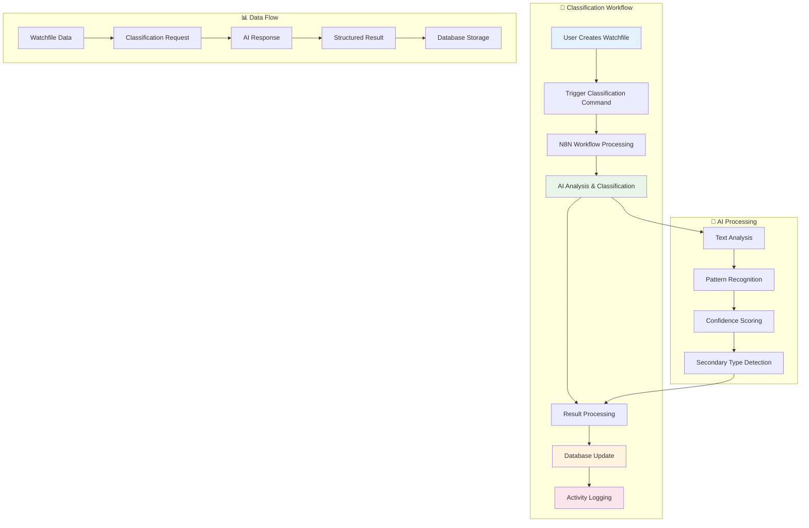

# Watchfile Type Classification Workflow 🤖

## Overview

The Watchfile Type Classification Workflow is an AI-powered system that automatically determines the monitoring type of watchfiles using advanced natural language processing. This workflow integrates N8N automation with OpenAI's language models to analyze user objectives and classify them into appropriate monitoring categories.

## 🎯 Objectives

- **Automatic Classification**: Intelligently classify watchfiles into monitoring types (Competitive, Technological, Legal, Commercial, Strategic)
- **High Accuracy**: Leverage AI models to achieve reliable classification with confidence scoring
- **Seamless Integration**: Integrate classification results into the existing watchfile workflow
- **Activity Logging**: Track all classification activities for audit and improvement purposes

## 🏗️ Architecture



````

## � Execution Steps

### Prerequisites
1. **System Setup**: Ensure all services are running (API, N8N, RabbitMQ, Database)
2. **Environment**: Verify OpenAI API key is configured in N8N
3. **Database**: Run migrations to ensure schema is up to date

### Step-by-Step Execution

#### 1. Start Required Services
```bash
# Start all services
docker compose up -d

# Verify services are running
docker compose ps
````

#### 2. Run Database Migration (if needed)

```bash
docker compose exec api php bin/console doctrine:migrations:migrate
```

#### 3. Classification Trigger

Classification is now triggered automatically by the system when a new conversation or direct message is received (subworkflow).

If a user requests a reevaluation, simply send a direct message in the conversation. The workflow will process the new context and update the classification accordingly.

#### 4. Monitor Progress

**Check N8N Workflow**:

- Access N8N UI: https://n8n.basil.local
- Navigate to "classify-watch-file" workflow
- Monitor execution in real-time

**Check Application Logs**:

```bash
# Monitor API logs for classification progress
docker compose logs -f api | grep -i "classification"

# Check for any errors
docker compose logs api | grep -i "error"
```

#### 5. Verify Results

**Check Database**:

```bash
# Connect to database and verify classification results
docker compose exec database psql -U postgres -d basil -c "
SELECT id, monitoring_type, secondary_monitoring_types
FROM watch_file
WHERE conversation_id = 'your-conversation-id';"
```

**Check Activity Logs**:

```bash
# View classification activities
docker compose exec database psql -U postgres -d basil -c "
SELECT * FROM watch_file_activity
WHERE type = 'monitoring_type_detection'
ORDER BY created_at DESC LIMIT 10;"
```

### Expected Outcomes

1. **Successful Classification**: Watch file gets assigned a primary monitoring type
2. **Confidence Score**: Classification includes confidence percentage
3. **Secondary Types**: Additional monitoring types may be detected
4. **Activity Logging**: All classification steps are logged for audit trail
5. **Reevaluation Support**: Classification can be updated with additional context when needed

### Use Cases

**Initial Classification:**

- Use when a watchfile is first created
- Analyzes the original user objective and context
- Provides baseline monitoring type assignment

**Reevaluation:**

- Use when additional context becomes available
- Helpful when initial classification confidence was low
- Allows refinement based on new information or feedback
- Updates existing classification with improved accuracy

### Troubleshooting Quick Checks

**If Classification Doesn't Start**:

```bash
# Check if RabbitMQ is receiving messages
docker compose exec rabbitmq rabbitmqctl list_queues

# Verify N8N workflow is active
docker compose logs n8n | grep -i "workflow"
```

**If AI Analysis Fails**:

- Check OpenAI API key in N8N workflow settings
- Verify internet connectivity from N8N container
- Check N8N execution logs for API errors

**If Database Update Fails**:

```bash
# Check database connectivity
docker compose exec api php bin/console doctrine:schema:validate

# Verify migration status
docker compose exec api php bin/console doctrine:migrations:status
```

## 🔍 Monitoring Types

The system classifies watchfiles into the following monitoring types:

### Primary Types

- **Competitive Intelligence** (`COMPETITIVE`): Market competition, competitor analysis
- **Technological Intelligence** (`TECHNOLOGICAL`): Technology trends, innovation tracking
- **Legal Intelligence** (`LEGAL`): Regulatory changes, legal developments
- **Commercial Intelligence** (`COMMERCIAL`): Market opportunities, commercial trends
- **Strategic Intelligence** (`STRATEGIC`): Strategic planning, business intelligence

### French Mapping

The AI analyzes in French and maps to English enums:

- Veille Concurrentielle → COMPETITIVE
- Veille Technologique → TECHNOLOGICAL
- Veille Réglementaire → LEGAL
- Veille Commerciale → COMMERCIAL
- Veille Stratégique → STRATEGIC

## 📊 Confidence Scoring

The system uses confidence thresholds to determine classification reliability:

- **High Confidence** (≥ 80%): Automatically sets monitoring type
- **Medium Confidence** (60-79%): Stores classification but requires manual review
- **Low Confidence** (< 60%): Classification stored for reference only

## 🔄 Integration Points

### Message Bus Integration

The workflow integrates with the existing message bus system to process classification commands asynchronously.

### Event System

The workflow integrates with the existing event system to:

- Trigger classification when watchfiles are created
- Update related entities when monitoring type is determined
- Send notifications for high-confidence classifications

### Activity Logging

All classification activities are logged with detailed information including:

- Detected monitoring type and confidence score
- Justification for the classification decision
- Secondary monitoring types identified
- Processing timestamps and user context
