# Workflow Diagrams 📊

This page presents all Basil project workflow diagrams with their detailed descriptions. Each diagram represents a specific process of artificial intelligence and automated workflows.

## 🎯 Main Basil Workflow

The main Basil system diagram shows the complete intelligent analysis architecture:

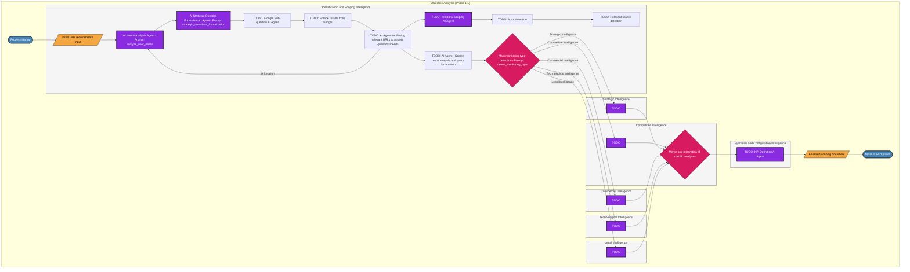

## 📊 Phase 1: Analysis and Configuration

### 1.1 Complete Objective Analysis

The objective analysis process with all specialized AI agents:

```mermaid
flowchart TD
    subgraph Analysis["Objective Analysis (Phase 1.1)"]
        START([Process startup]) --> INPUT[/Initial user requirements input/]

        subgraph Identification["Identification and Scoping Intelligence"]
            INPUT --> A1[AI Needs Analysis Agent]
            A1 --> A2[AI Strategic Question Formalization Agent]
            A2 --> A3[AI Temporal Scoping Agent]
            A3 --> DETECT{Main monitoring\ntype detection}
        end

        DETECT -->|Competitive Intelligence| B1
        DETECT -->|Strategic Intelligence| C1
        DETECT -->|Commercial Intelligence| D1
        DETECT -->|Technological Intelligence| E1
        DETECT -->|Legal Intelligence| F1

        subgraph Competitive["Competitive Intelligence"]
            B1[AI Competitive Mapping Agent]
            B1 --> B2[AI Differential Analysis Agent]
            B2 --> B3[AI Competitive Positioning Agent]
            B3 --> MERGE
        end

        subgraph Strategic["Strategic Intelligence"]
            C1[AI PESTEL Analysis Agent]
            C1 --> C2[AI Prospective Agent]
            C2 --> C3[AI Disruption Modeling Agent]
            C3 --> MERGE
        end

        subgraph Commercial["Commercial Intelligence"]
            D1[AI Customer Segmentation Agent]
            D1 --> D2[AI Opportunity Qualification Agent]
            D2 --> D3[AI Purchase Signal Detection Agent]
            D3 --> MERGE
        end

        subgraph Technological["Technological Intelligence"]
            E1[AI Technology Mapping Agent]
            E1 --> E2[AI Maturity Assessment Agent]
            E2 --> E3[AI Technical Disruption Analysis Agent]
            E3 --> MERGE
        end

        subgraph Legal["Legal Intelligence"]
            F1[AI Regulatory Mapping Agent]
            F1 --> F2[AI Compliance Impact Analysis Agent]
            F2 --> F3[AI Risk Prioritization Agent]
            F3 --> MERGE
        end

        MERGE{Merge and\nintegration of\nspecific analyses}

        MERGE --> G1

        subgraph Synthesis["Synthesis and Configuration Intelligence"]
            G1[AI KPI Definition Agent]
            G1 --> G2[AI Alert Threshold Configuration Agent]
            G2 --> G3[AI Impact Modeling Agent]
            G3 --> G4[AI Action Plan Generation Agent]
        end

        G4 --> OUTPUT[/Finalized scoping document/]
        OUTPUT --> END([Move to next phase])
    end

    %% Enhanced styles with better contrast
    classDef intelligence fill:#8a2be2,stroke:#000,stroke-width:2px,color:#fff
    classDef process fill:#4682b4,stroke:#000,stroke-width:1px,color:#fff
    classDef document fill:#f5a742,stroke:#000,stroke-width:1px,color:#000
    classDef decision fill:#d81b60,stroke:#000,stroke-width:1px,color:#fff
    classDef subgraphStyle fill:#f5f5f5,stroke:#333,stroke-width:1px

    %% Apply styles
    class A1,A2,A3,B1,B2,B3,C1,C2,C3,D1,D2,D3,E1,E2,E3,F1,F2,F3,G1,G2,G3,G4 intelligence
    class START,END process
    class INPUT,OUTPUT document
    class DETECT,MERGE decision
    class Identification,Competitive,Strategic,Commercial,Technological,Legal,Synthesis subgraphStyle
```

### 1.2 Element Mapping

Complete mapping of components and their relationships:

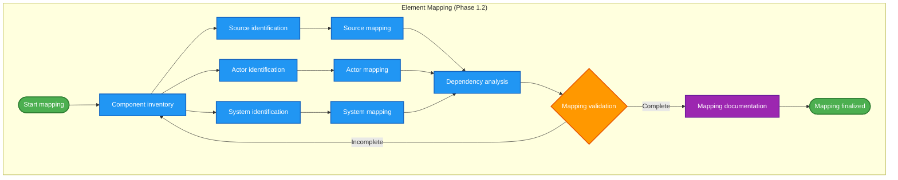

### 1.3 Criteria Configuration

Definition and parameterization of decision criteria:

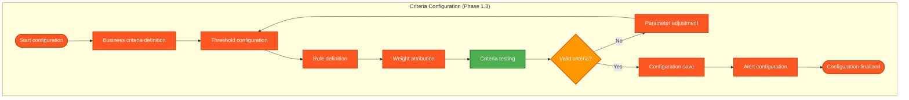

## 🔧 Phase 2: Source Configuration

### 2.1 Data Source Configuration

Setup and connection to different sources:

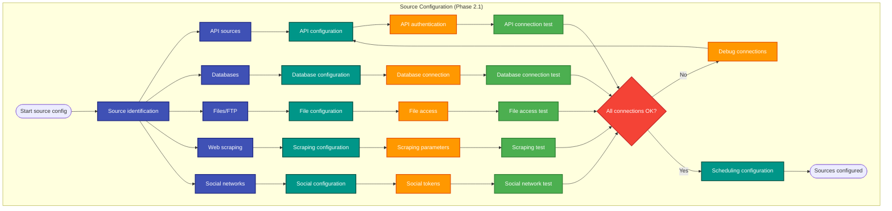

### 2.2 Automated Monitoring

Continuous monitoring of sources and data flows:

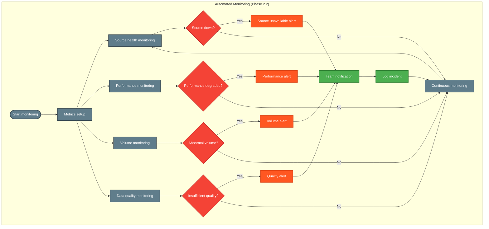

## 🧠 Phase 3: AI Contextual Analysis

### 3.1 Intelligent Contextual Analysis

Semantic processing and data enrichment:

```mermaid
flowchart TD
    subgraph Context["Contextual Analysis (Phase 3.1)"]
        START([Data received]) --> PREPROCESS[Data preprocessing]

        PREPROCESS --> NLP[NLP Processing]
        PREPROCESS --> EXTRACT[Entity extraction]
        PREPROCESS --> CLASSIFY[Automatic classification]

        NLP --> SENTIMENT[Sentiment analysis]
        EXTRACT --> ENTITIES[Named entity recognition]
        CLASSIFY --> TOPICS[Topic classification]

        SENTIMENT --> ENRICH[Contextual enrichment]
        ENTITIES --> ENRICH
        TOPICS --> ENRICH

        ENRICH --> ML_ANALYSIS[Machine Learning analysis]
        ML_ANALYSIS --> INSIGHTS[Insight generation]

        INSIGHTS --> VALIDATE{AI validation}
        VALIDATE -->|Low confidence| HUMAN_REVIEW[Human review]
        VALIDATE -->|High confidence| STORE[Enriched context storage]

        HUMAN_REVIEW --> FEEDBACK[Learning feedback]
        FEEDBACK --> STORE

        STORE --> END([Context analyzed])
    end

    classDef input fill:#2196F3,stroke:#1565C0,stroke-width:2px,color:#fff
    classDef nlp fill:#9C27B0,stroke:#6A1B9A,stroke-width:2px,color:#fff
    classDef ml fill:#FF9800,stroke:#E65100,stroke-width:2px,color:#fff
    classDef validate fill:#4CAF50,stroke:#2E7D32,stroke-width:2px,color:#fff
    classDef human fill:#F44336,stroke:#C62828,stroke-width:2px,color:#fff

    class START,PREPROCESS input
    class NLP,EXTRACT,CLASSIFY,SENTIMENT,ENTITIES,TOPICS nlp
    class ENRICH,ML_ANALYSIS,INSIGHTS ml
    class VALIDATE,STORE validate
    class HUMAN_REVIEW,FEEDBACK human
```

### 3.2 Quality Verification and Evaluation

Automated quality control of processed data:

```mermaid
flowchart TD
    subgraph Quality["Verification and Evaluation (Phase 3.2)"]
        START([Data to verify]) --> INTEGRITY[Integrity verification]

        INTEGRITY --> COMPLETENESS[Completeness check]
        INTEGRITY --> ACCURACY[Accuracy check]
        INTEGRITY --> CONSISTENCY[Consistency check]
        INTEGRITY --> TIMELINESS[Freshness check]

        COMPLETENESS --> SCORE_COMPLETENESS[Completeness score]
        ACCURACY --> SCORE_ACCURACY[Accuracy score]
        CONSISTENCY --> SCORE_CONSISTENCY[Consistency score]
        TIMELINESS --> SCORE_TIMELINESS[Freshness score]

        SCORE_COMPLETENESS --> GLOBAL_SCORE[Global quality score]
        SCORE_ACCURACY --> GLOBAL_SCORE
        SCORE_CONSISTENCY --> GLOBAL_SCORE
        SCORE_TIMELINESS --> GLOBAL_SCORE

        GLOBAL_SCORE --> THRESHOLD{Score > threshold?}

        THRESHOLD -->|No| FLAG[Insufficient quality flag]
        FLAG --> CORRECTION[Correction process]
        CORRECTION --> MANUAL_REVIEW[Manual review]
        MANUAL_REVIEW --> APPROVE{Approval?}
        APPROVE -->|No| REJECT[Data rejection]
        APPROVE -->|Yes| ACCEPT[Accept with reservations]

        THRESHOLD -->|Yes| ACCEPT

        ACCEPT --> STORE[Storage with quality score]
        REJECT --> LOG_REJECTION[Log rejection]

        STORE --> END([Data validated])
        LOG_REJECTION --> END
    end

    classDef check fill:#2196F3,stroke:#1565C0,stroke-width:2px,color:#fff
    classDef score fill:#4CAF50,stroke:#2E7D32,stroke-width:2px,color:#fff
    classDef decision fill:#FF9800,stroke:#E65100,stroke-width:2px,color:#fff
    classDef action fill:#F44336,stroke:#C62828,stroke-width:2px,color:#fff
    classDef storage fill:#9C27B0,stroke:#6A1B9A,stroke-width:2px,color:#fff

    class INTEGRITY,COMPLETENESS,ACCURACY,CONSISTENCY,TIMELINESS check
    class SCORE_COMPLETENESS,SCORE_ACCURACY,SCORE_CONSISTENCY,SCORE_TIMELINESS,GLOBAL_SCORE score
    class THRESHOLD,APPROVE decision
    class FLAG,CORRECTION,MANUAL_REVIEW,ACCEPT,REJECT action
    class STORE,LOG_REJECTION storage
```

### 3.3 ML Pattern Detection

Pattern recognition and machine learning:

```mermaid
flowchart TD
    subgraph Patterns["Pattern Detection (Phase 3.3)"]
        START([Enriched data]) --> FEATURE_EXT[Feature extraction]

        FEATURE_EXT --> CLUSTERING[Unsupervised clustering]
        FEATURE_EXT --> CLASSIFICATION[Supervised classification]
        FEATURE_EXT --> ANOMALY[Anomaly detection]
        FEATURE_EXT --> TRENDS[Trend detection]

        CLUSTERING --> PATTERN_CLUSTER[Clustering patterns]
        CLASSIFICATION --> PATTERN_CLASS[Classification patterns]
        ANOMALY --> PATTERN_ANOMALY[Anomaly patterns]
        TRENDS --> PATTERN_TRENDS[Trend patterns]

        PATTERN_CLUSTER --> VALIDATION[Pattern validation]
        PATTERN_CLASS --> VALIDATION
        PATTERN_ANOMALY --> VALIDATION
        PATTERN_TRENDS --> VALIDATION

        VALIDATION --> CONFIDENCE{Confidence > threshold?}

        CONFIDENCE -->|No| ADJUST[Algorithm adjustment]
        ADJUST --> RETRAIN[Model retraining]
        RETRAIN --> CLUSTERING

        CONFIDENCE -->|Yes| REGISTER[Pattern registration]
        REGISTER --> PREDICT[Prediction generation]

        PREDICT --> ALERT_PATTERNS{Critical pattern detected?}
        ALERT_PATTERNS -->|Yes| GENERATE_ALERT[Alert generation]
        ALERT_PATTERNS -->|No| MONITOR[Continuous monitoring]

        GENERATE_ALERT --> NOTIFY[User notification]
        NOTIFY --> MONITOR

        MONITOR --> END([Patterns detected])
    end

    classDef ml fill:#673AB7,stroke:#4527A0,stroke-width:2px,color:#fff
    classDef pattern fill:#009688,stroke:#004D40,stroke-width:2px,color:#fff
    classDef validation fill:#4CAF50,stroke:#2E7D32,stroke-width:2px,color:#fff
    classDef decision fill:#FF9800,stroke:#E65100,stroke-width:2px,color:#fff
    classDef alert fill:#F44336,stroke:#C62828,stroke-width:2px,color:#fff

    class FEATURE_EXT,CLUSTERING,CLASSIFICATION,ANOMALY,TRENDS,ADJUST,RETRAIN ml
    class PATTERN_CLUSTER,PATTERN_CLASS,PATTERN_ANOMALY,PATTERN_TRENDS,REGISTER,PREDICT pattern
    class VALIDATION,MONITOR validation
    class CONFIDENCE,ALERT_PATTERNS decision
    class GENERATE_ALERT,NOTIFY alert
```

## 🚀 Phase 4: Generation and Interface

### 4.1 Automatic Content Generation

Intelligent creation of personalized content:

```mermaid
flowchart TD
    subgraph Generation["Content Generation (Phase 4.1)"]
        START([Generation trigger]) --> CONTEXT[Context analysis]

        CONTEXT --> TEMPLATE_SEL[Template selection]
        CONTEXT --> DATA_PREP[Data preparation]
        CONTEXT --> PERSONA[Target persona analysis]

        TEMPLATE_SEL --> TEMPLATE_LOAD[Template loading]
        DATA_PREP --> DATA_FILTER[Relevant data filtering]
        PERSONA --> TONE_SETTING[Tone and style configuration]

        TEMPLATE_LOAD --> MERGE[Template + data fusion]
        DATA_FILTER --> MERGE
        TONE_SETTING --> MERGE

        MERGE --> AI_GENERATION[GPT-4 AI generation]
        AI_GENERATION --> CONTENT_DRAFT[Content draft]

        CONTENT_DRAFT --> QUALITY_CHECK[Quality verification]
        QUALITY_CHECK --> GRAMMAR[Grammar check]
        QUALITY_CHECK --> COHERENCE[Coherence check]
        QUALITY_CHECK --> RELEVANCE[Relevance check]

        GRAMMAR --> SCORE_GRAMMAR[Grammar score]
        COHERENCE --> SCORE_COHERENCE[Coherence score]
        RELEVANCE --> SCORE_RELEVANCE[Relevance score]

        SCORE_GRAMMAR --> GLOBAL_QUALITY[Global quality score]
        SCORE_COHERENCE --> GLOBAL_QUALITY
        SCORE_RELEVANCE --> GLOBAL_QUALITY

        GLOBAL_QUALITY --> THRESHOLD{Acceptable quality?}

        THRESHOLD -->|No| REGENERATE[Regeneration with adjustments]
        REGENERATE --> AI_GENERATION

        THRESHOLD -->|Yes| FORMAT[Final formatting]
        FORMAT --> PUBLISH[Publication/Distribution]

        PUBLISH --> END([Content generated and distributed])
    end

    classDef context fill:#2196F3,stroke:#1565C0,stroke-width:2px,color:#fff
    classDef template fill:#9C27B0,stroke:#6A1B9A,stroke-width:2px,color:#fff
    classDef ai fill:#FF9800,stroke:#E65100,stroke-width:2px,color:#fff
    classDef quality fill:#4CAF50,stroke:#2E7D32,stroke-width:2px,color:#fff
    classDef decision fill:#F44336,stroke:#C62828,stroke-width:2px,color:#fff
    classDef output fill:#607D8B,stroke:#37474F,stroke-width:2px,color:#fff

    class START,CONTEXT,DATA_PREP,PERSONA context
    class TEMPLATE_SEL,TEMPLATE_LOAD template
    class AI_GENERATION,CONTENT_DRAFT,REGENERATE ai
    class QUALITY_CHECK,GRAMMAR,COHERENCE,RELEVANCE,SCORE_GRAMMAR,SCORE_COHERENCE,SCORE_RELEVANCE,GLOBAL_QUALITY quality
    class THRESHOLD decision
    class FORMAT,PUBLISH,END output
```

### 4.2 Intelligent Alert System

Contextual notifications and intelligent routing:

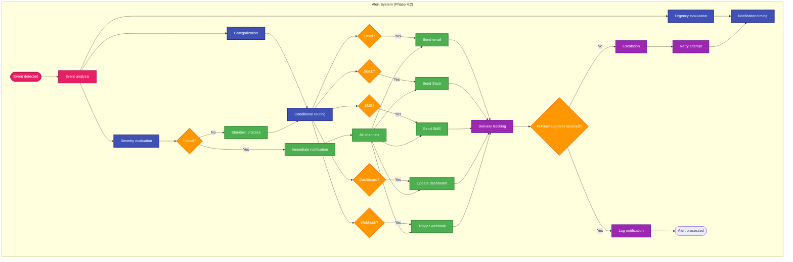

### 4.3 Real-time Collaborative Interface

Collaborative workspace with real-time synchronization:

```mermaid
flowchart TD
    subgraph Collaboration["Collaborative Interface (Phase 4.3)"]
        START([User connects]) --> AUTH[Authentication]

        AUTH --> LOAD_WORKSPACE[Workspace loading]
        LOAD_WORKSPACE --> SYNC_DATA[Data synchronization]

        SYNC_DATA --> UI[User interface]

        UI --> USER_ACTION[User action]
        USER_ACTION --> PERMISSIONS[Permission verification]

        PERMISSIONS --> AUTHORIZED{Authorized?}

        AUTHORIZED -->|No| DENY[Action denied]
        DENY --> ERROR_MSG[Error message]
        ERROR_MSG --> UI

        AUTHORIZED -->|Yes| EXECUTE[Action execution]
        EXECUTE --> UPDATE_LOCAL[Local update]
        UPDATE_LOCAL --> BROADCAST[Team broadcast]

        BROADCAST --> REALTIME_SYNC[Real-time sync]
        REALTIME_SYNC --> UPDATE_UI[Team UI update]

        UPDATE_UI --> CONFLICT{Conflict detected?}
        CONFLICT -->|Yes| RESOLVE_CONFLICT[Conflict resolution]
        RESOLVE_CONFLICT --> MERGE[Modification merge]
        MERGE --> NOTIFY_CONFLICT[Conflict resolved notification]

        CONFLICT -->|No| HISTORY[History recording]
        NOTIFY_CONFLICT --> HISTORY

        HISTORY --> BACKUP[Automatic backup]
        BACKUP --> UI

        UI --> DISCONNECT{Disconnect?}
        DISCONNECT -->|No| USER_ACTION
        DISCONNECT -->|Yes| SAVE_STATE[State save]
        SAVE_STATE --> END([Session ended])
    end

    classDef auth fill:#FF5722,stroke:#D84315,stroke-width:2px,color:#fff
    classDef ui fill:#2196F3,stroke:#1565C0,stroke-width:2px,color:#fff
    classDef action fill:#4CAF50,stroke:#2E7D32,stroke-width:2px,color:#fff
    classDef sync fill:#9C27B0,stroke:#6A1B9A,stroke-width:2px,color:#fff
    classDef decision fill:#FF9800,stroke:#E65100,stroke-width:2px,color:#fff
    classDef conflict fill:#F44336,stroke:#C62828,stroke-width:2px,color:#fff

    class START,AUTH,LOAD_WORKSPACE auth
    class UI,UPDATE_UI,ERROR_MSG ui
    class USER_ACTION,EXECUTE,UPDATE_LOCAL action
    class SYNC_DATA,BROADCAST,REALTIME_SYNC,HISTORY,BACKUP,SAVE_STATE sync
    class PERMISSIONS,AUTHORIZED,DISCONNECT decision
    class CONFLICT,RESOLVE_CONFLICT,MERGE,NOTIFY_CONFLICT conflict
```

## 📈 Phase 5: Business Integration

### 5.1 Business System Integration

Connection and synchronization with enterprise ecosystem:

```mermaid
flowchart TD
    subgraph Integration["Business Integration (Phase 5.1)"]
        START([Integration request]) --> ANALYSIS[Business needs analysis]

        ANALYSIS --> MAPPING[Existing process mapping]
        MAPPING --> SYSTEMS[Target system identification]

        SYSTEMS --> CRM[CRM integration]
        SYSTEMS --> ERP[ERP integration]
        SYSTEMS --> BI[BI integration]
        SYSTEMS --> CUSTOM[Custom systems]

        CRM --> CONFIG_CRM[CRM connector configuration]
        ERP --> CONFIG_ERP[ERP connector configuration]
        BI --> CONFIG_BI[BI connector configuration]
        CUSTOM --> CONFIG_CUSTOM[Custom connector configuration]

        CONFIG_CRM --> TEST_CRM[CRM integration test]
        CONFIG_ERP --> TEST_ERP[ERP integration test]
        CONFIG_BI --> TEST_BI[BI integration test]
        CONFIG_CUSTOM --> TEST_CUSTOM[Custom integration test]

        TEST_CRM --> VALIDATION{All tests OK?}
        TEST_ERP --> VALIDATION
        TEST_BI --> VALIDATION
        TEST_CUSTOM --> VALIDATION

        VALIDATION -->|No| DEBUG[Debug integrations]
        DEBUG --> SYSTEMS

        VALIDATION -->|Yes| DEPLOY[Production deployment]
        DEPLOY --> TRAINING[User training]

        TRAINING --> GOLIVE[Go-live]
        GOLIVE --> MONITORING[Post-deployment monitoring]

        MONITORING --> END([Integration operational])
    end

    classDef analysis fill:#3F51B5,stroke:#1A237E,stroke-width:2px,color:#fff
    classDef systems fill:#009688,stroke:#004D40,stroke-width:2px,color:#fff
    classDef config fill:#FF9800,stroke:#E65100,stroke-width:2px,color:#fff
    classDef test fill:#4CAF50,stroke:#2E7D32,stroke-width:2px,color:#fff
    classDef decision fill:#F44336,stroke:#C62828,stroke-width:2px,color:#fff
    classDef deploy fill:#9C27B0,stroke:#6A1B9A,stroke-width:2px,color:#fff

    class START,ANALYSIS,MAPPING analysis
    class SYSTEMS,CRM,ERP,BI,CUSTOM systems
    class CONFIG_CRM,CONFIG_ERP,CONFIG_BI,CONFIG_CUSTOM,DEBUG config
    class TEST_CRM,TEST_ERP,TEST_BI,TEST_CUSTOM test
    class VALIDATION decision
    class DEPLOY,TRAINING,GOLIVE,MONITORING,END deploy
```

## 🎯 Navigation and Usage

### 📖 Color Legend

- 🟦 **Blue**: Analysis and processing processes
- 🟪 **Purple**: Artificial intelligence and ML
- 🟩 **Green**: Validation and quality control
- 🟨 **Orange**: Decision points
- 🟥 **Red**: Alerts and escalations
- ⬜ **Gray**: Storage and documentation

### 🔗 Useful Links

- **[Workflow overview](workflow-overview.md)** - General presentation
- **[N8N configuration](n8n/index.md)** - Technical implementation
- **[Development guide](development-guide.md)** - Develop new workflows

### 📝 Implementation Notes

All these diagrams are implemented via:

1. **N8N** for workflow orchestration
2. **Specialized AI agents** with dedicated prompts
3. **Internal APIs** for inter-service communication
4. **Database** for state persistence
5. **Redis** for real-time coordination

---

_These diagrams evolve with project development. Check this documentation regularly for updates._
