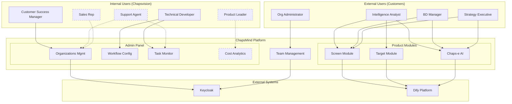

# Stakeholders

<!-- AUTO-GENERATED from agent-os/product/mission.md -->

This document describes the users of ChapsMind, including both external customers and internal team members who use the platform as a unified administration tool.

---

## Platform Vision: Unified Access

ChapsMind serves as a **centralized platform** for both:
- **External Users**: Customers using market intelligence features (Screen, Target, Explore, etc.)
- **Internal Users**: Chapsvision team members managing clients, configuration, and operations

This approach reduces the number of separate applications needed for administration, support, and operations by providing role-specific views within a single frontend.

---

## External Users (Customers)

### Primary Customers

#### Private Companies
Organizations of all sizes working in market intelligence fields. These companies need systematic approaches to tracking competitors, prospects, and market trends.

#### Market Intelligence Teams
Professionals who need to monitor competitors, prospects, and market trends. They require tools that reduce manual research time and provide actionable insights.

#### Business Development Teams
Teams tracking potential partners, acquisition targets, or investment opportunities. They need quick access to comprehensive company profiles.

---

### Customer Personas

#### Intelligence Analyst

| Attribute | Description |
|-----------|-------------|
| **Age Range** | 28-45 |
| **Role** | Market Intelligence Specialist |
| **Context** | Works at a consulting firm or corporate strategy department |
| **Permissions** | `company.view`, `company.create` |

**Pain Points:**
- Manual research is time-consuming
- Data becomes stale quickly
- Difficult to track multiple companies systematically
- Information scattered across multiple sources

**Goals:**
- Automate company research processes
- Get AI-powered insights via Chaps-e
- Maintain up-to-date intelligence on key targets
- Reduce time spent on data gathering

**Primary Needs:**
- Automated data collection for company profiles
- Real-time monitoring via watchfiles (Target module)
- AI assistance for interpreting data (Chaps-e Smart Assist)
- Bulk operations for managing multiple targets

---

#### Business Development Manager

| Attribute | Description |
|-----------|-------------|
| **Age Range** | 30-50 |
| **Role** | BD Lead or Sales Director |
| **Context** | Needs to understand prospects and competitors before meetings and pitches |
| **Permissions** | `company.view`, `company.create` |

**Pain Points:**
- Scattered information across multiple sources
- No single view of a company
- Time spent on manual research before meetings
- Difficulty sharing research with team members

**Goals:**
- Quick access to comprehensive company profiles
- Understand organizational structure
- Identify opportunities and partnerships
- Prepare efficiently for client meetings

**Primary Needs:**
- One-stop company profiles with all relevant data
- Organization-level sharing of company intelligence
- Easy export and presentation of data
- Smart actions tailored to BD goals (Chaps-e Smart Assist)

---

#### Strategy Executive

| Attribute | Description |
|-----------|-------------|
| **Age Range** | 35-55 |
| **Role** | VP Strategy or C-Suite |
| **Context** | Makes decisions about partnerships, acquisitions, and market positioning |
| **Permissions** | `company.view` |

**Pain Points:**
- Information overload
- Difficulty separating signal from noise
- Need for actionable intelligence, not raw data
- Limited time for detailed research

**Goals:**
- High-level insights with drill-down capability
- Trend analysis over time
- Relationship mapping between companies
- Strategic decision support

**Primary Needs:**
- Executive summaries and AI-generated insights
- Dashboard views with key metrics
- Historical trend visualization
- Network analysis for relationship discovery (Explore module)

---

#### Organization Administrator (Customer)

| Attribute | Description |
|-----------|-------------|
| **Role** | IT Admin or Team Lead at customer organization |
| **Context** | Manages user access, organization settings within their organization |
| **Permissions** | `organization.read`, `organization.write` |

**Needs:**
- User and role management within their organization
- Organization settings configuration
- Team member invitation and management
- Usage monitoring within their organization

---

## Internal Users (Chapsvision Team)

ChapsMind provides role-specific admin views for internal team members, eliminating the need for separate admin tools.

### Current Internal Roles

#### Customer Success Manager (CSM)

| Attribute | Description |
|-----------|-------------|
| **Role** | Customer Success Manager |
| **Context** | Manages client relationships, onboarding, and account health |
| **Permissions** | `admin.organizations` |

**Responsibilities:**
- Manage client organizations (create, configure, disable)
- Update token allocations for organizations
- Enable/disable features and modules per client
- Create and manage user accounts
- Monitor client usage and adoption

**Admin Panel Access:**
- Organizations management page
- User account management
- Token allocation interface
- Feature flags per organization

---

#### Technical Developer

| Attribute | Description |
|-----------|-------------|
| **Role** | Backend/Platform Developer |
| **Context** | Maintains platform configuration and debugs production issues |
| **Permissions** | `admin.tasks` |

**Responsibilities:**
- Monitor background task execution
- Debug failed tasks and workflow errors
- Update application configuration

**Admin Panel Access:**
- Task monitoring dashboard (`admin.tasks`)
- System health monitoring

---

### Planned Internal Roles

<!-- TODO: To be implemented as the platform evolves -->

#### Product Leader / Head of Tribe

| Attribute | Description |
|-----------|-------------|
| **Role** | Product Manager or Tribe Lead |
| **Context** | Tracks AI costs and platform economics |
| **Permissions** | `admin.costs` (currently disabled, needs rework) |

**Planned Responsibilities:**
- Monitor AI usage costs across all clients
- Track cost trends and anomalies
- Generate cost reports for budgeting
- Optimize workflow efficiency

**Status:** Permission exists but feature is disabled pending rework.

---

#### Support Agent

<!-- TODO: Define specific permissions and features -->

| Attribute | Description |
|-----------|-------------|
| **Role** | Customer Support / Helpdesk |
| **Context** | Resolves customer issues and handles support tickets |
| **Permissions** | TBD |

**Planned Responsibilities:**
- View client organization details (read-only)
- Access error logs and task failures for debugging
- Impersonate users for troubleshooting (with audit trail)
- Escalate technical issues to developers

**Planned Admin Panel Access:**
- Client organization viewer (read-only)
- Support ticket integration
- Error log viewer
- User session diagnostics

---

#### Sales Representative

<!-- TODO: Define specific permissions and features -->

| Attribute | Description |
|-----------|-------------|
| **Role** | Sales or Account Executive |
| **Context** | Tracks upsell opportunities and client expansion |
| **Permissions** | TBD |

**Planned Responsibilities:**
- View organization usage statistics
- Identify upsell opportunities (module adoption, token usage)
- Access client feature usage reports
- Track trial conversions

**Planned Admin Panel Access:**
- Usage analytics dashboard
- Module adoption reports
- Client health scores
- Expansion opportunity alerts

---

## Stakeholder Interaction Map

**Legend:**
- Solid lines: Current/implemented
- Dashed lines: Planned/future

---

## Permission Summary

### Customer Permissions

| Permission | Description | Typical Users |
|------------|-------------|---------------|
| `company.view` | View company cards and data | All customer users |
| `company.create` | Create new company cards | Analysts, BD managers |
| `company.delete` | Delete company cards | Team leads, admins |
| `organization.read` | View team members | Team members |
| `organization.write` | Manage team and settings | Org administrators |

### Internal Admin Permissions

| Permission | Description | Typical Users | Status |
|------------|-------------|---------------|--------|
| `admin.organizations` | Manage all organizations | CSM | Active |
| `admin.tasks` | Monitor and debug tasks | Developers | Active |
| `admin.costs` | View AI cost analytics | Product Leaders | Disabled (rework needed) |

<!-- TODO: Add permissions for Support and Sales roles when defined -->

---

## Related Documents

- [Context README](./README.md) - Project overview and roadmap
- [Constraints](./constraints.md) - Business, legal, and technical constraints
- [Authorization](../05-security/authorization.md) - Detailed permission documentation
- [Product Mission](../../../agent-os/product/mission.md) - Full product mission and personas
