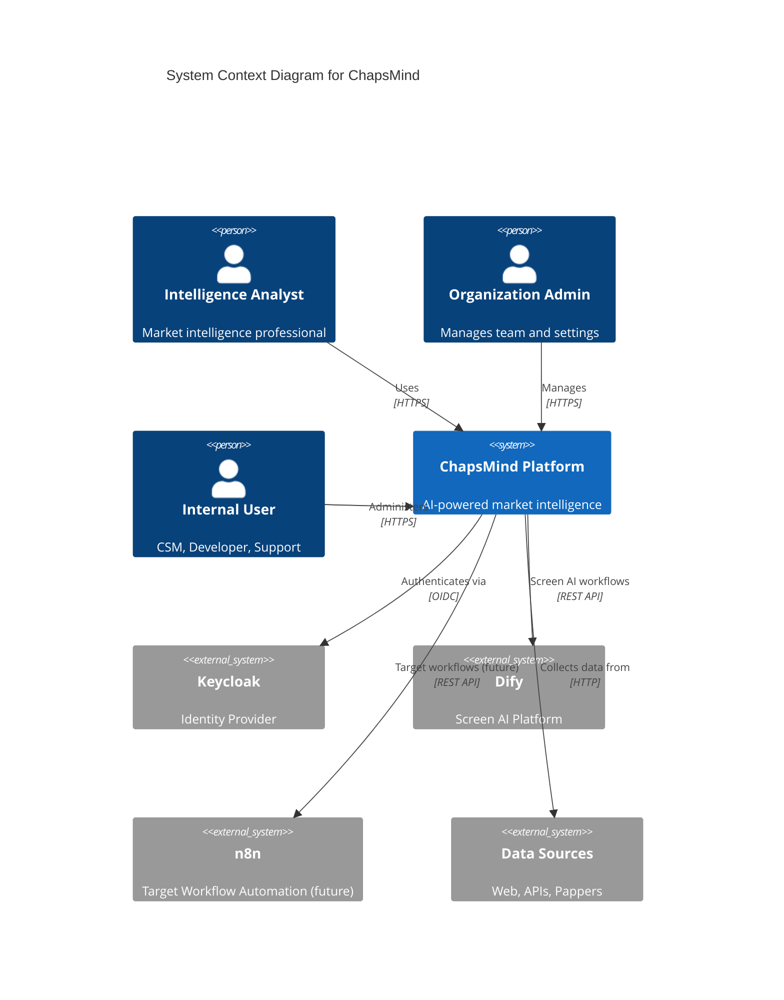
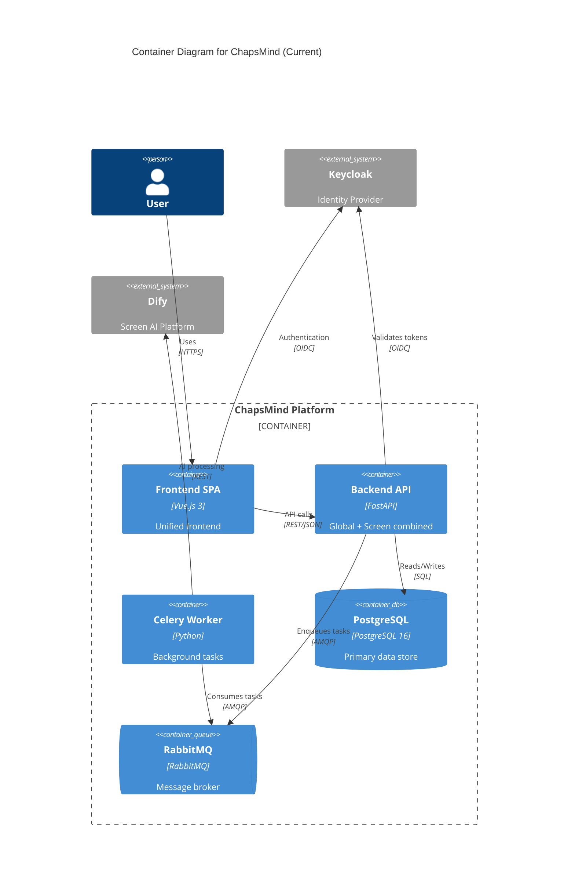

# Application View

This section documents the high-level architecture of the ChapsMind platform, including system context, container architecture, module breakdown, and data flows.

## Purpose

The Application View addresses:

- **System Context**: How ChapsMind fits into the broader ecosystem
- **Container Architecture**: Major deployment units and their interactions
- **Module Design**: Global Services vs Product Modules (Screen, Target, etc.)
- **Data Flows**: How data moves through the system

## Architecture Principles

ChapsMind follows these architectural principles:

1. **Modular Design**: Separation between Global Services (API Gateway) and Product Modules (Screen, Target, Explore)
2. **Module-Specific AI**: Each module may use different AI orchestration (Screen=Dify, Target=n8n)
3. **Single-Auth Multi-Tenant**: Keycloak Organizations for client isolation
4. **Async Processing**: Long-running AI tasks handled by Celery workers
5. **API-First**: RESTful API with auto-generated OpenAPI documentation
6. **Unified Frontend**: Single Vue.js SPA serves all modules

## Architecture Evolution

ChapsMind is evolving from a monolithic to a modular architecture:

| Version          | Description                                          | Status      |
| ---------------- | ---------------------------------------------------- | ----------- |
| **v1 (Current)** | Single FastAPI backend with Global + Screen combined | Active      |
| **v2 (Planned)** | API Gateway + Screen Service                         | In Progress |
| **v3 (Future)**  | API Gateway + Screen + Target + more modules         | Future      |

See [Containers](./containers.md) for detailed architecture diagrams.

## System Context

ChapsMind operates within an ecosystem of external services and user interactions:

## Container Architecture

The platform consists of several deployment units. See [Containers](./containers.md) for full architecture diagrams showing current, planned, and future states.

## Documentation Index

### Core Architecture

| Document                              | Description                                            |
| ------------------------------------- | ------------------------------------------------------ |
| [System Context](./system-context.md) | Detailed C4 Context diagram                            |
| [Containers](./containers.md)         | C4 Container architecture (current + planned + future) |
| [Data Flows](./data-flows.md)         | Data flow sequence diagrams                            |

### Module Architecture

| Document                                                        | Description                            |
| --------------------------------------------------------------- | -------------------------------------- |
| [Modules Overview](./modules/)                                  | Modular architecture philosophy        |
| **Global Services**                                             |                                        |
| [Global Services README](./modules/global-services/)            | API Gateway and cross-cutting services |
| [Auth Service](./modules/global-services/auth-service.md)       | Keycloak integration details           |
| **Screen Module**                                               |                                        |
| [Screen Module README](./modules/screen/)                       | Company screening module overview      |
| [Screen Backend API](./modules/screen/backend-api.md)           | Screen FastAPI service                 |
| [Screen AI Orchestration](./modules/screen/ai-orchestration.md) | Dify workflow integration              |
| **Frontend**                                                    |                                        |
| [Frontend Module](./modules/frontend.md)                        | Vue.js SPA architecture                |

## Related Documentation

- [Development View](../03-development/) - Implementation details
- [Security View](../05-security/) - Authentication and authorization
- [ADR Index](../adr/) - Architecture decisions
- [Stakeholders](../01-context/stakeholders.md) - External and internal users
