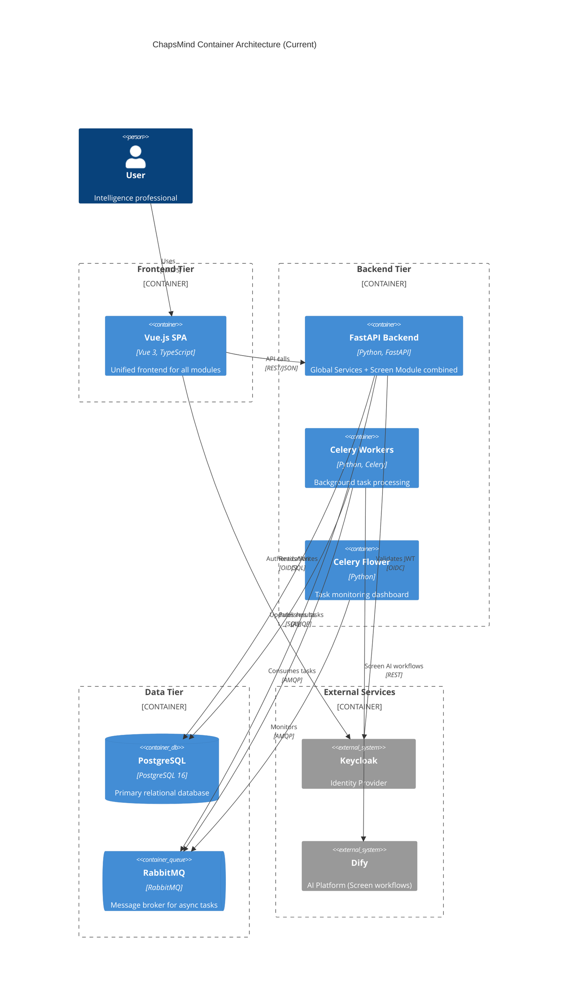
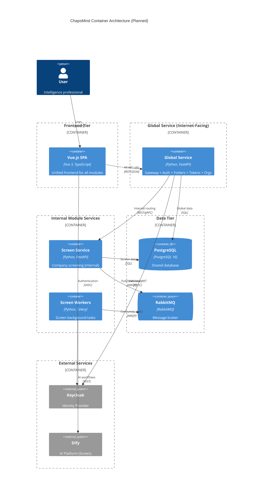
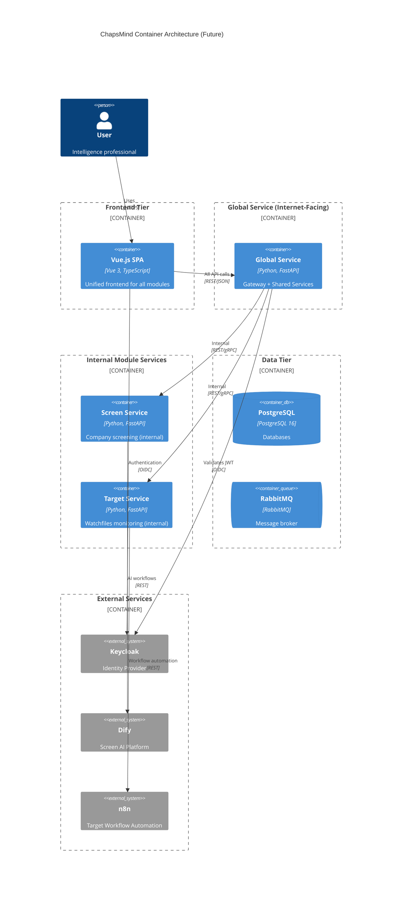

# Container Architecture

This document describes the container-level architecture of ChapsMind, showing the major deployment units and their interactions.

## Architecture Evolution

ChapsMind is evolving from a monolithic architecture to a modular service-based architecture.

### Current Architecture (v1 - Monolithic)

Everything runs in a single FastAPI backend with Global Services and Screen module combined:

### Planned Architecture (v2 - Global Service as Gateway)

Global Service acts as both API Gateway and shared services. Module services are internal only.

**Key Decision**: No separate API Gateway (Kong/Traefik) - Global Service IS the gateway. See [ADR-0009](../adr/0009-global-service-architecture.md).

### Future Architecture (v3 - Multiple Modules)

Multiple internal module services, all accessed through Global Service:

## Containers Overview

### Current Containers

| Container           | Technology                      | Purpose                             |
| ------------------- | ------------------------------- | ----------------------------------- |
| **Vue.js SPA**      | Vue 3, TypeScript, Pinia Colada | Unified user interface              |
| **FastAPI Backend** | Python, FastAPI, SQLAlchemy     | REST API (Global + Screen combined) |
| **Celery Workers**  | Python, Celery                  | Background processing               |
| **Celery Flower**   | Python                          | Task monitoring                     |
| **PostgreSQL**      | PostgreSQL 16                   | Primary database                    |
| **RabbitMQ**        | RabbitMQ                        | Message broker                      |

### Planned Containers

| Container          | Technology        | Purpose                                     |
| ------------------ | ----------------- | ------------------------------------------- |
| **Vue.js SPA**     | Vue 3, TypeScript | Unified frontend                            |
| **Global Service** | Python, FastAPI   | Gateway + Shared Services (internet-facing) |
| **Screen Service** | Python, FastAPI   | Company screening module (internal)         |
| **Screen Workers** | Python, Celery    | Screen background tasks                     |
| **PostgreSQL**     | PostgreSQL 16     | Shared database                             |
| **RabbitMQ**       | RabbitMQ          | Message broker                              |

## Deployment Ports

| Service        | Port        | Environment           |
| -------------- | ----------- | --------------------- |
| Frontend SPA   | 3000        | Development           |
| Global Service | 8000        | All (internet-facing) |
| Screen Service | 8001        | All (internal only)   |
| PostgreSQL     | 5432        | All                   |
| RabbitMQ       | 5672, 15672 | All                   |
| Celery Flower  | 5555        | All                   |

## Related Documentation

- [Modules Overview](./modules/) - Module architecture philosophy
- [Global Services](./modules/global-services/) - Global Service (gateway + shared services)
- [Screen Module](./modules/screen/) - Company screening module
- [Frontend Module](./modules/frontend.md) - Vue.js architecture details
- [Data Flows](./data-flows.md) - Request/response flows
