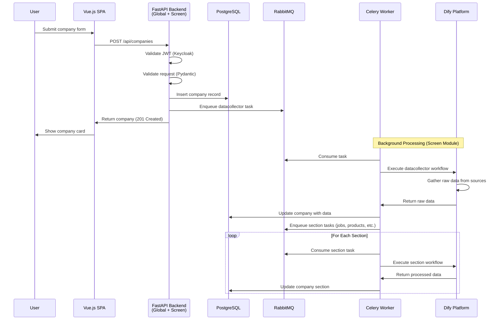
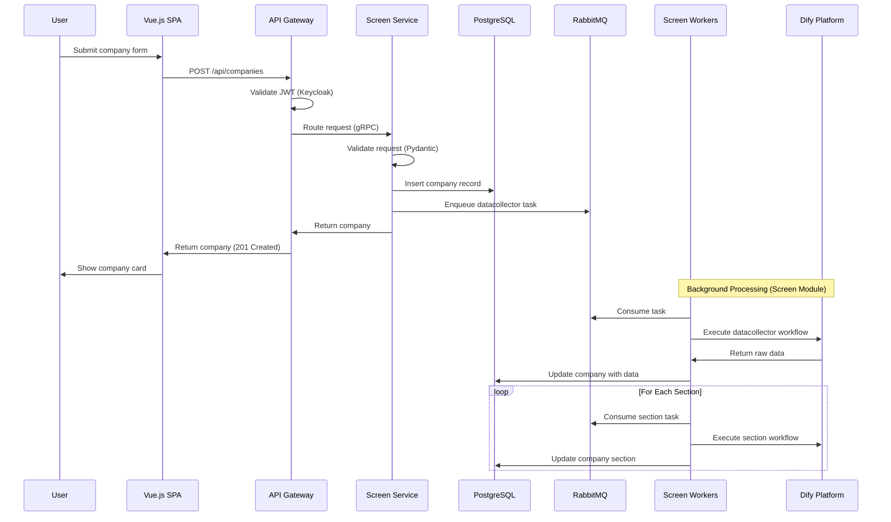
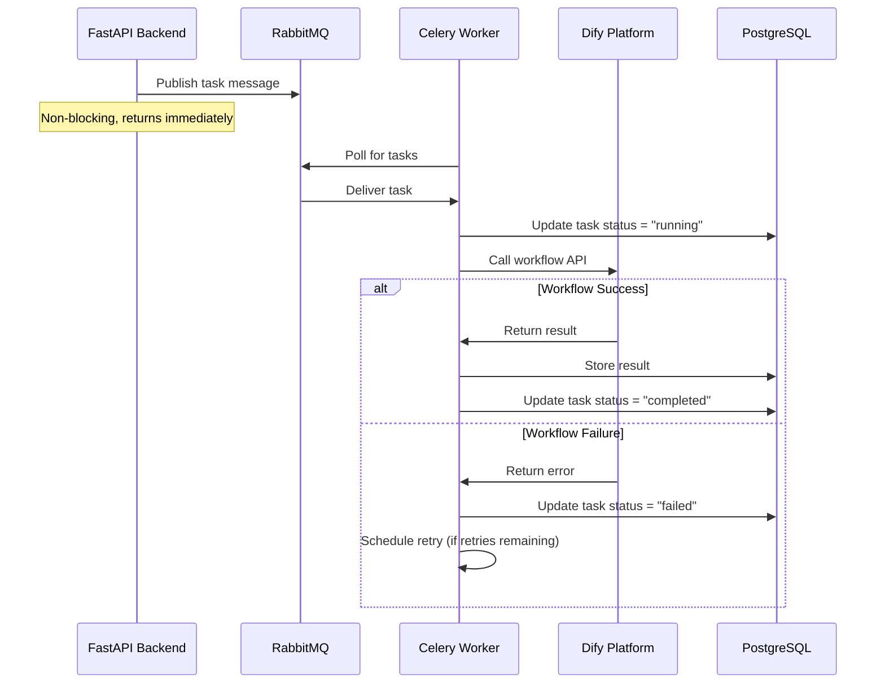
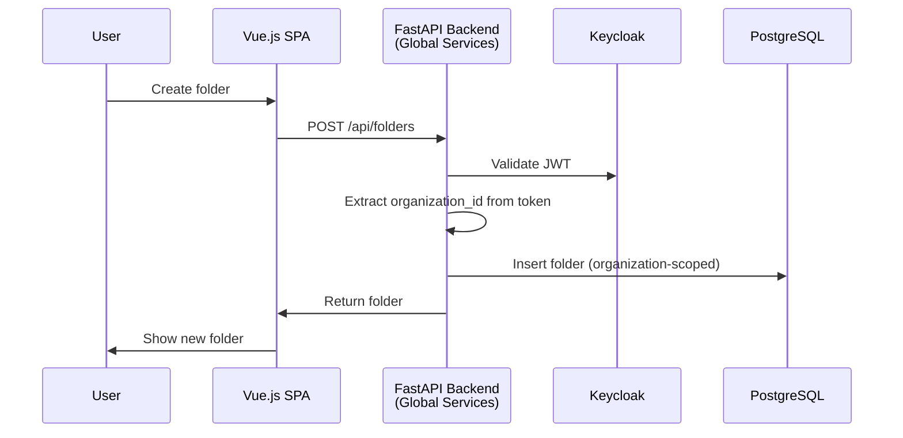
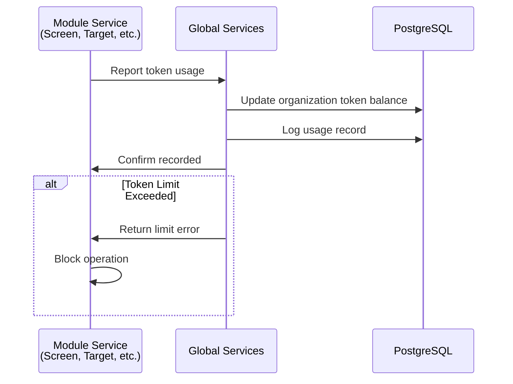
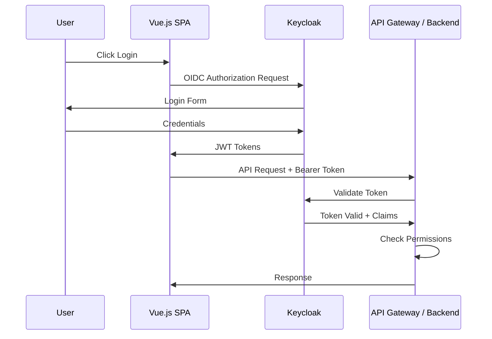

# Data Flows

This document describes the key data flows through the ChapsMind platform, with emphasis on how flows evolve from the current monolithic architecture to the planned modular architecture.

## Architecture Context

Data flows differ based on the architecture version:

| Version          | Description                                 |
| ---------------- | ------------------------------------------- |
| **Current (v1)** | Single FastAPI backend handles all requests |
| **Planned (v2)** | API Gateway routes to module services       |

## Company Creation Flow (Screen Module)

When a user creates a new company card, the system triggers data collection workflows via Dify.

### Current Flow (Monolithic)

### Planned Flow (API Gateway + Screen Service)

## Task Execution Flow (Screen Module)

Tasks are processed asynchronously through Celery with Dify workflows.

### Current Flow

## Global Services Flows

### Folder Operations (Global Service)

Folder operations are handled by Global Services and apply to all modules:

### Organization Token Usage (Global Service)

Token tracking is a global service used by all modules:

## Authentication Flow

Authentication is a global service. See [Authentication](../05-security/authentication.md) for the detailed OIDC flow.

### Summary Flow

## Related Documentation

- [Authentication Flow](../05-security/authentication.md) - Detailed OIDC sequence diagrams
- [Screen AI Orchestration](./modules/screen/ai-orchestration.md) - Dify workflow details
- [Global Services](./modules/global-services/) - Folder, token, sharing services
- [Containers](./containers.md) - Architecture evolution diagrams
