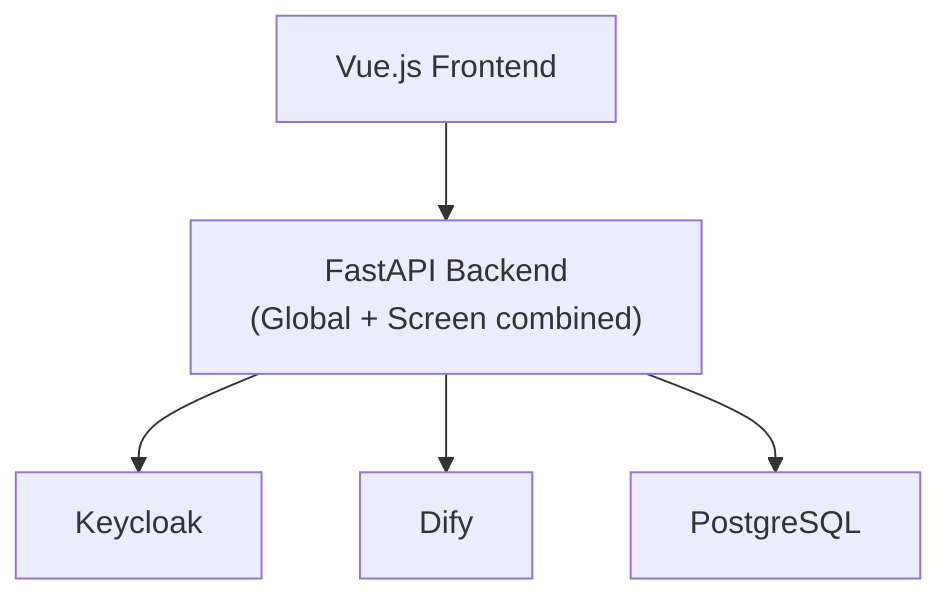
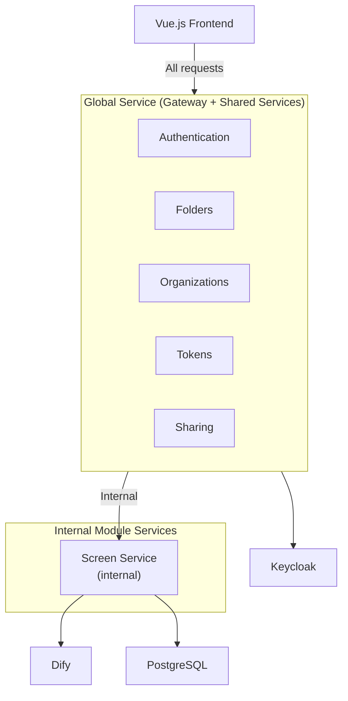
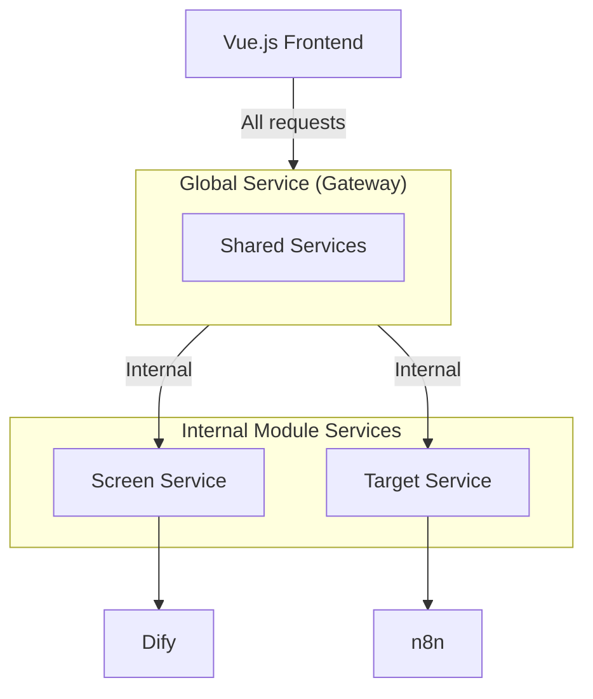

# Modules Overview

ChapsMind follows a **modular architecture** with a clear separation between global platform services and product modules.

## Architecture Philosophy

```text
ChapsMind Platform
│
├── Global Service (API Gateway + Shared Services)
│   └── Single entry point: Gateway + Tokens + Folders + Orgs
│
└── Product Modules (Internal Services)
    ├── Screen (Company Screening) - uses Dify
    ├── Target (Watchfiles) - uses n8n [Q1-Q2 2026]
    ├── Explore (Relationship Discovery) [Future]
    ├── Stream (Intelligence Distribution) [Future]
    └── Discover (Dashboards) [using current separate discover application]
```

**Key Decision**: Global Service IS the API Gateway - no separate Kong/Traefik. See [ADR-0009](../../adr/0009-global-service-architecture.md).

## Global Service vs Product Modules

| Aspect         | Global Service                                         | Product Modules                    |
| -------------- | ------------------------------------------------------ | ---------------------------------- |
| **Scope**      | Platform-wide functionality + Gateway                  | Module-specific features           |
| **Examples**   | Auth, Folders, Organizations, Tokens, Sharing, Routing | Company cards, Watchfiles, Graphs  |
| **Access**     | Internet-facing (single entry point)                   | Internal only (via Global Service) |
| **Deployment** | Single FastAPI service                                 | Separate internal services         |

## Current vs Planned Architecture

### Current Architecture (v1)

Everything runs in a single FastAPI backend:



### Planned Architecture (v2) - In Progress

Global Service acts as both gateway and shared services:



### Future Architecture (v3)

Multiple internal module services:



## Module Documentation Structure

```text
modules/
├── README.md                    # This file
├── frontend.md                  # Unified Vue.js frontend (all modules)
│
├── global-services/             # Global Service (gateway + shared services)
│   ├── README.md               # Overview of global services
│   └── auth-service.md         # Keycloak integration
│
└── screen/                      # Screen Module (internal service)
    ├── README.md               # Screen module overview
    ├── backend-api.md          # Screen FastAPI service
    └── ai-orchestration.md     # Dify integration (Screen-specific)
```

## AI Orchestration by Module

Each module may use different AI/workflow orchestration:

| Module      | AI Platform | Status               |
| ----------- | ----------- | -------------------- |
| **Screen**  | Dify        | Active               |
| **Target**  | n8n         | Planned (Q1-Q2 2026) |
| **Explore** | TBD         | Planned (Q4 2026)    |
| **Stream**  | TBD         | Future               |

## Related Documentation

- [Global Services](./global-services/) - API Gateway and cross-cutting services
- [Screen Module](./screen/) - Company screening module
- [Frontend](./frontend.md) - Unified Vue.js frontend
- [Containers](../containers.md) - Deployment architecture
