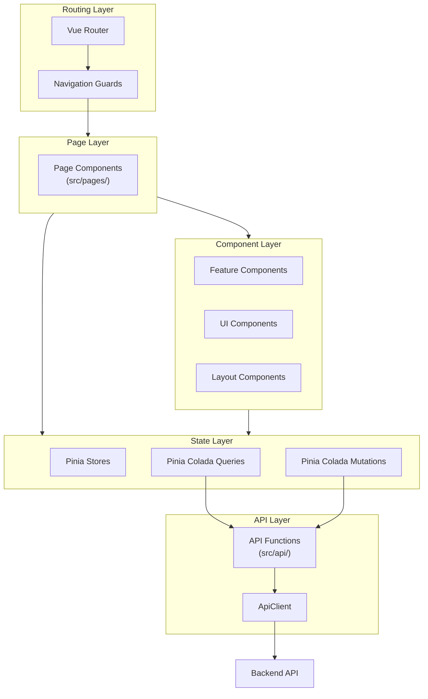

# Frontend Module

<!-- TODO: To be completed - detailed frontend architecture -->

The ChapsMind frontend is a Vue.js 3 single-page application (SPA) using the Composition API and TypeScript.

## Technology Stack

| Category | Technology |
|----------|------------|
| **Framework** | Vue 3 with Composition API |
| **Language** | TypeScript (strict mode) |
| **Build Tool** | Vite 7 |
| **Styling** | Tailwind CSS v4 |
| **State Management** | Pinia + Pinia Colada |
| **Routing** | Vue Router with unplugin-vue-router |
| **i18n** | vue-i18n |

## Architecture Overview



## Directory Structure

```
src/
├── api/              # Pure HTTP functions
├── components/       # Vue components
│   ├── ui/          # Generic UI components
│   ├── layout/      # Layout structure
│   └── features/    # Feature-specific components
├── composables/     # Composition functions (Vue-specific)
├── helpers/         # Reusable helper functions
│   └── cache/       # Cache management helpers for Pinia Colada
├── stores/          # Pinia global stores
├── queries/         # Pinia Colada queries
├── mutations/       # Pinia Colada mutations
├── pages/           # File-based routing
├── types/           # TypeScript interfaces
├── utils/           # Pure utility functions
├── i18n/            # Translations
├── config/          # Configuration files
├── router/          # Vue Router configuration
├── layouts/         # Layout components
└── assets/          # Static assets (CSS, images)
```

### Helpers vs Composables vs Utils

| Folder | Purpose | Example |
|--------|---------|---------|
| `helpers/` | Reusable logic for specific domains (cache, mutations) | `rollbackCacheChanges()`, `updateFolderInCache()` |
| `composables/` | Vue-specific composition functions (use refs, computed) | `useCompanyPermissions()`, `useFolderTree()` |
| `utils/` | Pure utility functions (no Vue dependency) | `formatDate()`, `debounce()` |

## Related Documentation

- [Frontend Architecture](../../03-development/frontend-architecture.md) - Detailed implementation
- [ADR-0001: Vue.js 3](../../adr/0001-vue3-composition-api.md) - Framework decision
- [ADR-0006: Pinia Colada](../../adr/0006-pinia-colada-data-fetching.md) - Data fetching decision
