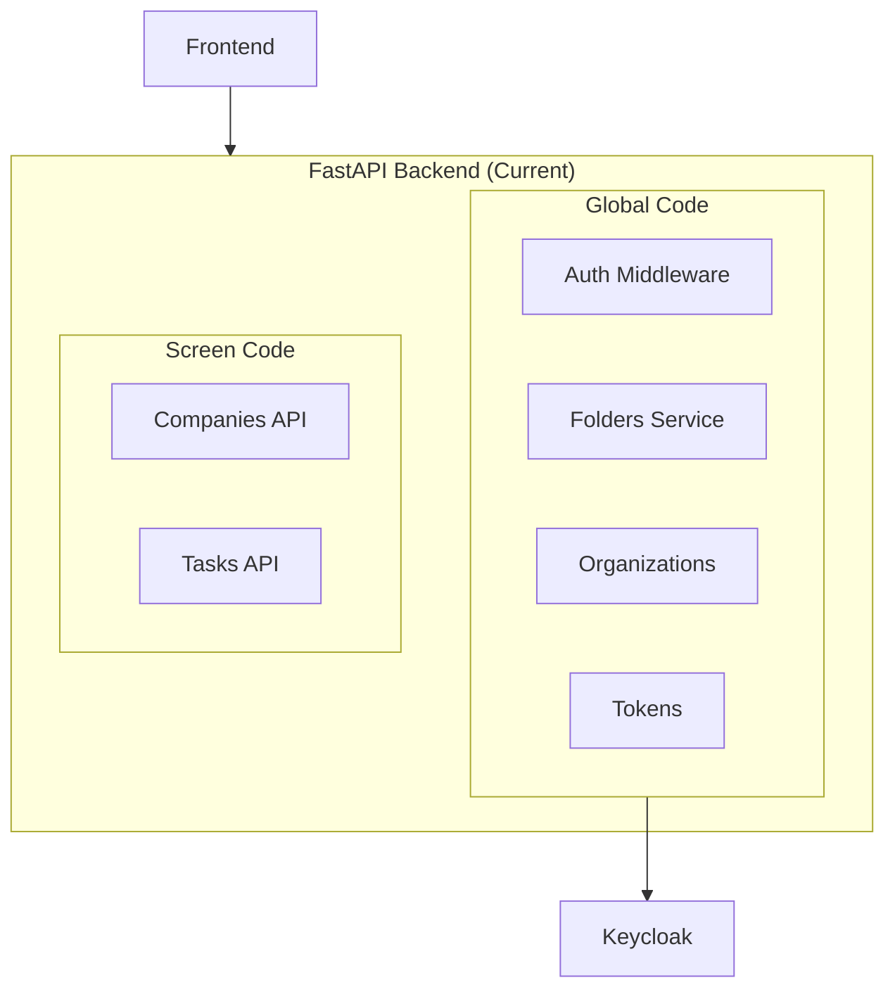
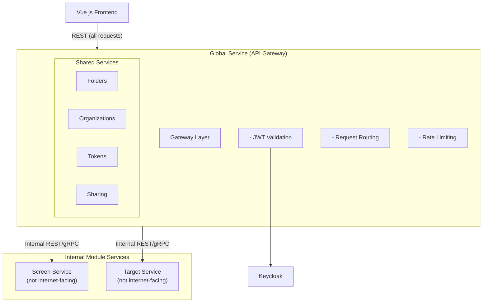
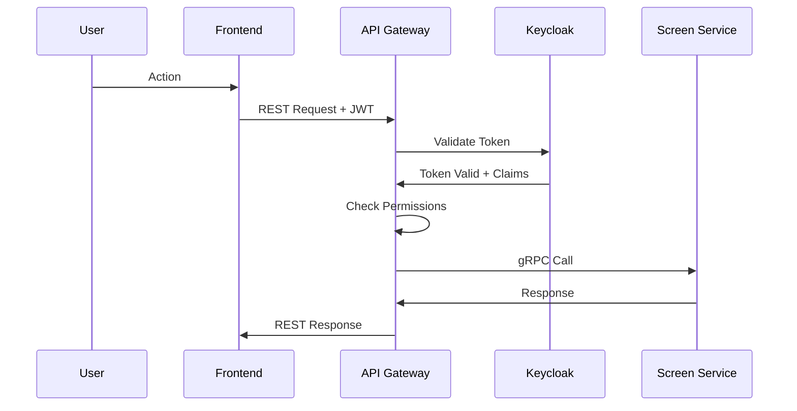

# Global Services (API Gateway)

The Global Service acts as both **API Gateway** and **shared services layer** for ChapsMind. This simplified architecture avoids microservices complexity while enabling module separation.

**Key Decision**: Global Service IS the gateway - there is no separate Kong/Traefik component. See [ADR-0009](../../adr/0009-global-service-architecture.md) for rationale.

## Overview

| Service | Description | Status |
|---------|-------------|--------|
| **Authentication** | Keycloak integration for OIDC auth and JWT validation | Active |
| **Authorization** | Permission checking and role validation | Active |
| **Organizations** | Multi-tenant organization management | Active |
| **Folders** | Folder system for organizing items | Active |
| **Tokens** | Token allocation and usage tracking | Active |
| **Sharing** | Cross-organization sharing capabilities | Planned |
| **Translation** | i18n and localization services | Active |

## Current Architecture

In the current version, global services are embedded within the FastAPI backend alongside Screen module code:

## Planned Architecture (Global Service as Gateway)

Global services will be extracted into a dedicated Global Service that acts as the single entry point:

**Important**: Module services (Screen, Target) are **internal only** - they are not exposed to the internet. Only Global Service is internet-facing.

## Responsibilities

### Authentication & Authorization

- **Frontend Authentication**: Keycloak OIDC flow (handled by frontend → Keycloak directly)
- **Token Validation**: API Gateway validates JWT on every request
- **Permission Checking**: API Gateway verifies `resource.action` permissions
- **Admin Operations**: API Gateway handles Keycloak admin API calls

See [Auth Service](./auth-service.md) for details.

### Organization Management

- Multi-tenant isolation via Keycloak Organizations
- Organization settings and configuration
- Feature flags per organization
- Module access control per organization

### Folder System

- Hierarchical folder structure
- Organization-scoped folders
- Folder sharing between users (future)
- Cross-module folder support (future)

### Token Management

- Token allocation per organization
- Token usage tracking
- Token consumption by module/feature
- Usage reporting and limits

### Translation / i18n

- Centralized translation management
- Locale detection and switching
- Translation key management

## Communication Patterns

### API Gateway → Module Services

| Protocol | Use Case | Notes |
|----------|----------|-------|
| **gRPC** | Preferred for service-to-service | Lower latency, type-safe |
| **REST** | Fallback or specific cases | Simpler debugging |

### Request Flow

## Database

Global services will have their own database tables (or dedicated database) for:

- Folder hierarchy and metadata
- Token allocations and usage logs
- Organization settings (beyond Keycloak)
- Sharing rules and permissions

## Related Documentation

- [Auth Service](./auth-service.md) - Keycloak integration details
- [ADR-0009: Global Service Architecture](../../adr/0009-global-service-architecture.md) - Architecture decision
- [Authorization](../../05-security/authorization.md) - Permission model
- [Containers](../containers.md) - Deployment architecture
