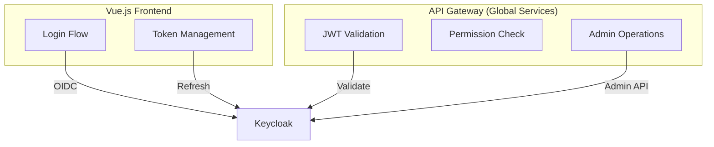
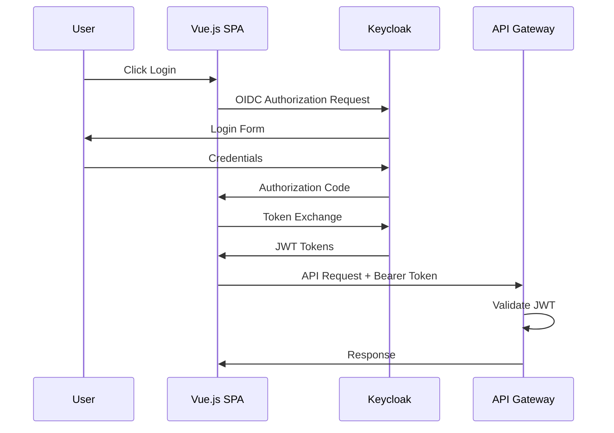
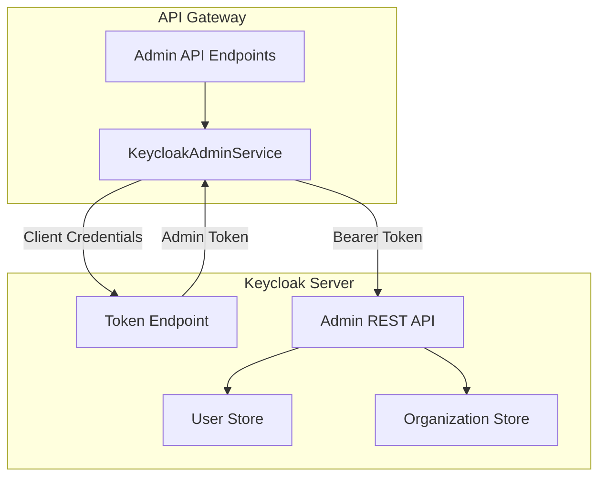

# Auth Service

ChapsMind uses Keycloak as its identity provider, implementing OIDC authentication and Keycloak Organizations for multi-tenancy. Authentication is a **global service** used by all modules.

## Overview

| Aspect                | Description            |
| --------------------- | ---------------------- |
| **Identity Provider** | Keycloak (self-hosted) |
| **Protocol**          | OpenID Connect 1.0     |
| **Token Format**      | JWT (JSON Web Token)   |
| **Multi-Tenancy**     | Keycloak Organizations |

## Integration Points

Authentication integrates with multiple parts of the system:



| Consumer        | Integration    | Purpose                             |
| --------------- | -------------- | ----------------------------------- |
| **Frontend**    | OIDC Direct    | User login, token refresh           |
| **API Gateway** | JWT Validation | Authenticate API requests           |
| **API Gateway** | Admin API      | Manage users, orgs (CSM operations) |

## Key Decisions

1. **No Users Table**: User identity managed entirely in Keycloak (see [ADR-0007](../../../adr/0007-keycloak-user-org-identification.md))
2. **No Organization Members Table**: Membership managed by Keycloak Organizations (see [ADR-0005](../../../adr/0005-multi-tenancy-keycloak-organizations.md))
3. **JWT Validation**: Backend validates tokens using fastapi-keycloak library

## Authentication Flow



## Permission Model

Permissions follow the `resource.action` format and are checked by the API Gateway:

### Customer Permissions

| Permission           | Description          |
| -------------------- | -------------------- |
| `company.view`       | View company cards   |
| `company.create`     | Create company cards |
| `company.delete`     | Delete company cards |
| `organization.read`  | View organization    |
| `organization.write` | Manage organization  |

### Admin Permissions (Internal Users)

| Permission            | Description                     |
| --------------------- | ------------------------------- |
| `admin.organizations` | Manage all client organizations |
| `admin.tasks`         | Monitor background tasks        |
| `admin.costs`         | View AI cost analytics          |

## Keycloak Admin Operations

The API Gateway performs admin operations via Keycloak Admin API using the `KeycloakAdminService` class.

### User Management

| Operation   | Method          | Permission Required   | Use Case                   |
| ----------- | --------------- | --------------------- | -------------------------- |
| Create User | `create_user()` | `admin.organizations` | CSM creates client user    |
| Get User    | `get_user()`    | `admin.organizations` | View user details          |
| Get Users   | `get_users()`   | `admin.organizations` | List all users (paginated) |
| Update User | `update_user()` | `admin.organizations` | Modify user profile        |
| Delete User | `delete_user()` | `admin.organizations` | Remove user from system    |
| Count Users | `count_users()` | `admin.organizations` | Get total user count       |

### Password Management

| Operation                 | Method                        | Permission Required   | Use Case                          |
| ------------------------- | ----------------------------- | --------------------- | --------------------------------- |
| Send Password Reset Email | `send_password_reset_email()` | `admin.organizations` | Trigger email-based reset         |
| Set User Password         | `set_user_password()`         | `admin.organizations` | Direct password reset (temporary) |

### Role Management

| Operation              | Method                           | Permission Required   | Use Case                        |
| ---------------------- | -------------------------------- | --------------------- | ------------------------------- |
| Get Realm Roles        | `get_realm_roles()`              | `admin.organizations` | List all available roles        |
| Get User Realm Roles   | `get_user_realm_roles()`         | `admin.organizations` | View user's assigned roles      |
| Assign Roles to User   | `assign_realm_roles_to_user()`   | `admin.organizations` | Grant permissions to user       |
| Remove Roles from User | `remove_realm_roles_from_user()` | `admin.organizations` | Revoke user permissions         |
| Sync User Roles        | `sync_user_realm_roles()`        | `admin.organizations` | Sync roles to match target list |

### Organization Management

| Operation                     | Method                            | Permission Required   | Use Case                      |
| ----------------------------- | --------------------------------- | --------------------- | ----------------------------- |
| Get Organizations             | `get_organizations()`             | `admin.organizations` | List all client organizations |
| Get Organization              | `get_organization()`              | `admin.organizations` | View organization details     |
| Get Organization Members      | `get_organization_members()`      | `admin.organizations` | List users in organization    |
| Count Organization Members    | `count_organization_members()`    | `admin.organizations` | Get member count              |
| Add User to Organization      | `add_user_to_organization()`      | `admin.organizations` | Assign user to client org     |
| Remove User from Organization | `remove_user_from_organization()` | `admin.organizations` | Remove user from org          |
| Get User Organizations        | `get_user_organizations()`        | `admin.organizations` | List orgs user belongs to     |

### Session Management

| Operation                | Method                       | Permission Required   | Use Case                      |
| ------------------------ | ---------------------------- | --------------------- | ----------------------------- |
| Get User Sessions        | `get_user_sessions()`        | `admin.organizations` | View active user sessions     |
| Revoke Session           | `revoke_session()`           | `admin.organizations` | Logout specific session       |
| Revoke All User Sessions | `revoke_all_user_sessions()` | `admin.organizations` | Force logout from all devices |

### Event Tracking

| Operation       | Method              | Permission Required   | Use Case                                     |
| --------------- | ------------------- | --------------------- | -------------------------------------------- |
| Get User Events | `get_user_events()` | `admin.organizations` | View user activity log (login, logout, etc.) |

## Admin Service Architecture



### Token Management

The admin service uses client credentials grant with automatic token caching:

```python
class KeycloakAdminService:
    async def _get_admin_token(self) -> str:
        """Get admin access token with caching and thread-safety."""
        # Token cached for ~5 minutes (expires_in - 30 seconds buffer)
        # Automatic retry logic (3 attempts with exponential backoff)
        # Thread-safe token refresh using asyncio.Lock
```

## Related Documentation

- [Authentication](../../../05-security/authentication.md) - Detailed OIDC flow
- [Authorization](../../../05-security/authorization.md) - RBAC documentation
- [Global Services](./README.md) - API Gateway overview
- [ADR-0003: Keycloak Authentication](../../../adr/0003-keycloak-authentication.md)
- [ADR-0005: Multi-Tenancy](../../../adr/0005-multi-tenancy-keycloak-organizations.md)
- [ADR-0007: User/Org Identification](../../../adr/0007-keycloak-user-org-identification.md)
