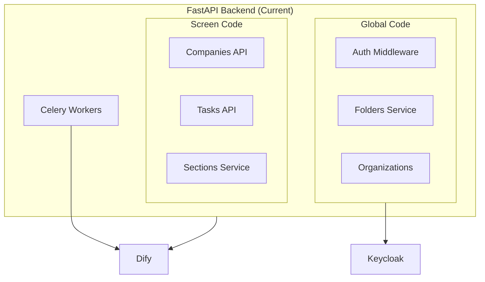
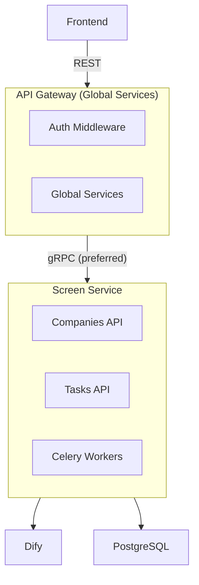

# Screen Module

The **Screen module** provides company screening and intelligence capabilities. Users can create company cards to gather AI-powered insights about companies they want to monitor.

## Overview

| Aspect           | Description                                                 |
| ---------------- | ----------------------------------------------------------- |
| **Purpose**      | Company screening and intelligence                          |
| **AI Platform**  | Dify (for workflows and AI analysis)                        |
| **Status**       | Active (current production module)                          |
| **Key Features** | Company cards, AI-powered data collection, section analysis |

## Module Responsibilities

The Screen module handles:

- **Company Card Creation**: Users search for and create company cards
- **Data Collection**: AI workflows gather information from various sources
- **Section Analysis**: Specialized workflows process company sections (jobs, products, CSR, etc.)
- **AI Summarization**: Generate insights and summaries via Dify
- **Task Management**: Track background task execution status

## Architecture

### Current Architecture

In the current version, Screen module code is embedded within the main FastAPI backend:



### Planned Architecture

Screen will be extracted to a dedicated service:



## Key Entities

### Company

Company cards are the core entity of the Screen module:

```python
class Company:
    id: int
    name: str
    organization_id: str  # Keycloak org UUID (multi-tenancy)
    owner_id: str         # Keycloak user UUID
    folder_id: int        # Global folder system
    status: str           # pending, active, error

    # Section data (populated by Dify workflows)
    jobs_data: dict
    products_data: dict
    team_data: dict
    csr_data: dict
    # ... other sections
```

### Task

Tasks track AI workflow execution:

```python
class Task:
    id: int
    company_id: int
    type: str           # datacollector, jobs, products, etc.
    status: str         # pending, running, completed, failed
    result: dict        # Workflow output
    error: str          # Error message if failed
```

## Data Flow

1. **User creates company** → Company record created
2. **Datacollector task** → Dify gathers raw data from sources
3. **Section tasks** → Dify processes each section (jobs, products, etc.)
4. **Results stored** → Company data updated in database
5. **Frontend refreshes** → User sees complete company card

See [AI Orchestration](./ai-orchestration.md) for detailed workflow architecture.

## Integration Points

| Consumer        | Protocol       | Purpose                            |
| --------------- | -------------- | ---------------------------------- |
| **Frontend**    | REST           | Display companies, trigger actions |
| **API Gateway** | gRPC (planned) | Route authenticated requests       |
| **Dify**        | REST           | AI workflow execution              |
| **PostgreSQL**  | SQL            | Company and task data storage      |
| **RabbitMQ**    | AMQP           | Celery task queue                  |

## Related Documentation

- [Backend API](./backend-api.md) - FastAPI service patterns
- [AI Orchestration](./ai-orchestration.md) - Dify workflow details
- [Global Services](../global-services/) - Shared platform services
- [Data Flows](../../data-flows.md) - End-to-end data sequences
- [ADR-0004: Dify AI Orchestration](../../../adr/0004-dify-ai-orchestration.md)
