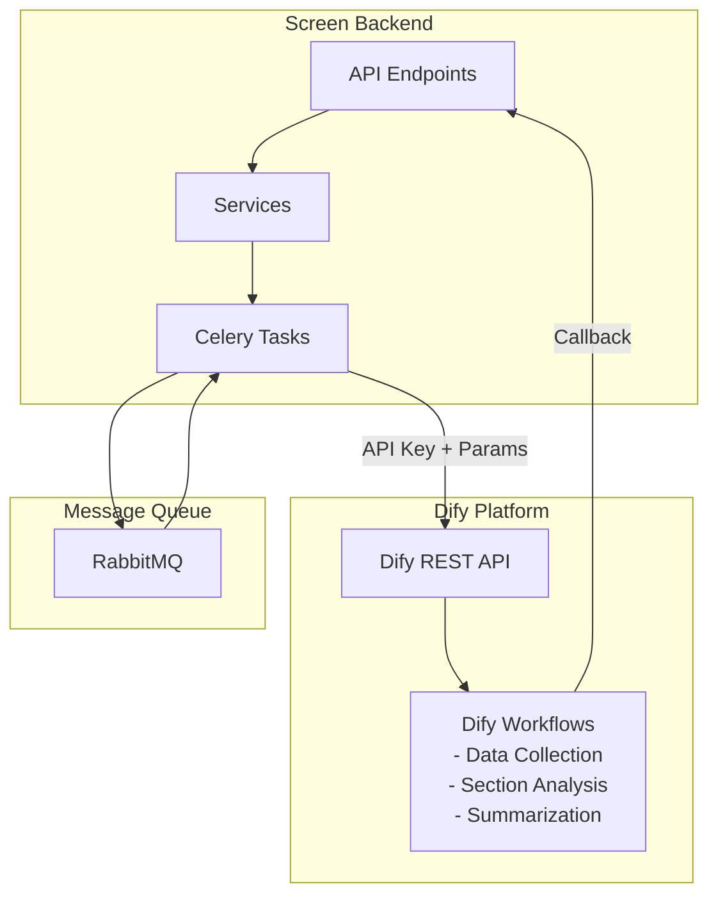
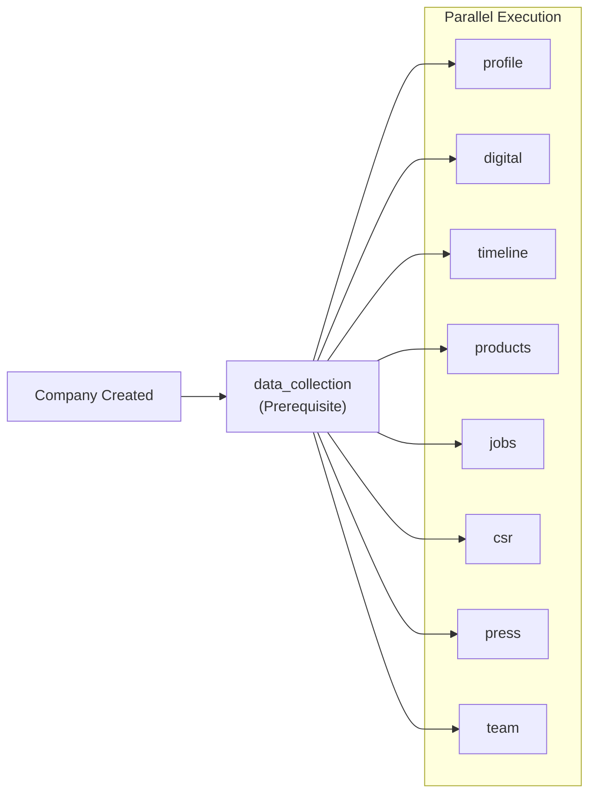
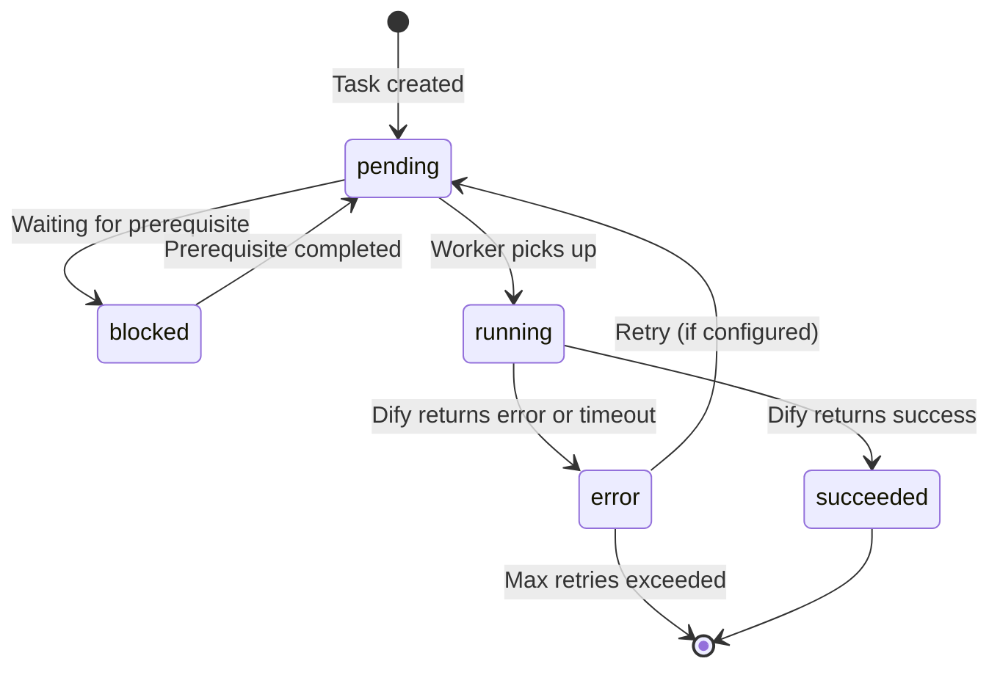

# Screen AI Orchestration

The **Screen module** uses **Dify** as its AI orchestration platform for all company screening workflows. The backend calls Dify via REST API with workflow-specific API keys, and Dify calls back to the backend with results.

> **Note**: Each ChapsMind module may use different AI/workflow orchestration platforms. Screen uses Dify, while Target (planned) will use n8n. See [Modules Overview](../README.md) for details.

## Technology Stack

| Component    | Purpose                                                                |
| ------------ | ---------------------------------------------------------------------- |
| **Dify**     | LLM orchestration, AI workflows, intelligent analysis, data collection |
| **Celery**   | Task queue orchestration between backend and Dify                      |
| **RabbitMQ** | Message broker for async task processing                               |

## Architecture Overview



## Workflow Architecture

When a company is created, tasks are executed in a specific order:

1. **Data Collection Task** runs first (prerequisite) to gather raw data from sources
2. **Section Tasks** run in parallel after data collection completes
3. Results are stored in PostgreSQL and displayed to the user



## Task Types

The complete list of task types defined in the system:

| Task Type           | Purpose                                  | Prerequisite     | Trigger               |
| ------------------- | ---------------------------------------- | ---------------- | --------------------- |
| **data_collection** | Gather raw company data from web sources | Yes (runs first) | Company creation      |
| **profile**         | Company profile and basic information    | No               | After data_collection |
| **digital**         | Digital presence and online metrics      | No               | After data_collection |
| **timeline**        | Company history and key events           | No               | After data_collection |
| **products**        | Products and services offered            | No               | After data_collection |
| **jobs**            | Job postings and hiring information      | No               | After data_collection |
| **csr**             | Corporate social responsibility data     | No               | After data_collection |
| **press**           | News and press releases                  | No               | After data_collection |
| **team**            | Leadership and team information          | No               | After data_collection |

## Concurrency Configuration

Parallel task execution is controlled by Celery worker configuration:

| Setting                    | Default | Description                                             |
| -------------------------- | ------- | ------------------------------------------------------- |
| `MAX_CONCURRENT_WORKFLOWS` | 10      | Maximum number of Dify workflows running simultaneously |
| `TASK_TIMEOUT_MINUTES`     | 5       | Tasks running longer are marked as stale/error          |

```python
# app/core/config.py
class Settings(BaseSettings):
    MAX_CONCURRENT_WORKFLOWS: int = 10  # Controls parallel Dify executions
    TASK_TIMEOUT_MINUTES: int = 5       # Stale task detection threshold
```

### Concurrency Manager

The `DifyConcurrencyManager` class manages parallel workflow execution:

```python
# app/core/concurrency.py
class DifyConcurrencyManager:
    def __init__(self, db: Session, max_concurrent: int = None):
        self.max_concurrent = max_concurrent or settings.MAX_CONCURRENT_WORKFLOWS

    def can_start_workflow(self) -> bool:
        """Check if we can start a new workflow based on RUNNING tasks in database."""
        running_count = self.db.query(Task).filter(Task.status == TaskStatus.RUNNING).count()
        return running_count < self.max_concurrent

    def wait_for_available_slot(self, task_id: int, max_wait_time: int = 300) -> bool:
        """Wait for an available workflow slot (max 5 minutes by default)."""
        # Polls every 5 seconds until slot available or timeout
```

## Task Dependency System

Tasks use a dependency system to ensure proper execution order:

```python
# Task model with dependency tracking
class Task(Base):
    is_prerequisite = Column(Boolean, default=False)  # Marks prerequisite tasks

    # Dependency relationships
    dependencies = relationship("TaskDependency", ...)
    dependents = relationship("TaskDependency", ...)

class TaskDependency(Base):
    task_id = Column(Integer, ForeignKey("tasks.id"))
    depends_on_task_id = Column(Integer, ForeignKey("tasks.id"))
```

## Task Status Flow



## Dify Integration

### API Configuration

Each workflow type has its own API key configured in the `workflow_configs` table:

```python
class WorkflowConfig:
    id: int
    task_type: str        # data_collection, profile, products, etc.
    api_endpoint: str     # Dify API URL
    api_key: str          # Workflow-specific API key
    organization_id: str  # Multi-tenant configuration
```

### Workflow Execution

```python
# Celery task calls Dify workflow
@celery_app.task(name='execute_dify_workflow', queue='dify_workflows')
def execute_dify_workflow(
    task_id: int,
    company_id: int,
    task_type: str,
    api_key: str,
    success_callback: str,
    error_callback: str,
    token_callback: str,
    llm: str = "mistral"
):
    """Execute Dify workflow with dynamic concurrency control."""
    with SessionLocal() as db:
        concurrency_manager = DifyConcurrencyManager(db)

        # Wait for available slot (max 5 minutes)
        if not concurrency_manager.wait_for_available_slot(task_id, max_wait_time=300):
            task.status = TaskStatus.ERROR
            task.error = "Timeout waiting for available workflow slot"
            return

        # Execute Dify workflow
        dify_service = DifyService(db=db)
        result = await dify_service.run_workflow(
            task_type=task_type,
            company_name=company.name,
            website=company.website,
            api_key=api_key,
            ...
        )
```

### Callback Handling

Dify calls back to the backend API to deliver results:

```python
@router.post("/api/dify/callback")
def dify_callback(payload: DifyCallbackPayload):
    """Handle callback from Dify workflow completion."""
    task = get_task(payload.task_id)
    task.status = "succeeded"
    task.result = payload.data
    save_task(task)
```

## Error Handling

| Error Type        | Handling                                            |
| ----------------- | --------------------------------------------------- |
| Dify timeout      | Task marked as ERROR after `TASK_TIMEOUT_MINUTES`   |
| Dify API error    | Mark task as failed, log error                      |
| Concurrency limit | Wait up to 5 minutes for slot, then error           |
| Rate limiting     | Queue delay, retry later                            |
| Stale tasks       | Periodic cleanup marks stuck RUNNING tasks as ERROR |

### Stale Task Cleanup

A periodic Celery task cleans up tasks stuck in RUNNING state:

```python
@celery_app.task(name='cleanup_stale_running_tasks')
def cleanup_stale_running_tasks():
    """Runs every 2 minutes, marks tasks as ERROR if running > 10 minutes."""
```

## Related Documentation

- [Screen Module Overview](./README.md) - Module architecture
- [Backend API](./backend-api.md) - Service layer patterns
- [Data Flows](../../data-flows.md) - Task execution sequences
- [Backend Architecture](../../../03-development/backend-architecture.md) - Celery integration
- [ADR-0004: Dify AI Orchestration](../../../adr/0004-dify-ai-orchestration.md)
