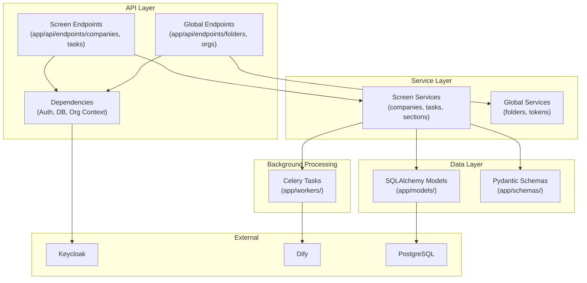
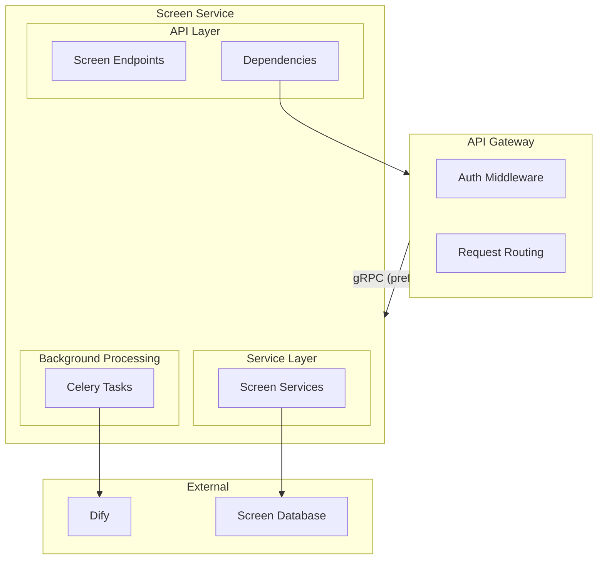

# Screen Backend API

<!-- TODO: To be completed - detailed backend architecture -->

The Screen module backend is part of the FastAPI application, providing REST API endpoints for company screening functionality with SQLAlchemy ORM and Celery task processing.

## Technology Stack

| Category        | Technology           |
| --------------- | -------------------- |
| **Framework**   | FastAPI              |
| **Language**    | Python 3.9+          |
| **ORM**         | SQLAlchemy 2.x       |
| **Validation**  | Pydantic v2          |
| **Migrations**  | Alembic              |
| **Task Queue**  | Celery with RabbitMQ |
| **Auth**        | fastapi-keycloak     |
| **AI Platform** | Dify                 |

## Architecture Overview

### Current Architecture

In the current version, Screen module code is embedded with Global Services in a single backend:



### Planned Architecture

Screen endpoints will be extracted to a dedicated service communicating with API Gateway:



## Directory Structure

### Current Structure (Combined Backend)

```text
app/
├── api/
│   └── endpoints/
│       ├── companies.py     # Screen: Company endpoints
│       ├── tasks.py         # Screen: Task endpoints
│       ├── folders.py       # Global: Folder endpoints
│       └── organizations.py # Global: Org endpoints
├── core/                    # Core configuration
├── models/
│   ├── company.py          # Screen: Company model
│   ├── task.py             # Screen: Task model
│   └── folder.py           # Global: Folder model
├── schemas/                 # Pydantic schemas
├── services/
│   ├── company_service.py  # Screen: Company business logic
│   └── folder_service.py   # Global: Folder business logic
├── infrastructure/          # External service clients
├── workers/
│   └── dify_tasks.py       # Screen: Dify workflow tasks
└── main.py                  # Application entry
```

### Planned Structure (Screen Service)

```text
screen-service/
├── api/
│   └── endpoints/
│       ├── companies.py
│       ├── tasks.py
│       └── sections.py
├── core/
├── models/
│   ├── company.py
│   └── task.py
├── schemas/
├── services/
│   ├── company_service.py
│   └── section_service.py
├── workers/
│   └── dify_tasks.py
└── main.py
```

## Key Endpoints

| Endpoint                    | Method | Purpose                          |
| --------------------------- | ------ | -------------------------------- |
| `/api/companies`            | GET    | List companies (filtered by org) |
| `/api/companies`            | POST   | Create company card              |
| `/api/companies/{id}`       | GET    | Get company details              |
| `/api/companies/{id}`       | DELETE | Delete company                   |
| `/api/companies/{id}/tasks` | GET    | List company tasks               |
| `/api/companies/{id}/tasks` | POST   | Trigger task execution           |

## Related Documentation

- [Screen Module Overview](./README.md) - Module purpose and architecture
- [AI Orchestration](./ai-orchestration.md) - Dify workflow integration
- [Backend Architecture](../../../03-development/backend-architecture.md) - Detailed implementation
- [ADR-0002: FastAPI Backend](../../../adr/0002-fastapi-backend.md) - Framework decision
- [API Contracts](../../../03-development/api-contracts.md) - API patterns
