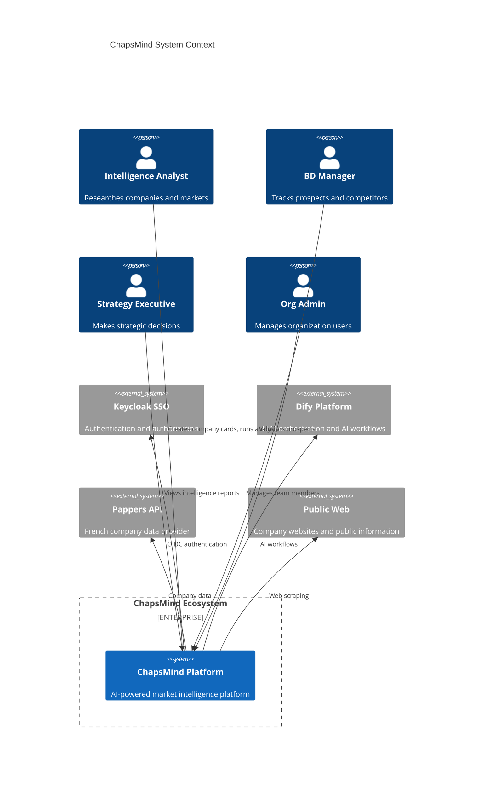

# System Context

<!-- TODO: To be completed - detailed C4 Context diagram and description -->

This document provides the detailed system context view showing how ChapsMind interacts with external systems and actors.

## C4 Context Diagram

## External Systems

| System | Purpose | Integration |
|--------|---------|-------------|
| **Keycloak** | Identity management, SSO | OIDC protocol |
| **Dify** | AI/LLM workflow orchestration | REST API with callbacks |
| **Pappers** | French company data | REST API |
| **Public Web** | Company information | Web scraping |

## Related Documentation

- [Containers](./containers.md) - Internal container architecture
- [Auth Service](./modules/auth-service.md) - Keycloak integration details
- [AI Orchestration](./modules/ai-orchestration.md) - Dify integration
