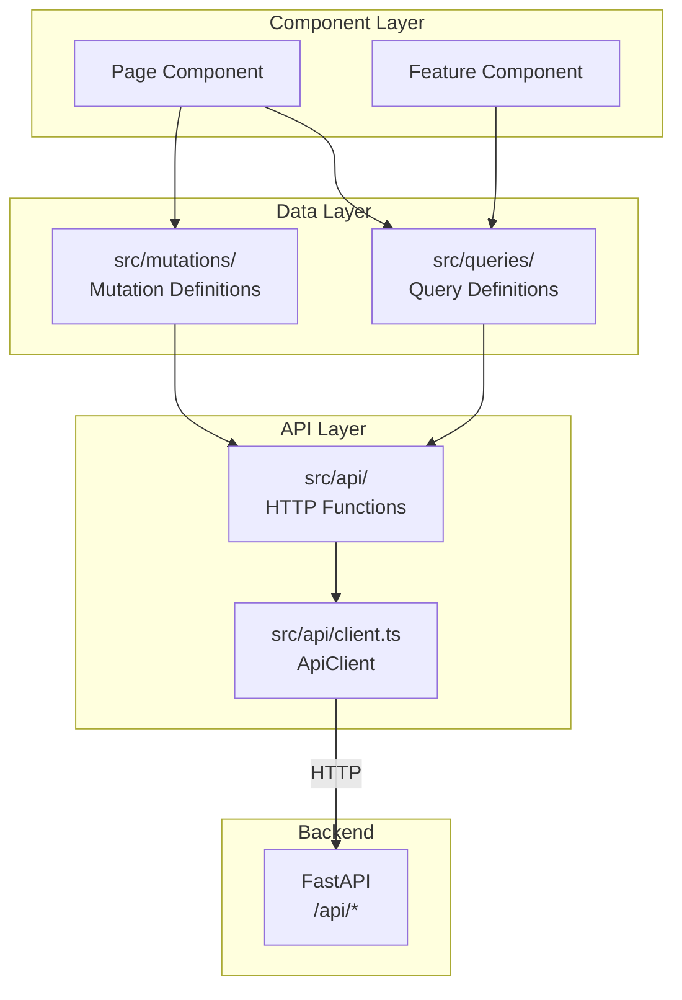

# API Contracts

This document describes how the frontend and backend communicate, including API patterns, data fetching strategies, and contract definitions.

## API Documentation

### Live API Documentation

The backend automatically generates OpenAPI documentation:

| Endpoint | Description |
|----------|-------------|
| **`/docs`** | Swagger UI - Interactive API explorer with try-it-out functionality |
| **`/redoc`** | ReDoc - Clean, readable API documentation |
| **`/openapi.json`** | Raw OpenAPI 3.0 schema for code generation |

> **Note**: The OpenAPI specification at `/docs` is the authoritative source for API contracts. This document describes patterns and conventions, not individual endpoints.

## Frontend API Architecture

The frontend uses a three-layer approach for data fetching:



### Layer Responsibilities

| Layer | Location | Responsibility |
|-------|----------|---------------|
| **Queries** | `src/queries/` | Define cached queries with Pinia Colada |
| **Mutations** | `src/mutations/` | Define mutations with cache invalidation |
| **API Functions** | `src/api/` | Pure functions that make HTTP calls |
| **ApiClient** | `src/api/client.ts` | HTTP wrapper with auth token handling |

## API Functions Layer (`src/api/`)

Pure functions that wrap HTTP calls with TypeScript types:

```typescript
// src/api/companies.ts
import { apiClient } from './client'
import type { Company, CompanyCreate, PaginatedResponse } from '@/types'

// GET single resource
export async function getCompanyById(id: string): Promise<Company> {
  return apiClient.get<Company>(`/companies/${id}`)
}

// GET list with pagination
export async function getCompanies(filters: {
  page: number
  size: number
}): Promise<PaginatedResponse<Company>> {
  const params = new URLSearchParams({
    page: filters.page.toString(),
    size: filters.size.toString(),
  })
  return apiClient.get<PaginatedResponse<Company>>(`/companies?${params}`)
}

// POST create
export async function createCompany(data: CompanyCreate): Promise<Company> {
  return apiClient.post<Company>('/companies', data)
}

// PUT full update
export async function updateCompany(id: string, data: CompanyUpdate): Promise<Company> {
  return apiClient.put<Company>(`/companies/${id}`, data)
}

// PATCH partial update
export async function patchCompany(id: string, data: Partial<CompanyUpdate>): Promise<Company> {
  return apiClient.patch<Company>(`/companies/${id}`, data)
}

// DELETE
export async function deleteCompany(id: string): Promise<void> {
  await apiClient.delete(`/companies/${id}`)
}
```

### API Function Guidelines

- **Always type responses**: Use TypeScript generics for return types
- **Use URLSearchParams**: For query parameter construction
- **Keep functions pure**: No side effects, no state management
- **Let errors propagate**: Don't catch errors here; let Pinia Colada handle them

## ApiClient (`src/api/client.ts`)

The ApiClient class handles HTTP requests with automatic authentication:

```typescript
class ApiClient {
  private baseUrl: string

  async get<T>(endpoint: string): Promise<T>
  async post<T>(endpoint: string, data: unknown): Promise<T>
  async put<T>(endpoint: string, data: unknown): Promise<T>
  async patch<T>(endpoint: string, data: unknown): Promise<T>
  async delete(endpoint: string): Promise<void>
}
```

### ApiClient Features

| Feature | Description |
|---------|-------------|
| **Token Injection** | Automatically adds Bearer token from auth store |
| **401 Handling** | Triggers token refresh on unauthorized response |
| **402 Handling** | Handles insufficient tokens error |
| **Error Transformation** | Converts HTTP errors to typed exceptions |

## Query Definitions (`src/queries/`)

Queries use Pinia Colada's `defineQueryOptions` for declarative data fetching:

```typescript
// src/queries/companies.ts
import { defineQueryOptions } from '@pinia/colada'
import { getCompanyById, getCompanies } from '@/api/companies'

// Define hierarchical cache keys
export const COMPANY_QUERY_KEYS = {
  root: ['companies'] as const,
  byId: (id: string) => [...COMPANY_QUERY_KEYS.root, id] as const,
  list: (filters: CompanyFilters) => [...COMPANY_QUERY_KEYS.root, 'list', { filters }] as const,
}

// Single resource query
export const companyByIdQuery = defineQueryOptions(({ id }: { id: string }) => ({
  key: COMPANY_QUERY_KEYS.byId(id),
  query: () => getCompanyById(id),
}))

// List query with filters
export const companiesQuery = defineQueryOptions(
  ({ filters }: { filters: CompanyFilters }) => ({
    key: COMPANY_QUERY_KEYS.list(filters),
    query: () => getCompanies(filters),
  })
)
```

### Query Key Patterns

```
companies                    # Root key
companies.{id}              # Single company
companies.list.{filters}    # Filtered list
```

Keys enable:
- **Cache lookup**: Reuse data across components
- **Cache invalidation**: Invalidate related data after mutations
- **Background refetch**: Keep data fresh

## Mutation Definitions (`src/mutations/`)

Mutations handle data modifications with cache invalidation:

```typescript
// src/mutations/companies.ts
import { defineMutation, useMutation, useQueryCache } from '@pinia/colada'
import { createCompany, deleteCompany } from '@/api/companies'
import { COMPANY_QUERY_KEYS } from '@/queries/companies'

export const useCreateCompany = defineMutation(() => {
  const queryCache = useQueryCache()

  const { mutate, ...mutation } = useMutation({
    mutation: (data: CompanyCreate) => createCompany(data),
    onSettled: () => {
      // Invalidate company lists after creation
      queryCache.invalidateQueries({ key: COMPANY_QUERY_KEYS.root })
    },
  })

  return {
    ...mutation,
    createCompany: mutate,
  }
})

export const useDeleteCompany = defineMutation(() => {
  const queryCache = useQueryCache()

  const { mutate, ...mutation } = useMutation({
    mutation: (id: string) => deleteCompany(id),
    onSettled: () => {
      queryCache.invalidateQueries({ key: COMPANY_QUERY_KEYS.root })
    },
  })

  return {
    ...mutation,
    deleteCompany: mutate,
  }
})
```

## Component Usage

### Using Queries

```vue
<script setup lang="ts">
import { useQuery } from '@pinia/colada'
import { companyByIdQuery } from '@/queries/companies'

const props = defineProps<{ companyId: string }>()

const { data: company, isLoading, error } = useQuery(
  companyByIdQuery,
  () => ({ id: props.companyId })
)
</script>

<template>
  <div v-if="isLoading">Loading...</div>
  <div v-else-if="error">Error: {{ error.message }}</div>
  <CompanyCard v-else :company="company" />
</template>
```

### Using Mutations

```vue
<script setup lang="ts">
import { useCreateCompany } from '@/mutations/companies'

const { createCompany, isPending, error } = useCreateCompany()

async function handleSubmit() {
  await createCompany({
    name: companyName.value,
    website: companyWebsite.value,
  })
}
</script>

<template>
  <form @submit.prevent="handleSubmit">
    <Input v-model="companyName" label="Name" />
    <Input v-model="companyWebsite" label="Website" />
    <Button type="submit" :loading="isPending">Create</Button>
    <Alert v-if="error" variant="error" :message="error.message" />
  </form>
</template>
```

## REST API Conventions

### HTTP Methods

| Method | Usage | Example |
|--------|-------|---------|
| `GET` | Retrieve resources | `GET /companies/{id}` |
| `POST` | Create resources | `POST /companies` |
| `PUT` | Full resource update | `PUT /companies/{id}` |
| `PATCH` | Partial update | `PATCH /companies/{id}` |
| `DELETE` | Remove resources | `DELETE /companies/{id}` |

### URL Patterns

```
/companies                  # Collection
/companies/{id}             # Single resource
/companies/{id}/tasks       # Nested resource
/companies?page=1&size=10   # Filtered collection
```

### Response Patterns

**Single Resource**:
```json
{
  "id": 1,
  "name": "Acme Corp",
  "website": "https://acme.com",
  "created_at": "2024-01-15T10:30:00Z"
}
```

**Paginated Collection**:
```json
{
  "items": [...],
  "total": 100,
  "page": 1,
  "size": 10,
  "pages": 10
}
```

**Error Response**:
```json
{
  "detail": "Company not found"
}
```

### HTTP Status Codes

| Code | Meaning | Usage |
|------|---------|-------|
| `200` | OK | Successful GET, PUT, PATCH |
| `201` | Created | Successful POST |
| `204` | No Content | Successful DELETE |
| `400` | Bad Request | Validation error |
| `401` | Unauthorized | Missing/invalid token |
| `403` | Forbidden | Insufficient permissions |
| `404` | Not Found | Resource doesn't exist |
| `422` | Unprocessable Entity | Validation failed |
| `500` | Server Error | Unexpected error |

## Related Documentation

- [Frontend Architecture](./frontend-architecture.md) - Frontend data flow
- [Backend Architecture](./backend-architecture.md) - API endpoint patterns
- [ADR-006: Pinia Colada](../adr/0006-pinia-colada-data-fetching.md) - Data fetching decision
- [API Standards](../../../agent-os/standards/backend/api.md) - API conventions
- [Workspace CLAUDE.md](../../../CLAUDE.md) - API patterns section
