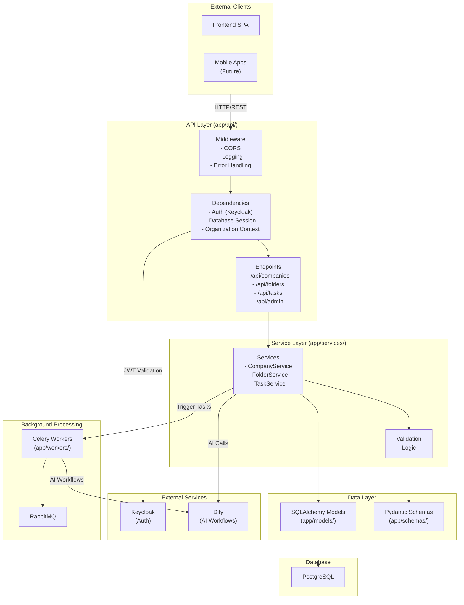
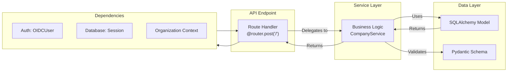
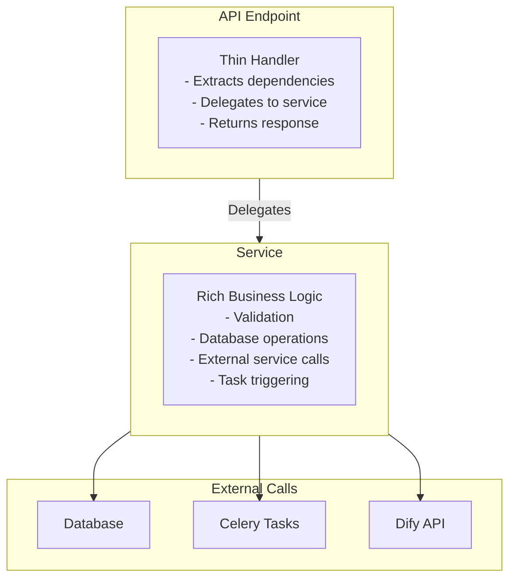
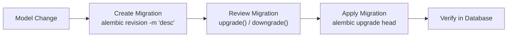
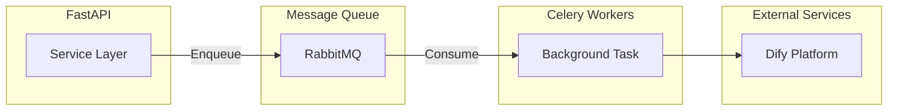

# Backend Architecture

This document describes the internal architecture of the ChapsMind FastAPI backend, including layer organization, service patterns, and dependency injection approaches.

## Architecture Overview

The backend follows a service layer architecture pattern with clear separation between API endpoints, business logic, and data access.



## Directory Structure

```
app/
├── api/
│   └── endpoints/              # API route handlers
│       ├── companies.py       # Company CRUD
│       ├── folders.py         # Folder management
│       ├── tasks.py           # Task status
│       ├── tokens.py          # Token management
│       └── admin.py           # Admin endpoints
│
├── core/                       # Core configuration
│   ├── config.py              # Application settings
│   ├── keycloak.py            # Keycloak IdP setup
│   ├── organization.py        # Organization context
│   ├── security.py            # Security utilities
│   ├── exceptions.py          # Custom exceptions
│   └── logging_config.py      # Logging setup
│
├── models/                     # SQLAlchemy models
│   ├── company.py
│   ├── folder.py
│   ├── task.py
│   └── ...
│
├── schemas/                    # Pydantic schemas
│   ├── company.py
│   ├── folder.py
│   └── ...
│
├── services/                   # Business logic
│   ├── company.py
│   ├── folder.py
│   ├── task_service.py
│   ├── dify.py
│   └── keycloak_admin.py
│
├── infrastructure/             # External service clients
│   └── dify/                  # Dify client wrapper
│
├── workers/                    # Celery tasks
│   └── tasks.py
│
└── main.py                     # FastAPI application entry
```

## Layer Architecture

### API Layer (Routes -> Services -> Models)



### Request Flow Example

```python
# 1. API Endpoint (app/api/endpoints/companies.py)
@router.post("/")
def create_company(
    data: CompanyCreate,                                              # Pydantic validation
    user: OIDCUser = Depends(idp.get_current_user(required_roles=["company.create"])),
    org_context: OrganizationContext = Depends(get_user_organization),
    db: Session = Depends(get_db)
):
    """Create a new company. Requires company.create role."""
    # Endpoint is thin - delegates to service
    service = CompanyService(db)
    return service.create_company(
        data,
        owner_id=user.sub,
        owner_username=user.preferred_username,
        organization_id=org_context.organization_id
    )

# 2. Service Layer (app/services/company.py)
class CompanyService:
    def __init__(self, db: Session):
        self.db = db

    def create_company(
        self,
        data: CompanyCreate,
        owner_id: str,
        owner_username: str,
        organization_id: str
    ) -> Company:
        """Business logic for company creation."""
        # Validation logic
        # Database operations
        company = Company(
            name=data.name,
            website=str(data.website),
            owner_id=owner_id,
            owner_username=owner_username,
            organization_id=organization_id
        )
        self.db.add(company)
        self.db.commit()

        # Trigger background tasks
        trigger_data_collection.delay(company.id)

        return company
```

## Dependency Injection

FastAPI's `Depends` system provides dependency injection for:

### Authentication Dependency

```python
from fastapi_keycloak import OIDCUser
from app.core.keycloak import idp

@router.get("/companies")
def list_companies(
    user: OIDCUser = Depends(idp.get_current_user(required_roles=["company.view"]))
):
    # Role is validated automatically
    # Returns 403 if user lacks required role
```

### Organization Context Dependency

```python
from app.core.organization import get_user_organization, OrganizationContext

@router.get("/folders")
def list_folders(
    org_context: OrganizationContext = Depends(get_user_organization)
):
    # org_context.organization_id - Current organization UUID
    # org_context.username - Current user's username
```

### Database Session Dependency

```python
from app.core.database import get_db
from sqlalchemy.orm import Session

@router.post("/companies")
def create_company(
    db: Session = Depends(get_db)
):
    # Session is automatically closed after request
```

## Service Layer Pattern

Services encapsulate business logic and keep endpoints thin:



### Service Responsibilities

| Component | Responsibility |
|-----------|---------------|
| **Endpoint** | Extract dependencies, delegate to service, return response |
| **Service** | All business logic, validation, orchestration |
| **Model** | Database structure and relationships |
| **Schema** | Request/response validation and serialization |

## Database Migrations (Alembic)

### Migration Workflow



### Key Migration Rules

1. **Run from Docker**: Always execute Alembic from within Docker container
2. **Include downgrade**: Every migration should have reversible logic
3. **Test on copy**: Test migrations on production data copy before deployment
4. **No user tables**: Remember there are no users/organization tables (Keycloak manages these)

```bash
# Create migration
docker compose exec backend alembic revision -m "add_company_status"

# Apply migrations
docker compose exec backend alembic upgrade head

# Check current version
docker compose exec backend alembic current
```

## Error Handling

### Custom Exception Hierarchy

```python
# app/core/exceptions.py
class AuthorizationError(Exception):
    """User lacks permission for the requested operation."""
    pass

class ResourceNotFoundError(Exception):
    """Requested resource does not exist."""
    pass

class DatabaseError(Exception):
    """Database operation failed."""
    pass

class ExternalServiceError(Exception):
    """External service (Dify, Keycloak) call failed."""
    pass
```

### Exception Handler Pattern

```python
# FastAPI converts exceptions to HTTP responses
@app.exception_handler(AuthorizationError)
async def authorization_error_handler(request, exc):
    return JSONResponse(
        status_code=403,
        content={"detail": str(exc)}
    )
```

## Background Tasks (Celery)

### Task Architecture



### Task Definition Pattern

```python
# app/workers/tasks.py
from celery import Celery

app = Celery('mint')

@app.task(bind=True, max_retries=3)
def process_company_data_collection(self, company_id: int, task_type: str):
    """Run Dify workflow for company data collection."""
    try:
        # Execute Dify workflow
        # Update task status
        # Store results
    except Exception as exc:
        self.retry(exc=exc, countdown=60)
```

### Task Monitoring

Celery Flower provides web monitoring at port 5555:

- Task queue status
- Worker health
- Task history
- Failed task inspection

## API Documentation

FastAPI automatically generates OpenAPI documentation:

| Endpoint | Purpose |
|----------|---------|
| `/docs` | Swagger UI - Interactive API explorer |
| `/redoc` | ReDoc - Alternative documentation |
| `/openapi.json` | Raw OpenAPI schema |

## Related Documentation

- [API Contracts](./api-contracts.md) - API patterns and frontend integration
- [Backend Module](../02-application/modules/backend-api.md) - Module overview
- [ADR-002: FastAPI Backend](../adr/0002-fastapi-backend.md) - Framework choice
- [Backend CLAUDE.md](../../../back/CLAUDE.md) - Detailed development guide
- [Migrations Standard](../../../agent-os/standards/backend/migrations.md) - Migration conventions
