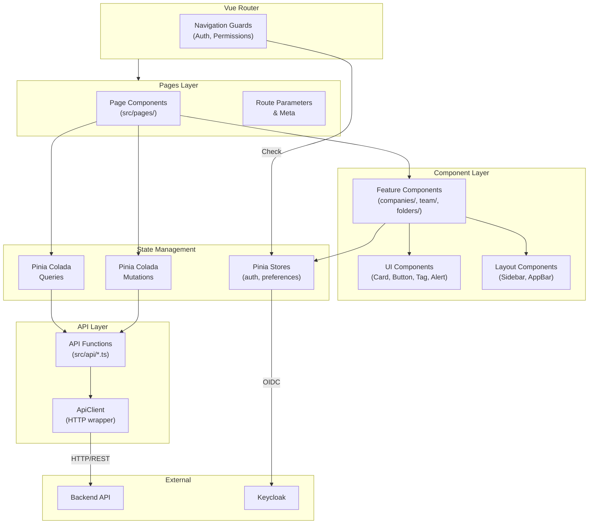
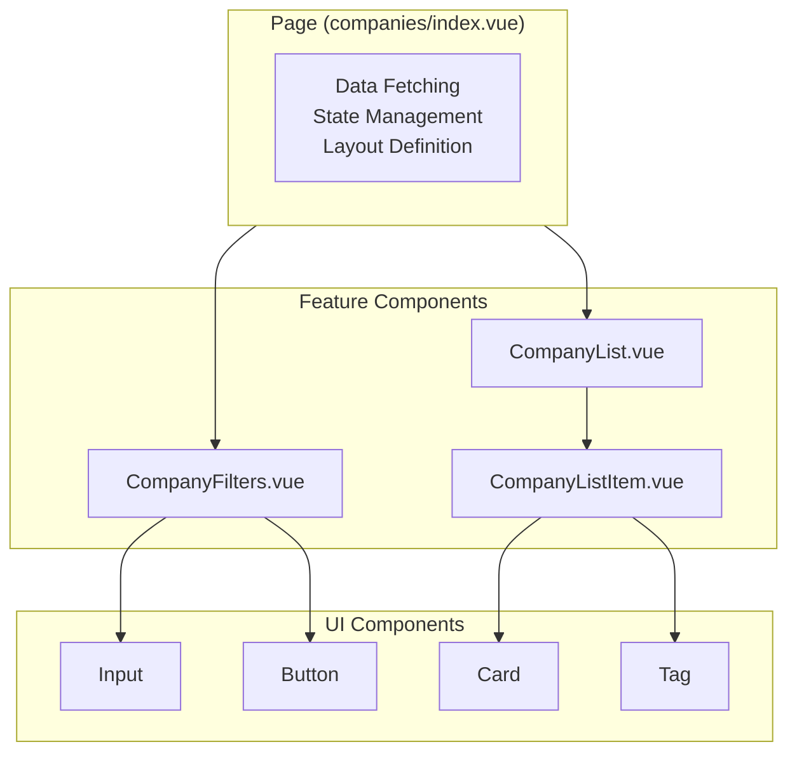
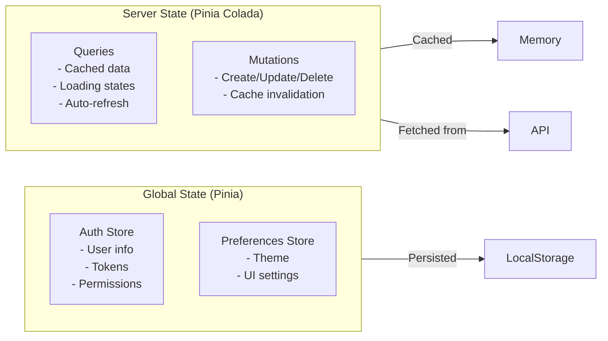

# Frontend Architecture

This document describes the internal architecture of the ChapsMind Vue.js frontend application, including component organization, state management, and data flow patterns.

## Architecture Overview

The frontend follows a layered architecture with clear separation between pages, components, state management, and API communication.



## Directory Structure

```text
src/
├── api/                    # Pure HTTP functions
│   ├── client.ts          # ApiClient class with auth handling
│   ├── companies.ts       # Company API calls
│   ├── folders.ts         # Folder API calls
│   └── ...
│
├── components/
│   ├── ui/                # Generic UI components
│   │   ├── Alert.vue
│   │   ├── Button.vue
│   │   ├── Card.vue
│   │   ├── Input.vue
│   │   └── Tag.vue
│   ├── layout/            # Layout structure
│   │   ├── Sidebar.vue
│   │   └── AppBar.vue
│   ├── features/          # Shared feature components
│   ├── companies/         # Company-specific components
│   ├── company/           # Company detail components
│   ├── folders/           # Folder management
│   ├── team/              # Team management
│   └── admin/             # Admin panel
│
├── composables/            # Reusable composition functions
│   ├── usePermissions.ts
│   ├── useCompanyPermissions.ts
│   └── ...
│
├── stores/                 # Pinia global stores
│   ├── auth.ts            # Authentication state
│   └── preferences.ts     # User preferences
│
├── queries/                # Pinia Colada query definitions
│   ├── companies.ts
│   ├── folders.ts
│   └── ...
│
├── mutations/              # Pinia Colada mutations
│   └── ...
│
├── pages/                  # File-based routing
│   ├── (home).vue
│   ├── companies/
│   │   ├── index.vue
│   │   └── [id].vue
│   └── ...
│
├── types/                  # TypeScript interfaces
│
├── i18n/                   # Internationalization
│
└── assets/                 # Static assets (CSS, images)
```

## Component Architecture

### Component Hierarchy

Pages act as orchestrators that compose feature components:



### Component Responsibilities

| Layer                  | Responsibility                        | Data Access                    |
| ---------------------- | ------------------------------------- | ------------------------------ |
| **Pages**              | Route handling, data fetching, layout | Uses `useQuery`, `useMutation` |
| **Feature Components** | Feature-specific UI and logic         | Receives data via props        |
| **UI Components**      | Generic, reusable presentation        | Props only, no data fetching   |
| **Layout Components**  | Application structure                 | May access auth store          |

### Component Decomposition Rules

From [Components CLAUDE.md](../../../apps/front/src/components/CLAUDE.md):

1. **Extract list items**: Always create dedicated item components for `v-for` loops
2. **Keep pages small**: Pages should orchestrate, not render complex UI
3. **Single responsibility**: Each component focuses on one thing
4. **Check existing components**: Reuse before creating new

## State Management

### Two Types of State



### Pinia Stores (Global State)

Used for application-wide state that persists across navigation:

```typescript
// stores/auth.ts
export const useAuthStore = defineStore('auth', () => {
  const user = ref<OIDCUser | null>(null)
  const permissions = ref<string[]>([])

  function hasPermission(permission: string): boolean {
    return permissions.value.includes(permission)
  }

  return { user, permissions, hasPermission }
})
```

### Pinia Colada (Server State)

Used for data from the backend API with automatic caching:

```typescript
// queries/companies.ts
export const COMPANY_QUERY_KEYS = {
  root: ['companies'] as const,
  byId: (id: string) => [...COMPANY_QUERY_KEYS.root, id] as const,
}

export const companyByIdQuery = defineQueryOptions(({ id }: { id: string }) => ({
  key: COMPANY_QUERY_KEYS.byId(id),
  query: () => getCompanyById(id),
}))
```

## Data Flow Pattern

```text
┌─────────────────────────────────────────────────────────────────┐
│                         Component                                │
│  const { data, isLoading, error } = useQuery(companyByIdQuery)  │
└─────────────────────────────────────────────────────────────────┘
                              │
                              ▼
┌─────────────────────────────────────────────────────────────────┐
│                    Pinia Colada Query                            │
│  - Checks cache first                                           │
│  - Manages loading/error states                                 │
│  - Background refetching                                        │
└─────────────────────────────────────────────────────────────────┘
                              │
                              ▼
┌─────────────────────────────────────────────────────────────────┐
│                      API Function                                │
│  export const getCompanyById = (id: string) =>                  │
│    apiClient.get<Company>(`/companies/${id}`)                   │
└─────────────────────────────────────────────────────────────────┘
                              │
                              ▼
┌─────────────────────────────────────────────────────────────────┐
│                        ApiClient                                 │
│  - Adds Bearer token                                            │
│  - Handles 401 (token refresh)                                  │
│  - Handles 402 (insufficient tokens)                            │
└─────────────────────────────────────────────────────────────────┘
                              │
                              ▼
                    ┌─────────────────┐
                    │   Backend API    │
                    └─────────────────┘
```

## File-Based Routing

Routes are automatically generated from the `src/pages/` directory structure:

| File Path                       | Generated Route        |
| ------------------------------- | ---------------------- |
| `pages/(home).vue`              | `/`                    |
| `pages/companies/index.vue`     | `/companies`           |
| `pages/companies/[id].vue`      | `/companies/:id`       |
| `pages/admin/organizations.vue` | `/admin/organizations` |

### Route Protection

Routes are protected using YAML frontmatter in page files:

```vue
<route lang="yaml">
meta:
  permissions:
    - company.view
  requiresAuth: true
  title: 'Companies'
</route>
```

## UI Layer

### Vuellar Component Library (CRITICAL)

**MANDATORY**: ChapsMind uses **Vuellar** (`@owlint/feathers-vue`) as its primary UI component library. This is the Chapsvision Design System shared across all company projects.

```typescript
import {
  // Core components (Electrons)
  Avatar,
  Badge,
  Bullet,
  Button,
  Checkbox,
  Input,
  Label,
  Link,
  Radio,
  Select,
  Switch,
  Tab,
  Tag,
  Textarea,
  Toggle,

  // Building Blocks (Atoms)
  Breadcrumb,
  Chips,
  DateRangePicker,
  Pagination,
  Searchbar,
  Table,

  // Composites (Molecules/Organisms)
  Alert,
  Menu,
  Modal,
} from '@owlint/feathers-vue'
```

### Component Selection Rules

| Priority                  | Action                                    |
| ------------------------- | ----------------------------------------- |
| **1. Use Vuellar**        | If a Vuellar component exists, use it     |
| **2. Compose Vuellar**    | Combine Vuellar components for complex UI |
| **3. Custom (Exception)** | Only when Vuellar cannot meet the need    |

### Creating Custom UI Components

Custom UI components in `src/components/ui/` should be **exceptional** and require:

1. **Vuellar doesn't have it** - Verified that no Vuellar component exists
2. **ChapsMind-specific** - Will NOT be used in other Chapsvision projects
3. **Lead Tech Approval** - Must be approved before implementation

**If the component could be useful in other projects**, it should be contributed to Vuellar instead of created locally.

### Existing Local Components (Legacy)

Some custom components exist in `src/components/ui/` from before Vuellar adoption:

| Component         | Status             | Action                          |
| ----------------- | ------------------ | ------------------------------- |
| `AuthLoader.vue`  | ChapsMind-specific | Keep (auth loading state)       |
| `Breadcrumbs.vue` | Deprecated         | Migrate to Vuellar `Breadcrumb` |
| `Card.vue`        | ChapsMind-specific | Keep (no Vuellar equivalent)    |
| `NoData.vue`      | ChapsMind-specific | Keep (empty state component)    |
| `Pagination.vue`  | Deprecated         | Migrate to Vuellar `Pagination` |
| `Tag.vue`         | Deprecated         | Migrate to Vuellar `Tag`        |
| Others            | Review needed      | Evaluate for migration          |

### Design System Tokens

Vuellar uses a props-based design system:

| Prop      | Purpose                 | Values                                                         |
| --------- | ----------------------- | -------------------------------------------------------------- |
| `variant` | Visual weight           | `primary`, `secondary`, `tertiary`                             |
| `intent`  | Semantic meaning        | `neutral`, `success`, `warning`, `danger`, `info`              |
| `color`   | Decorative (no meaning) | `sage`, `almond`, `pink`, `indigo`, `yellow`, `cherry`, `cyan` |
| `size`    | Dimensions              | `xs`, `sm`, `md`, `lg`                                         |

**Rule**: Use `intent` for semantic states (errors, success), use `color` for decoration only.

See [Vuellar Standards](../../../agent-os/standards/frontend/vuellar/components.md) for detailed component documentation.

## Related Documentation

- [API Contracts](./api-contracts.md) - Frontend API patterns
- [Frontend Module](../02-application/modules/frontend.md) - Module overview
- [ADR-006: Pinia Colada](../adr/0006-pinia-colada-data-fetching.md) - Data fetching decision
- [Components CLAUDE.md](../../../apps/front/src/components/CLAUDE.md) - Component guidelines
- [Pages CLAUDE.md](../../../apps/front/src/pages/CLAUDE.md) - Routing patterns
