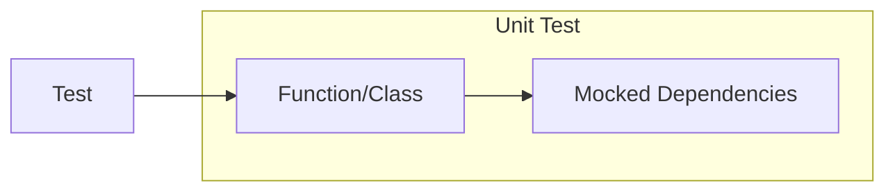
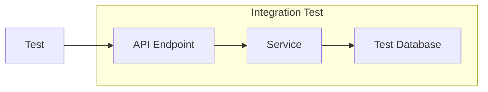
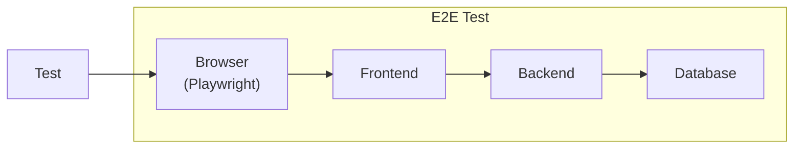

# Testing Strategy

This document describes the testing approach, tools, and philosophy for ChapsMind development.

## Testing Philosophy

From [Test Writing Standards](../../../agent-os/standards/testing/test-writing.md):

1. **Write Minimal Tests During Development**: Focus on completing features first, then add strategic tests at logical completion points
2. **Test Only Core User Flows**: Write tests for critical paths and primary workflows
3. **Defer Edge Case Testing**: Address edge cases in dedicated testing phases
4. **Test Behavior, Not Implementation**: Focus on what the code does, not how
5. **Clear Test Names**: Use descriptive names explaining what's being tested
6. **Mock External Dependencies**: Isolate units from databases, APIs, file systems
7. **Fast Execution**: Keep unit tests fast (milliseconds)

## Current Testing Setup

### Backend Testing

| Tool | Purpose | Status |
|------|---------|--------|
| **pytest** | Test framework | Active |
| **pytest-asyncio** | Async test support | Active |
| **pytest-cov** | Coverage reporting | Active |

#### Backend Test Structure

```
back/tests/
├── unit/              # Fast, isolated tests
│   ├── test_services.py
│   └── test_models.py
├── integration/       # Database + external services
│   ├── test_api.py
│   └── test_workflows.py
└── conftest.py        # Shared fixtures
```

#### Running Backend Tests

```bash
# Run all tests
docker compose exec backend pytest tests/

# Run specific test file
docker compose exec backend pytest tests/unit/test_services.py

# Run with coverage
docker compose exec backend pytest --cov=app tests/

# Run verbose
docker compose exec backend pytest tests/ -v
```

#### Backend Test Example

```python
import pytest
from app.core.exceptions import AuthorizationError
from app.services.company import CompanyService

def test_create_company_success(db_session, mock_user):
    """Test successful company creation."""
    service = CompanyService(db_session)
    company = service.create_company(
        data=CompanyCreate(name="Test Co", website="https://test.com"),
        owner_id=mock_user.sub,
        organization_id="org-uuid-123"
    )
    assert company.name == "Test Co"
    assert company.organization_id == "org-uuid-123"

def test_create_company_unauthorized(db_session, mock_user_no_perms):
    """Test company creation fails without permission."""
    service = CompanyService(db_session)
    with pytest.raises(AuthorizationError):
        service.create_company(...)
```

### Frontend Testing

| Tool | Purpose | Status |
|------|---------|--------|
| **Vitest** | Unit/component tests | Planned |
| **Playwright** | E2E testing | Planned |

#### Frontend Test Structure (Planned)

```
front/src/
├── components/
│   ├── ui/
│   │   ├── Button.vue
│   │   └── Button.spec.ts    # Component tests alongside
│   └── ...
├── composables/
│   ├── usePermissions.ts
│   └── usePermissions.spec.ts
└── ...

front/tests/
└── e2e/                       # Playwright E2E tests
    ├── companies.spec.ts
    └── auth.spec.ts
```

#### Running Frontend Tests (When Implemented)

```bash
# Unit tests
cd front && pnpm run test

# Run specific test
cd front && pnpm exec vitest run Button.spec.ts

# Coverage
cd front && pnpm exec vitest run --coverage

# E2E tests
cd front && pnpm exec playwright test
```

## Test Types

### Unit Tests

Test individual functions and classes in isolation:



**Characteristics**:
- Fast execution (milliseconds)
- No external dependencies
- Mock everything external
- Test single responsibility

**Examples**:
- Service method logic
- Utility functions
- Composables
- Validation logic

### Integration Tests

Test multiple components working together:



**Characteristics**:
- Slower than unit tests
- May use real database (test instance)
- Test component interaction
- Mock only external services (Dify, Keycloak)

**Examples**:
- API endpoint with database
- Service with database operations
- Multi-service workflows

### E2E Tests (End-to-End)

Test complete user workflows through the UI:



**Characteristics**:
- Slowest tests
- Test real user scenarios
- Full stack integration
- Catch integration issues

**Examples**:
- Login flow
- Create company workflow
- Team management operations

## Test Coverage Guidelines

### Coverage Targets

| Code Type | Target | Notes |
|-----------|--------|-------|
| **Security-critical** | 100% | Auth, permissions, validation |
| **Business logic** | >80% | Services, core workflows |
| **API endpoints** | >70% | Happy paths, error cases |
| **UI components** | >60% | Core components |
| **Utilities** | As needed | Based on complexity |

### What to Test

**Always Test**:
- Authentication and authorization logic
- Permission checks
- Data validation
- Core business workflows
- Error handling paths
- Public API contracts

**Defer Testing**:
- Simple getters/setters
- Framework boilerplate
- Purely presentational components
- Edge cases (until dedicated testing phase)

## Mocking Strategies

### Backend Mocking

```python
# Mock external services
@pytest.fixture
def mock_dify_client(mocker):
    return mocker.patch('app.services.dify.DifyClient')

@pytest.fixture
def mock_keycloak(mocker):
    return mocker.patch('app.core.keycloak.idp')

# Mock database session
@pytest.fixture
def db_session():
    # Use test database or in-memory SQLite
    engine = create_engine('sqlite:///:memory:')
    Session = sessionmaker(bind=engine)
    session = Session()
    yield session
    session.close()
```

### Frontend Mocking (Planned)

```typescript
// Mock API calls
vi.mock('@/api/companies', () => ({
  getCompanyById: vi.fn().mockResolvedValue({ id: '1', name: 'Test' }),
}))

// Mock stores
vi.mock('@/stores/auth', () => ({
  useAuthStore: () => ({
    hasPermission: vi.fn().mockReturnValue(true),
  }),
}))
```

## Continuous Integration

<!-- TODO: To be completed when CI pipeline is implemented -->

Tests should run automatically on:
- Pull request creation
- Push to feature branches
- Pre-merge validation

## Related Documentation

- [Test Writing Standards](../../../agent-os/standards/testing/test-writing.md) - Testing best practices
- [Backend CLAUDE.md](../../../back/CLAUDE.md) - Backend testing section
- [Coding Standards](./coding-standards.md) - Development conventions
