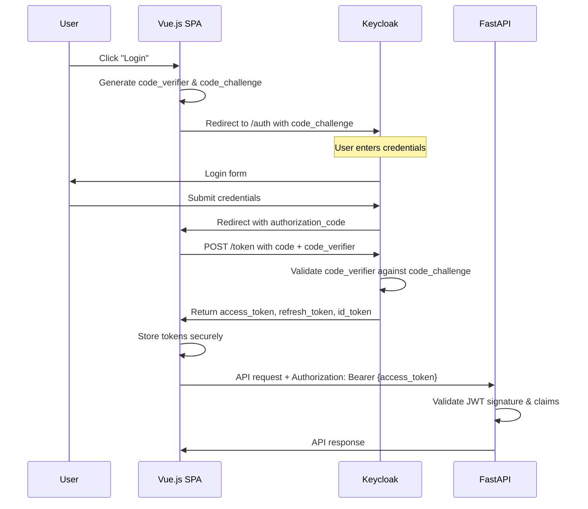
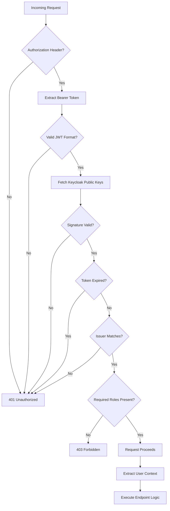
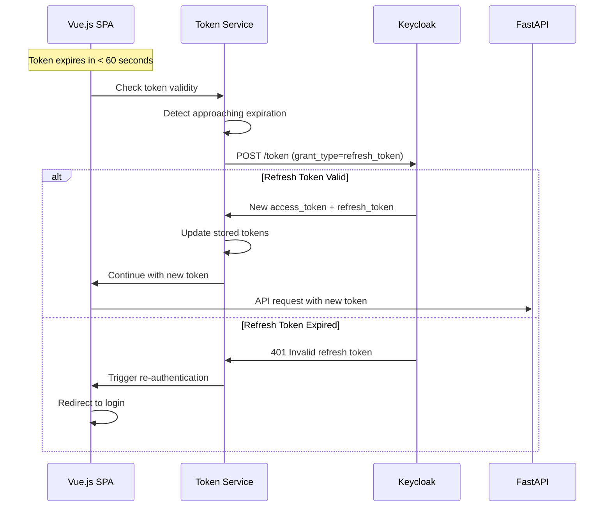

# Authentication

ChapsMind uses **Keycloak** as its identity provider, implementing the **OpenID Connect (OIDC)** protocol for authentication. This document covers the authentication flow, JWT validation, and token refresh mechanisms.

## Overview

- **Identity Provider**: Keycloak (self-hosted)
- **Protocol**: OpenID Connect 1.0 (built on OAuth 2.0)
- **Token Format**: JSON Web Tokens (JWT)
- **Flow**: Authorization Code Flow with PKCE (frontend), Direct Token Validation (backend)

## OIDC Authentication Flow

The frontend SPA implements the Authorization Code Flow with PKCE (Proof Key for Code Exchange), which is the recommended flow for single-page applications.



## JWT Token Structure

Access tokens issued by Keycloak contain claims used for authentication and authorization.

### Key JWT Claims

| Claim | Description | Example |
|-------|-------------|---------|
| `sub` | Subject (user UUID) | `"123e4567-e89b-12d3-a456-426614174000"` |
| `preferred_username` | Username | `"john.doe"` |
| `email` | User email | `"john@example.com"` |
| `realm_access.roles` | Realm-level roles | `["company.view", "company.create"]` |
| `organization` | Keycloak Organization ID | `"org-uuid-456"` |
| `exp` | Expiration timestamp | `1704067200` |
| `iss` | Issuer (Keycloak URL) | `"https://sso.domain.com/auth/realms/mint"` |

### Token Lifetime

| Token Type | Default Lifetime | Purpose |
|------------|------------------|---------|
| Access Token | 5 minutes | API authentication |
| Refresh Token | 30 minutes | Obtain new access tokens |
| ID Token | 5 minutes | User identity information |

## JWT Validation Process

The backend validates JWT tokens on every request using the `fastapi-keycloak` library.



### Backend Validation Code Pattern

```python
from fastapi import Depends
from fastapi_keycloak import OIDCUser
from app.core.keycloak import idp

@router.get("/companies")
def list_companies(
    user: OIDCUser = Depends(idp.get_current_user(required_roles=["company.view"]))
):
    """
    Requires company.view role for access.

    The idp.get_current_user dependency:
    1. Extracts JWT from Authorization header
    2. Validates signature against Keycloak public keys
    3. Checks token expiration and issuer
    4. Verifies required roles are present
    5. Returns OIDCUser with claims if valid
    """
    # user.sub contains the Keycloak user UUID
    # user.preferred_username contains the username
    return {"companies": [...]}
```

## Token Refresh Mechanism

The frontend automatically refreshes tokens before expiration to maintain seamless user sessions.



### Frontend Token Management

The frontend API client automatically handles token refresh:

```typescript
// Simplified token refresh logic in API client
async function refreshTokenIfNeeded(): Promise<void> {
  const expiresIn = getTokenExpirationTime();

  // Refresh if token expires within 60 seconds
  if (expiresIn < 60) {
    const newTokens = await keycloak.updateToken(60);
    if (newTokens) {
      updateStoredTokens(newTokens);
    } else {
      // Refresh token expired, redirect to login
      redirectToLogin();
    }
  }
}

// API client intercepts requests to check token validity
apiClient.interceptors.request.use(async (config) => {
  await refreshTokenIfNeeded();
  config.headers.Authorization = `Bearer ${getAccessToken()}`;
  return config;
});
```

## Security Considerations

### Token Storage

- **Access tokens**: Stored in memory (JavaScript variable) for security
- **Refresh tokens**: HttpOnly cookie or memory (configuration-dependent)
- **Never**: Stored in localStorage (vulnerable to XSS)

### PKCE Protection

PKCE (Proof Key for Code Exchange) prevents authorization code interception attacks:

1. Frontend generates random `code_verifier` (43-128 characters)
2. Creates `code_challenge` = Base64URL(SHA256(code_verifier))
3. Sends `code_challenge` to authorization endpoint
4. Exchanges code with `code_verifier` at token endpoint
5. Keycloak validates the challenge/verifier pair

### Token Validation Checks

Every token validation performs:

1. **Signature verification** against Keycloak public key (RSA)
2. **Expiration check** (`exp` claim)
3. **Issuer validation** (`iss` matches expected Keycloak realm)
4. **Audience validation** (`aud` includes expected client ID)
5. **Role verification** (required roles present in `realm_access.roles`)

## Configuration

### Keycloak Realm Settings

| Setting | Value | Purpose |
|---------|-------|---------|
| Realm | `mint` | Isolated configuration space |
| Client ID (Frontend) | `mint-frontend` | SPA client with PKCE |
| Client ID (Backend) | `mint-backend` | Confidential client for token validation |
| Access Token Lifespan | 5 minutes | Short-lived for security |
| Refresh Token Lifespan | 30 minutes | Session duration |

### Backend Environment Variables

```env
KEYCLOAK_SERVER_URL=https://sso.domain.com/auth
KEYCLOAK_REALM=mint
KEYCLOAK_CLIENT_ID=mint-backend
KEYCLOAK_CLIENT_SECRET=<secret>
```

## Related Documentation

- [Authorization](./authorization.md) - Role-based access control after authentication
- [ADR-0003: Keycloak Authentication](../adr/0003-keycloak-authentication.md) - Decision record
- [Backend CLAUDE.md](../../../back/CLAUDE.md) - Security best practices section
