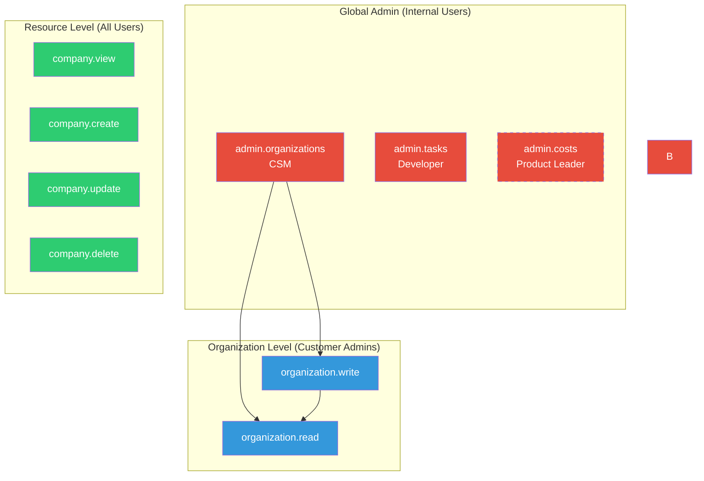
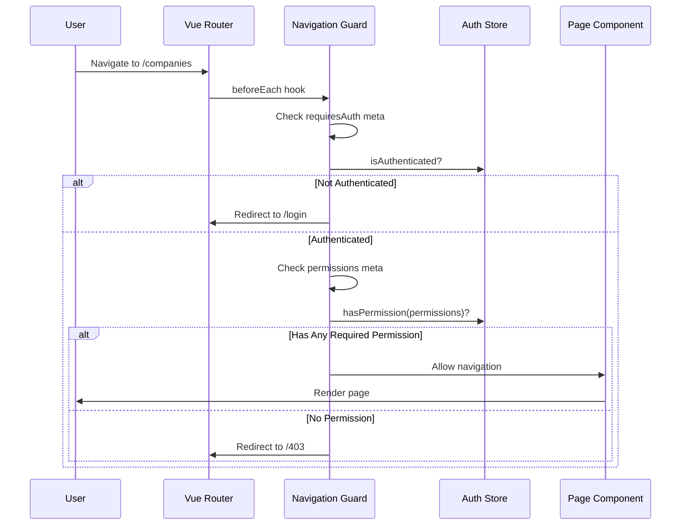
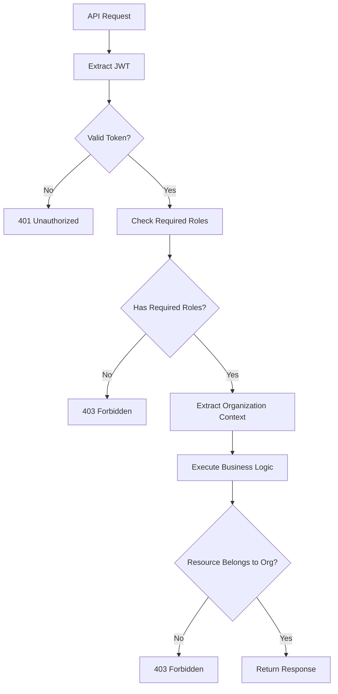

# Authorization

ChapsMind implements **Role-Based Access Control (RBAC)** with a permission model that follows the `resource.action` naming convention. Authorization is enforced at multiple levels: route-level, component-level, and backend API.

## Permission Model

### Permission Format

Permissions follow a consistent `resource.action` format:

```text
<resource>.<action>

Examples:
- company.view      # View company details
- company.create    # Create new companies
- organization.read # Read-only access to organization
```

### Available Permissions

<!-- AUTO-GENERATED from workspace CLAUDE.md -->

#### Company Permissions (Organization-Scoped)

| Permission       | Description               | Use Case                               |
| ---------------- | ------------------------- | -------------------------------------- |
| `company.view`   | View company details      | View company cards, details, and data  |
| `company.create` | Create new companies      | Search and create company cards        |
| `company.update` | Update existing companies | Edit company information (future)      |
| `company.delete` | Delete companies          | Remove company cards from organization |

#### Organization Permissions (Organization-Scoped)

| Permission           | Description                   | Use Case                               |
| -------------------- | ----------------------------- | -------------------------------------- |
| `organization.read`  | Read-only organization access | Access team page, view members         |
| `organization.write` | Modify organization           | Manage users and organization settings |

#### Admin Permissions (Global - Internal Users)

These permissions are for Chapsvision internal team members who manage the platform.

| Permission            | Description                 | Use Case                                                | Typical User             |
| --------------------- | --------------------------- | ------------------------------------------------------- | ------------------------ |
| `admin.organizations` | Organization administration | Manage all client organizations, tokens, features       | Customer Success Manager |
| `admin.tasks`         | Task monitoring             | Monitor and debug background tasks                      | Technical Developer      |
| `admin.costs`         | Cost analysis access        | View AI usage and cost reports (disabled, needs rework) | Product Leader           |

<!-- TODO: Add permissions for Support and Sales roles when defined -->

### Permission Hierarchy



**Note:** `admin.costs` is shown with dashed border as it's currently disabled pending rework.

## Route-Level Authorization

### Frontend Route Protection

Vue Router guards enforce permissions at the route level. Permissions are declared in route meta.

```yaml
# In Vue page component (route block)
<route lang="yaml">
meta:
  permissions:
    - company.view
    - company.create
  requiresAuth: true
  title: 'Companies'
</route>
```

**Permission Logic**: Routes use **OR** logic - user needs **any one** of the specified permissions to access the route.

### Route Guard Flow



### Frontend Implementation

```typescript
// Navigation guard in router/index.ts
router.beforeEach(async (to, from) => {
  const authStore = useAuthStore()

  // Check authentication
  if (to.meta.requiresAuth && !authStore.isAuthenticated) {
    return { name: 'login', query: { redirect: to.fullPath } }
  }

  // Check permissions (OR logic)
  if (to.meta.permissions?.length > 0) {
    const hasAccess = to.meta.permissions.some((permission) => authStore.hasPermission(permission))

    if (!hasAccess) {
      return { name: 'forbidden' }
    }
  }

  return true
})
```

## Component-Level Authorization

### Conditional Rendering

Components use permission checks to show/hide UI elements.

```vue
<script setup lang="ts">
import { useAuthStore } from '@/stores/auth'
import { useCompanyPermissions } from '@/composables/useCompanyPermissions'

const authStore = useAuthStore()
const { canCreateCompany, canDeleteCompany } = useCompanyPermissions()
</script>

<template>
  <div class="flex flex-col gap-4">
    <!-- Only show create button if user has company.create -->
    <Button
      v-if="canCreateCompany"
      variant="primary"
      label="Create Company"
      @click="openCreateModal"
    />

    <!-- Only show delete action if user has company.delete -->
    <Button
      v-if="canDeleteCompany"
      variant="secondary"
      color="danger"
      label="Delete"
      @click="confirmDelete"
    />

    <!-- Show read-only message for users without edit permissions -->
    <Alert v-if="!canCreateCompany" variant="info"> You have read-only access to companies. </Alert>
  </div>
</template>
```

### Permission Composables

Dedicated composables encapsulate permission logic for each resource.

```typescript
// composables/useCompanyPermissions.ts
import { computed } from 'vue'
import { useAuthStore } from '@/stores/auth'

export function useCompanyPermissions() {
  const authStore = useAuthStore()

  return {
    canViewCompany: computed(() => authStore.hasPermission('company.view')),
    canCreateCompany: computed(() => authStore.hasPermission('company.create')),
    canEditCompany: computed(() => authStore.hasPermission('company.update')),
    canDeleteCompany: computed(() => authStore.hasPermission('company.delete')),
    canManageCompanies: computed(
      () => authStore.hasPermission('company.update') || authStore.hasPermission('company.delete'),
    ),
    hasAnyCompanyAccess: computed(() =>
      authStore.hasAnyPermission([
        'company.view',
        'company.create',
        'company.update',
        'company.delete',
      ]),
    ),
  }
}
```

### Auth Store Methods

```typescript
// stores/auth.ts
export const useAuthStore = defineStore('auth', () => {
  // Check single permission
  function hasPermission(permission: string): boolean {
    return user.value?.roles.includes(permission) ?? false
  }

  // Check single role (alias for hasPermission)
  function hasRole(role: string): boolean {
    return hasPermission(role)
  }

  // Check if user has ANY of the roles (OR logic)
  function hasAnyRole(roles: string[]): boolean {
    return roles.some((role) => hasPermission(role))
  }

  // Check if user has ALL roles (AND logic)
  function hasAllRoles(roles: string[]): boolean {
    return roles.every((role) => hasPermission(role))
  }

  return {
    hasPermission,
    hasRole,
    hasAnyRole,
    hasAllRoles,
  }
})
```

## Backend Authorization

### Endpoint Protection

Backend endpoints use FastAPI dependencies to enforce permissions.

```python
from fastapi import Depends, APIRouter
from fastapi_keycloak import OIDCUser
from app.core.keycloak import idp
from app.core.organization import get_user_organization, OrganizationContext

router = APIRouter()

@router.post("/companies")
def create_company(
    data: CompanyCreate,
    user: OIDCUser = Depends(idp.get_current_user(required_roles=["company.create"])),
    org_context: OrganizationContext = Depends(get_user_organization)
):
    """
    Create a new company in the user's organization.

    Requires company.create role for access.
    """
    # Role checking happens automatically via dependency
    # If user lacks 'company.create' role, returns 403 automatically
    # org_context.organization_id contains the user's organization UUID
    return create_company_in_org(data, user.sub, org_context.organization_id)
```

### Authorization Flow



### Resource-Level Checks

Beyond role checks, the backend verifies resource ownership.

```python
from app.core.security import verify_company_organization_access

@router.get("/companies/{company_id}")
def get_company(
    company_id: int,
    user: OIDCUser = Depends(idp.get_current_user(required_roles=["company.view"])),
    org_context: OrganizationContext = Depends(get_user_organization),
    db: Session = Depends(get_db)
):
    """
    Get company by ID.

    Requires company.view role for access.
    """
    company = db.query(Company).filter(Company.id == company_id).first()

    if not company:
        raise HTTPException(status_code=404, detail="Company not found")

    # Verify company belongs to user's organization
    verify_company_organization_access(company, org_context)

    return company
```

### Authorization Helper Functions

```python
# app/core/security.py

def verify_company_organization_access(
    company: Company,
    org_context: OrganizationContext
) -> None:
    """Verify company belongs to user's organization."""
    if company.organization_id != org_context.organization_id:
        raise HTTPException(
            status_code=403,
            detail="Company not in your organization"
        )

# app/core/auth.py

def verify_role_access(user: OIDCUser, role: str) -> None:
    """Verify user has specific role, raise 403 if missing."""
    if role not in user.roles:
        raise HTTPException(
            status_code=403,
            detail=f"Missing required role: {role}"
        )

def verify_any_role_access(user: OIDCUser, roles: list[str]) -> None:
    """Verify user has any of the specified roles."""
    if not any(role in user.roles for role in roles):
        raise HTTPException(
            status_code=403,
            detail=f"Missing required role. Need one of: {roles}"
        )
```

## Multi-Tenancy Isolation

ChapsMind uses **Keycloak Organizations** for multi-tenant data isolation.

### Organization Scoping

All organization-scoped resources include an `organization_id` field:

```python
class Company(Base):
    __tablename__ = "companies"

    id = Column(Integer, primary_key=True)
    name = Column(String, nullable=False)
    organization_id = Column(String, nullable=False, index=True)  # Keycloak org UUID
    owner_id = Column(String, nullable=False)  # Keycloak user UUID
```

### Automatic Filtering

Queries automatically filter by the user's organization:

```python
@router.get("/companies")
def list_companies(
    user: OIDCUser = Depends(idp.get_current_user(required_roles=["company.view"])),
    org_context: OrganizationContext = Depends(get_user_organization),
    db: Session = Depends(get_db)
):
    """List all companies in user's organization."""
    # Always filter by organization_id
    companies = db.query(Company).filter(
        Company.organization_id == org_context.organization_id,
        Company.is_deleted == False
    ).all()

    return companies
```

## Test Users

See [Workspace CLAUDE.md](../../../CLAUDE.md#test-users) for test user credentials with different permission levels:

- **admin**: Full access to all features
- **company_manager**: Can manage companies (view, create, delete)
- **company_viewer**: Read-only company access
- **team_viewer**: Can view team page and companies (read-only)
- **team_manager**: Can manage team members
- **no_access**: No permissions (sees permission denied everywhere)

## Related Documentation

- [Authentication](./authentication.md) - How users are authenticated before authorization
- [Backend Security Practices](../../../apps/screen/CLAUDE.md) - Backend security patterns
- [Workspace Permission System](../../../CLAUDE.md#available-permissions) - Complete permission documentation
