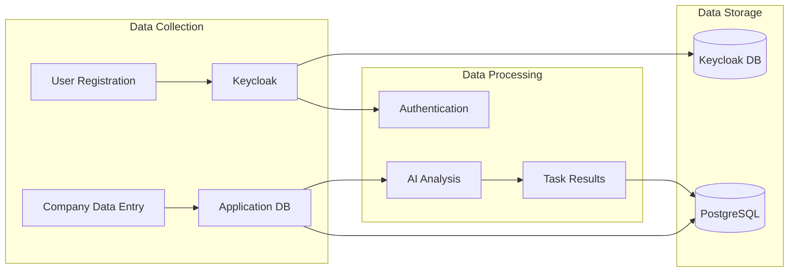
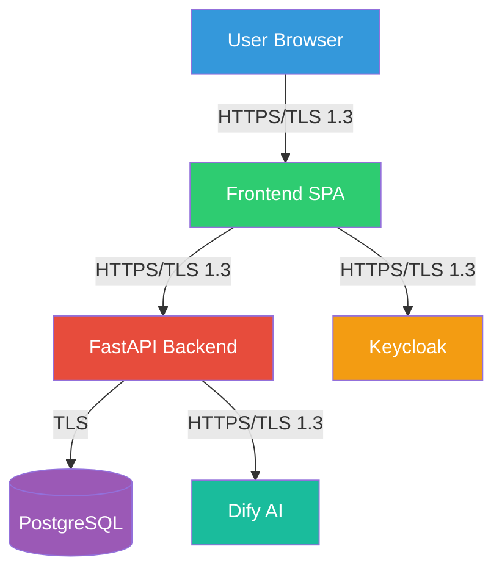

# Data Protection

This document outlines data protection principles and GDPR considerations for the ChapsMind platform.

## Overview

ChapsMind handles two categories of data:

1. **User Identity Data**: Managed entirely by Keycloak (not stored in application database)
2. **Business Data**: Company information, task results, and organizational content

## User Data Storage Architecture

### Critical Design Decision

**User identity data is NOT stored in the application database.** All user information resides exclusively in Keycloak.

```
┌─────────────────────────────────────────────────────────────────┐
│                    Keycloak (Identity Provider)                  │
├─────────────────────────────────────────────────────────────────┤
│  - User profiles (name, email, credentials)                     │
│  - Organization membership                                       │
│  - Role assignments                                              │
│  - Session management                                            │
│  - Authentication history                                        │
└─────────────────────────────────────────────────────────────────┘
                              │
                              │ JWT tokens with claims
                              ▼
┌─────────────────────────────────────────────────────────────────┐
│              Application Database (PostgreSQL)                   │
├─────────────────────────────────────────────────────────────────┤
│  - NO users table                                                │
│  - NO organization_members table                                 │
│  - References only: owner_id (UUID), organization_id (UUID)     │
│  - Denormalized display data: owner_username (for UI)           │
└─────────────────────────────────────────────────────────────────┘
```

### Benefits of This Approach

| Benefit | Description |
|---------|-------------|
| **Data Minimization** | Only store what is absolutely necessary |
| **Single Source of Truth** | User data lives in one place (Keycloak) |
| **Reduced Exposure Risk** | Application database breach exposes less PII |
| **Simplified Compliance** | User data management centralized in IdP |
| **Right to Erasure** | Delete user in Keycloak, no application cleanup needed |

### Database Reference Pattern

```python
class Company(Base):
    """Company model with user references, not user data."""
    __tablename__ = "companies"

    id = Column(Integer, primary_key=True)
    name = Column(String, nullable=False)

    # References to Keycloak entities (UUIDs only)
    organization_id = Column(String, nullable=False)  # Keycloak org UUID
    owner_id = Column(String, nullable=False)         # Keycloak user UUID (from JWT sub)

    # Denormalized for display purposes (not authoritative)
    owner_username = Column(String, nullable=True)    # Can be stale, refresh from JWT
```

## GDPR Considerations

### Relevant GDPR Principles

| Principle | Implementation |
|-----------|----------------|
| **Lawful Basis** | User consent obtained during registration via Keycloak |
| **Purpose Limitation** | Data used only for market intelligence services |
| **Data Minimization** | No user tables in app DB; minimal JWT claims |
| **Accuracy** | User can update profile in Keycloak directly |
| **Storage Limitation** | Data retention policies managed in Keycloak |
| **Integrity & Confidentiality** | Encryption at rest and in transit |

### Data Subject Rights

| Right | How It's Supported |
|-------|-------------------|
| **Access** | User can view their data in Keycloak account console |
| **Rectification** | User can edit their profile in Keycloak |
| **Erasure** | Admin deletes user in Keycloak; references become orphaned (acceptable) |
| **Portability** | Keycloak provides user data export capabilities |
| **Restriction** | User account can be disabled in Keycloak |

### Data Processing



## Data Handling Principles

### Sensitive Data Categories

| Category | Examples | Handling |
|----------|----------|----------|
| **Authentication Credentials** | Passwords, tokens | Keycloak only, never in app |
| **Personal Identifiers** | Email, name | Keycloak only, JWT claims transient |
| **Business Data** | Company information | Application database, encrypted at rest |
| **AI Processing Results** | Analysis outputs | Application database, no PII expected |

### Security Controls by Data Type

#### Authentication Data (Keycloak)
- Password hashing (bcrypt/Argon2)
- Token signing (RS256)
- Session encryption
- MFA support (configurable)

#### Business Data (Application)
- Database encryption at rest (PostgreSQL TDE)
- TLS for all connections
- Parameterized queries (SQL injection prevention)
- Input validation (Pydantic schemas)

### Data Flow Security



## Logging and Audit

### What Is Logged

| Event Type | Data Logged | PII Included |
|------------|-------------|--------------|
| API Requests | Endpoint, method, status, duration | No (user ID only) |
| Authentication | Success/failure, timestamp | Username (via Keycloak) |
| Authorization | Resource access, permission check | User ID, resource ID |
| Errors | Stack trace, context | No PII in error messages |

### What Is NOT Logged

- Passwords or credentials
- Full JWT tokens
- Personal data (email, full name)
- Request/response bodies with sensitive data

### Logging Best Practices

```python
from app.core.logging_config import get_logger

logger = get_logger(__name__)

# DO: Log with IDs, not personal data
logger.info(
    "Company created",
    extra={
        "company_id": company.id,
        "owner_id": user.sub,           # UUID only
        "organization_id": org_context.organization_id
    }
)

# DON'T: Log personal data
# logger.info(f"User {user.email} created company")  # BAD
```

## Incident Response

### Data Breach Considerations

In the event of a breach:

1. **Application Database Breach**:
   - No passwords or credentials exposed
   - No personal user data (stored in Keycloak)
   - Business data (company information) potentially exposed

2. **Keycloak Breach**:
   - User credentials at risk (password hashes)
   - Personal data exposed
   - Immediate password reset required
   - GDPR notification obligations apply

### Breach Notification

<!-- TODO: To be completed by security team -->

- Notification procedures and timelines
- DPO contact information
- Regulatory reporting requirements (GDPR 72-hour rule)

## Related Documentation

- [Authentication](./authentication.md) - Token and session security
- [Authorization](./authorization.md) - Access control and data isolation
- [Threat Model](./threat-model.md) - Risk assessment
- [ADR-0007: Keycloak User/Org Identification](../adr/0007-keycloak-user-org-identification.md) - No users table decision
