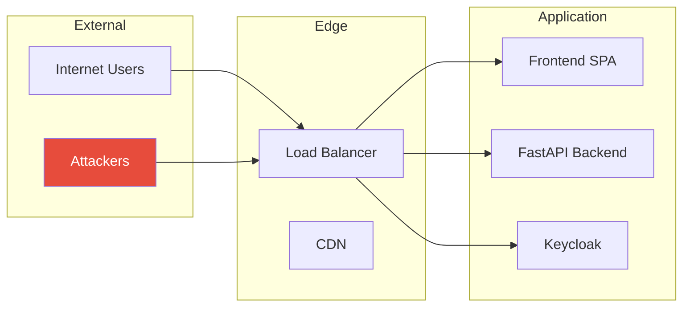

# Threat Model

<!-- TODO: To be completed by security team -->

This document provides a template for threat modeling the ChapsMind platform. It should be completed by the security team with detailed analysis of threats, vulnerabilities, and mitigations.

## Overview

Threat modeling helps identify potential security threats and vulnerabilities before they can be exploited. This document follows the STRIDE methodology.

## STRIDE Categories

| Category | Description |
|----------|-------------|
| **S**poofing | Impersonating a user or system |
| **T**ampering | Modifying data or code |
| **R**epudiation | Denying actions without proof |
| **I**nformation Disclosure | Exposing data to unauthorized parties |
| **D**enial of Service | Making system unavailable |
| **E**levation of Privilege | Gaining unauthorized access levels |

---

## Assets

### Critical Assets

<!-- TODO: Complete asset inventory with security team -->

| Asset | Description | Sensitivity | Owner |
|-------|-------------|-------------|-------|
| User Credentials | Passwords, tokens in Keycloak | Critical | Security Team |
| JWT Signing Keys | Keycloak RS256 private keys | Critical | Security Team |
| Company Data | Business intelligence gathered | High | Data Team |
| API Keys | Dify, external services | High | DevOps Team |
| Database | PostgreSQL with business data | High | DevOps Team |

### Data Classification

<!-- TODO: Define data classification levels -->

| Classification | Description | Examples |
|----------------|-------------|----------|
| Public | No sensitivity | Marketing content |
| Internal | Business use only | Company analysis |
| Confidential | Restricted access | API keys, configs |
| Restricted | Highly sensitive | Credentials, PII |

---

## Threat Analysis

### Authentication Threats

<!-- TODO: To be completed by security team -->

| ID | Threat | Category | Likelihood | Impact | Mitigation |
|----|--------|----------|------------|--------|------------|
| AUTH-01 | Credential stuffing | Spoofing | Medium | High | Rate limiting, MFA |
| AUTH-02 | JWT token theft | Spoofing | Medium | High | Short token lifetime, HTTPS |
| AUTH-03 | Session hijacking | Spoofing | Low | High | Secure cookies, token binding |

### Authorization Threats

<!-- TODO: To be completed by security team -->

| ID | Threat | Category | Likelihood | Impact | Mitigation |
|----|--------|----------|------------|--------|------------|
| AUTHZ-01 | IDOR (Insecure Direct Object Reference) | Elevation | Medium | High | Organization scoping |
| AUTHZ-02 | Role manipulation | Elevation | Low | Critical | Role validation in Keycloak |
| AUTHZ-03 | Cross-tenant access | Elevation | Low | Critical | Organization ID validation |

### Data Threats

<!-- TODO: To be completed by security team -->

| ID | Threat | Category | Likelihood | Impact | Mitigation |
|----|--------|----------|------------|--------|------------|
| DATA-01 | SQL injection | Tampering | Low | Critical | Parameterized queries |
| DATA-02 | XSS attacks | Tampering | Medium | Medium | Input sanitization, CSP |
| DATA-03 | Data exfiltration | Info Disclosure | Medium | High | Access logging, DLP |

### Infrastructure Threats

<!-- TODO: To be completed by security team -->

| ID | Threat | Category | Likelihood | Impact | Mitigation |
|----|--------|----------|------------|--------|------------|
| INFRA-01 | DDoS attack | DoS | Medium | High | Rate limiting, CDN |
| INFRA-02 | Database breach | Info Disclosure | Low | Critical | Encryption at rest |
| INFRA-03 | Container escape | Elevation | Low | Critical | Security contexts |

---

## Mitigations

### Implemented Mitigations

<!-- TODO: Verify and expand with security team -->

| Mitigation | Threats Addressed | Status | Owner |
|------------|-------------------|--------|-------|
| Keycloak OIDC | AUTH-01, AUTH-02, AUTH-03 | Implemented | Backend Team |
| JWT validation | AUTH-02, AUTHZ-02 | Implemented | Backend Team |
| Organization scoping | AUTHZ-01, AUTHZ-03 | Implemented | Backend Team |
| Pydantic validation | DATA-01 | Implemented | Backend Team |
| SQLAlchemy ORM | DATA-01 | Implemented | Backend Team |
| HTTPS everywhere | AUTH-02, DATA-03 | Implemented | DevOps Team |

### Planned Mitigations

<!-- TODO: Prioritize with security team -->

| Mitigation | Threats Addressed | Priority | Target Date |
|------------|-------------------|----------|-------------|
| MFA enforcement | AUTH-01 | High | TBD |
| Rate limiting | AUTH-01, INFRA-01 | High | TBD |
| WAF deployment | DATA-02, INFRA-01 | Medium | TBD |
| Security logging | All | Medium | TBD |
| Penetration testing | All | High | TBD |

---

## Attack Surface

### External Attack Surface

<!-- TODO: To be completed by security team -->

### Internal Attack Surface

<!-- TODO: To be completed by security team -->

- Service-to-service communication
- Database connections
- Message queue (RabbitMQ)
- AI service integration (Dify)

---

## Security Testing

### Testing Requirements

<!-- TODO: Define testing cadence with security team -->

| Test Type | Frequency | Scope | Owner |
|-----------|-----------|-------|-------|
| SAST (Static Analysis) | Per commit | All code | CI/CD Pipeline |
| DAST (Dynamic Analysis) | Weekly | Staging env | Security Team |
| Dependency Scanning | Daily | All dependencies | CI/CD Pipeline |
| Penetration Testing | Quarterly | Production | External Vendor |
| Security Review | Per feature | New features | Security Team |

### Vulnerability Management

<!-- TODO: Define SLAs with security team -->

| Severity | Response Time | Resolution Time |
|----------|---------------|-----------------|
| Critical | 4 hours | 24 hours |
| High | 24 hours | 7 days |
| Medium | 7 days | 30 days |
| Low | 30 days | 90 days |

---

## Compliance Requirements

### Applicable Standards

<!-- TODO: Confirm applicable standards -->

| Standard | Applicability | Status |
|----------|---------------|--------|
| GDPR | EU user data | Applicable |
| SOC 2 | Enterprise clients | TBD |
| ISO 27001 | Enterprise clients | TBD |

---

## Document History

| Version | Date | Author | Changes |
|---------|------|--------|---------|
| 0.1 | 2026-01-12 | Architecture Team | Initial template |

---

## Next Steps

1. Schedule threat modeling workshop with security team
2. Complete asset inventory
3. Perform detailed threat analysis per STRIDE category
4. Prioritize mitigations based on risk
5. Establish security testing cadence
6. Define incident response procedures

## Related Documentation

- [Authentication](./authentication.md) - Current authentication implementation
- [Authorization](./authorization.md) - Current authorization implementation
- [Data Protection](./data-protection.md) - Data handling and GDPR
- [Security README](./README.md) - Security overview
