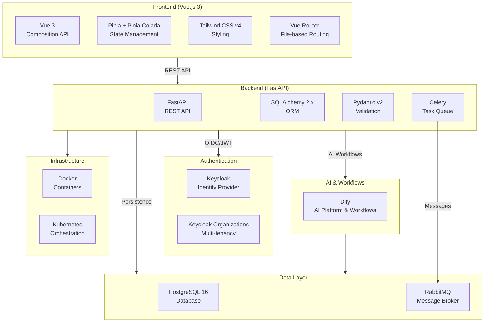

# ChapsMind - Technical Architecture Document

> **Last Updated:** 2026-01-12
> **Version:** 1.0

This document serves as the entry point to the ChapsMind Technical Architecture Document (TAD). It provides a comprehensive overview of the system architecture for developers, architects, and stakeholders.

---

## Table of Contents

| View                                   | Description                                                  | Target Audience        |
| -------------------------------------- | ------------------------------------------------------------ | ---------------------- |
| [Context](./01-context/)               | Objectives, scope, business constraints, and product roadmap | Everyone               |
| [Application](./02-application/)       | Application architecture, modules, and data flows            | Architects, Tech Leads |
| [Development](./03-development/)       | Software architecture, patterns, and coding standards        | Developers             |
| [Infrastructure](./04-infrastructure/) | Deployment, CI/CD, Kubernetes (deferred)                     | DevOps, SRE            |
| [Security](./05-security/)             | Authentication, authorization, data protection               | Security, Architects   |
| [Performance](./06-performance/)       | Scalability, caching, monitoring                             | DevOps, Architects     |
| [ADR](./adr/)                          | Architecture Decision Records                                | Everyone               |

---

## Glossary

Key terms used throughout the ChapsMind documentation:

| Term                       | Definition                                                                                                                                 |
| -------------------------- | ------------------------------------------------------------------------------------------------------------------------------------------ |
| **ChapsMind**              | AI-powered market and economic intelligence platform for discovering, monitoring, and analyzing information                                |
| **OSINT**                  | Open Source Intelligence - publicly available information gathered from public sources                                                     |
| **Screen**                 | Company screening module - primary module for gathering information about companies online                                                 |
| **Target**                 | Watchfile monitoring module for automated tracking on any topic (Q1 2025)                                                                  |
| **Explore**                | Graph-based relationship discovery module (planned)                                                                                        |
| **Stream**                 | Intelligence distribution features for newsletters, Slack, RSS (planned)                                                                   |
| **Discover**               | Advanced dashboard capabilities module (organization level link to already existing Discover portal)                                       |
| **Chaps-e**                | Global AI assistant accessible from sidebar, adapts context to current page, conversational interface for data queries and watchfile setup |
| **Chaps-e Smart Assist**   | Feature providing goal-based smart action buttons on company cards based on user's AI preferences                                          |
| **Dify**                   | AI orchestration platform used for LLM workflows and intelligent analysis                                                                  |
| **Keycloak**               | Identity provider (IdP) for authentication and authorization                                                                               |
| **Keycloak Organizations** | Multi-tenancy feature enabling client isolation                                                                                            |
| **Organization**           | Tenant unit in the multi-tenant architecture; clients are organizations                                                                    |
| **Pinia Colada**           | Vue.js data fetching library for queries and mutations with caching                                                                        |
| **OIDC**                   | OpenID Connect - authentication protocol built on OAuth 2.0                                                                                |
| **JWT**                    | JSON Web Token - token format used for authentication                                                                                      |
| **RBAC**                   | Role-Based Access Control - permission model using `resource.action` format                                                                |
| **Celery**                 | Distributed task queue for background job processing                                                                                       |
| **RabbitMQ**               | Message broker used for async communication                                                                                                |
| **Global Service**         | Single entry point acting as both API gateway and shared services (tokens, folders, orgs)                                                  |
| **gRPC**                   | High-performance RPC framework for service-to-service communication                                                                        |

---

## Tech Stack Overview



---

## Architecture Principles

1. **AI-First Design**: Built from the ground up with AI at its core (Dify)
2. **Modular Architecture**: Independent modules (Screen, Target, Explore) with synergies
3. **Single Source of Truth**: Identity in Keycloak, business data in PostgreSQL
4. **No Users Table**: User identity managed entirely by Keycloak (see [ADR-0007](./adr/0007-keycloak-user-org-identification.md))
5. **Organization-Scoped Data**: All data filtered by organization for multi-tenant isolation
6. **Async by Default**: Long-running tasks handled by Celery workers
7. **Type Safety**: TypeScript on frontend, Python type hints on backend

---

## Quick Links

### For New Developers

1. Start with [Context View](./01-context/) to understand the product
2. Read [Development View](./03-development/) for architecture patterns
3. Check [Coding Standards](./03-development/coding-standards.md) for conventions
4. Review [ADRs](./adr/) to understand key decisions

### For Architects

1. [Application View](./02-application/) for system architecture
2. [ADR-0009: Global Service Architecture](./adr/0009-global-service-architecture.md) for evolution roadmap
3. [Security View](./05-security/) for security architecture

### For DevOps

1. [Performance View](./06-performance/) for scalability information
2. [Infrastructure View](./04-infrastructure/) (documentation deferred)
3. [Backend Architecture](./03-development/backend-architecture.md) for service patterns

---

## Document Structure

```text
docs/architecture/
├── README.md                          # This file - entry point
├── 01-context/                        # Business context
│   ├── README.md                      # Project overview and roadmap
│   ├── stakeholders.md                # User personas
│   └── constraints.md                 # Business, legal, technical constraints
├── 02-application/                    # Application architecture
│   ├── README.md                      # Architecture principles
│   ├── system-context.md              # C4 Context diagram
│   ├── containers.md                  # C4 Container diagram
│   ├── data-flows.md                  # Data flow diagrams
│   └── modules/                       # Module documentation
│       ├── frontend.md
│       ├── backend-api.md
│       ├── auth-service.md
│       └── ai-orchestration.md
├── 03-development/                    # Development practices
│   ├── README.md                      # Development overview
│   ├── frontend-architecture.md       # Vue.js architecture
│   ├── backend-architecture.md        # FastAPI architecture
│   ├── api-contracts.md               # API patterns
│   ├── coding-standards.md            # Standards references
│   └── testing-strategy.md            # Testing approach
├── 04-infrastructure/                 # Infrastructure (deferred)
│   └── README.md                      # Placeholder
├── 05-security/                       # Security architecture
│   ├── README.md                      # Security overview
│   ├── authentication.md              # OIDC flow diagrams
│   ├── authorization.md               # RBAC documentation
│   ├── data-protection.md             # GDPR considerations
│   └── threat-model.md                # Threat model template
├── 06-performance/                    # Performance architecture
│   ├── README.md                      # Performance overview
│   ├── scalability.md                 # Scaling strategies
│   ├── caching.md                     # Caching approach
│   └── monitoring.md                  # Monitoring tools
├── adr/                               # Architecture Decision Records
│   ├── README.md                      # ADR index
│   ├── template.md                    # ADR template
│   ├── 0001-vue3-composition-api.md
│   ├── 0002-fastapi-backend.md
│   ├── 0003-keycloak-authentication.md
│   ├── 0004-dify-ai-orchestration.md
│   ├── 0005-multi-tenancy-keycloak-organizations.md
│   ├── 0006-pinia-colada-data-fetching.md
│   ├── 0007-keycloak-user-org-identification.md
│   ├── 0008-translation-i18n.md
│   └── 0009-global-service-architecture.md
└── diagrams/                          # Shared diagram assets (if needed)
```

---

## Related Documentation

| Resource            | Location                                                                           | Description                    |
| ------------------- | ---------------------------------------------------------------------------------- | ------------------------------ |
| Workspace Guide     | [`CLAUDE.md`](../../CLAUDE.md)                                                     | Development guide and patterns |
| Product Mission     | [`agent-os/product/mission.md`](../../agent-os/product/mission.md)                 | Product pitch and vision       |
| Tech Stack          | [`agent-os/product/tech-stack.md`](../../agent-os/product/tech-stack.md)           | Technology details             |
| Coding Standards    | [`agent-os/standards/`](../../agent-os/standards/)                                 | Development conventions        |
| Feature Specs       | [`agent-os/specs/`](../../agent-os/specs/)                                         | Feature specifications         |
| Frontend Components | [`apps/front/src/components/CLAUDE.md`](../../apps/front/src/components/CLAUDE.md) | Component guidelines           |
| API Documentation   | `/docs` endpoint                                                                   | Live OpenAPI documentation     |

---

## Contributing to Documentation

### Adding New Content

1. Place documents in the appropriate view folder
2. Use Mermaid for diagrams (no external image files)
3. Add `<!-- TODO: To be completed by X team -->` for incomplete sections
4. Add `<!-- AUTO-GENERATED -->` for content derived from other sources
5. Update this README if adding new sections

### ADR Process

1. Copy `adr/template.md` to a new file with the next sequential number
2. Follow naming: `NNNN-short-descriptive-name.md`
3. Update `adr/README.md` index
4. Submit for review via merge request

### Documentation Standards

- Use relative links for internal references
- Include Mermaid diagrams for complex flows
- Keep language clear and concise
- Target specific audiences for each view
- Reference existing documentation rather than duplicating

---

## Version History

| Version | Date       | Changes                            |
| ------- | ---------- | ---------------------------------- |
| 1.0     | 2026-01-12 | Initial TAD release with all views |

---

_This Technical Architecture Document is maintained by the ChapsMind Engineering Team._
