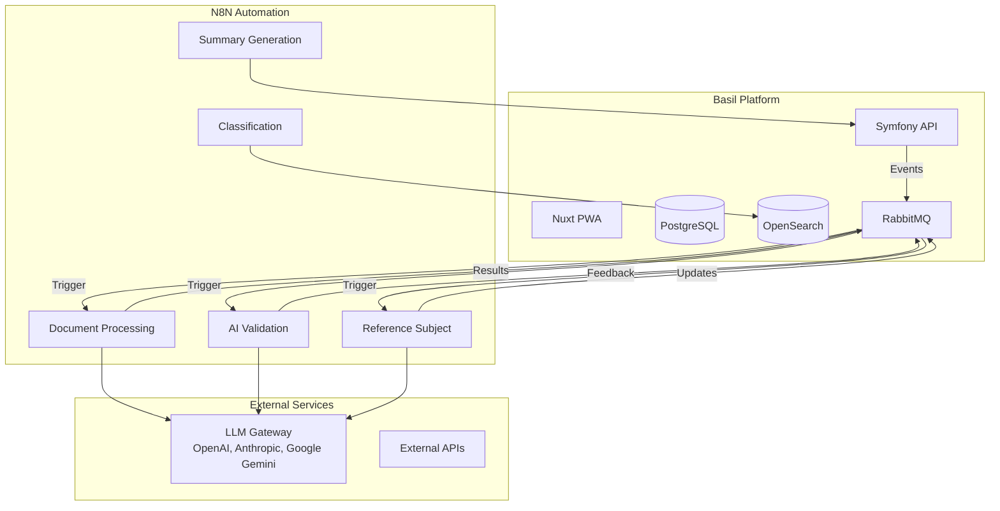

# N8N & Workflow Automation

## Overview

N8N is the workflow automation engine powering Basil's intelligent document processing, AI-driven analysis, and real-time event handling. This section provides comprehensive documentation for understanding, developing, and maintaining N8N workflows in the Basil ecosystem.

## Why N8N?

N8N enables Basil to:

- **🤖 Orchestrate AI Workflows**: Chain multiple AI models (LLMs, validators, generators) with fallback strategies
- **🔄 Process Events**: React to RabbitMQ messages, webhooks, and database changes in real-time
- **🔗 Integrate Services**: Connect OpenSearch, PostgreSQL, external APIs, and AI services seamlessly
- **📊 Manage Complexity**: Visualize and maintain complex business logic through graphical workflows
- **🚀 Scale Operations**: Handle high-volume document processing with parallel execution

## Architecture Integration



## Key Workflows

### 📄 Document Summary Workflow

Generates AI-powered summaries of uploaded documents using structured prompts and validation chains.

**Triggers**: Document upload events
**Outputs**: Structured summaries with metadata
**[Learn more →](./document-summary-workflow.md)**

### 🏷️ Watchfile Classification Workflow

Automatically classifies documents based on content, metadata, and business rules using AI and pattern matching.

**Triggers**: New watchfile creation
**Outputs**: Category tags, confidence scores
**[Learn more →](./watchfile-classification-workflow.md)**

### ✅ AI Validation Workflow

Validates AI-generated content through multi-stage verification with primary/fallback LLM chains.

**Triggers**: Content generation completion
**Outputs**: Validation results, quality metrics
**[Learn more →](../ai/ai-validation.md)**

### 📝 Reference Subject Update Workflow

Maintains and updates reference subjects in folders using context-aware AI generation with relevance validation.

**Triggers**: Folder updates, conversation messages
**Outputs**: Updated reference subjects, feedback
**Uses**: `LLM_Validator_*`, `LLM_Generator_*`, `Agent_*_ReferenceSubject` nodes

### 🔄 Auto Rename Workflow

Automatically applies naming conventions to workflow nodes for consistency and maintainability.

**Triggers**: Manual trigger
**Outputs**: Renamed workflow nodes
**[Learn more →](./n8n-auto-rename-workflow.md)**

## Technology Stack

- **N8N Version**: Latest (containerized)
- **Database**: PostgreSQL 16 (shared with Basil API)
- **Authentication**: User management with JWT
- **Encryption**: AES-256 for credentials
- **Networking**: Docker Compose with Traefik reverse proxy
- **Access**: <https://n8n.basil.local>

## Quick Navigation

### 🚀 Getting Started

New to N8N in Basil? Start here.

- **[Installation & Setup](./setup.md)** - Configure N8N environment, certificates, and database
- **[Environment Update Guide](./upgrade.md)** - Update environment for testing framework
- **[Quick Start Guide](./quick-start.md)** - Create your first workflow in 5 minutes

### 📚 Core Concepts

Understand N8N fundamentals in the Basil context.

- **[Workflow Principles](./concepts.md)** - Triggers, nodes, connections, execution model
- **[Node Types](./concepts.md#node-types-in-basil)** - LLMs, Agents, Parsers, Conditions, Messaging
- **[Naming Convention](./naming-convention.md)** - Standard `Domain_Role_Action` format

### 🔧 Workflow Development {#workflow-development}

Build and maintain workflows.

- **[Workflow Overview](./workflow-overview.md)** - Complete workflow architecture (5 phases)
- **[Workflow Diagrams](./workflow-diagrams.md)** - Visual workflow references
- **[Best Practices](./best-practices.md)** - Error handling, performance, optimization
- **[Workflow Testing](./workflow-testing.md)** - Automated testing with webhooks and snapshots
- **[Workflow Validation](./workflow-validation.md)** - Validate naming, agents, feedback nodes, and RabbitMQ messages

## Workflow Statistics

Current Basil N8N deployment includes:

- **7 Active Workflows**
- **120+ Total Nodes**
- **15+ AI Agent Nodes**
- **10+ RabbitMQ Integrations**
- **5+ OpenSearch Queries**

## Development Workflow

```bash
# Start N8N
docker compose up -d n8n

# Access N8N UI
open https://n8n.basil.local

# View N8N logs
docker compose logs -f n8n

# Backup workflows
docker compose exec n8n n8n export:workflow --all --output=/data/backup.json

# Import workflows
docker compose exec n8n n8n import:workflow --input=/data/workflows.json
```

## Standards and Conventions

All N8N workflows in Basil follow:

✅ **Naming Convention**: `Domain_Role_Action` format for all nodes
✅ **Error Handling**: Primary/Fallback LLM chains with proper error outputs
✅ **Documentation**: Inline node notes explaining business logic
✅ **Version Control**: Workflows exported to `docker/n8n/workflows/`
✅ **Testing**: Automated testing with webhooks, snapshots, and test datasets
✅ **Workflow Validation**: Naming, agents, feedback nodes, and RabbitMQ messages validated automatically
✅ **Response Format**: Standardized `{success, message, context}` structure

## Contributing

When creating or modifying N8N workflows:

1. Follow the [Naming Convention](./naming-convention.md)
2. Document complex logic with node notes
3. Create test datasets and run automated tests
4. Ensure response includes `success`, `message`, and `context.execution.id`
5. Run validation: `task n8n:validate` (see [Workflow Validation](./workflow-validation.md))
6. Export and commit to `docker/n8n/workflows/`
7. Update relevant documentation pages

## Support and Resources

- **N8N Official Docs**: <https://docs.n8n.io>
- **N8N Community Forum**: <https://community.n8n.io>
- **Basil N8N Issues**: [GitLab Issues](https://git.mediaspeech.com/basil/basil/-/issues)
- **Internal Support**: #basil-dev Slack channel

## Next Steps

- **New to N8N?** → [Quick Start Guide](./quick-start.md)
- **Setting up?** → [Installation & Setup](./setup.md)
- **Building workflows?** → [Best Practices](./best-practices.md)
- **Testing workflows?** → [Workflow Testing](./workflow-testing.md)
- **Validating workflows?** → [Workflow Validation](./workflow-validation.md)
