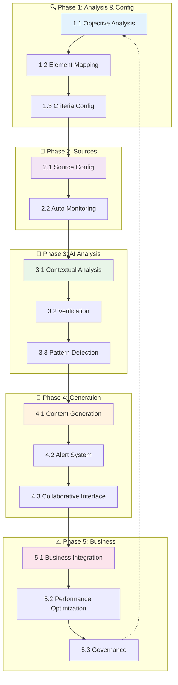
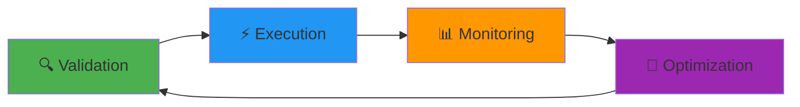

# Workflow Overview 🔄

This section presents the complete architecture of Basil project workflows, organized into 5 main phases that constitute a complete cycle of intelligent data processing.

## 🎯 Workflow Objectives

Basil workflows implement an intelligent system for analysis, processing, and content generation based on:

- **Contextual analysis** of business objectives
- **Dynamic configuration** of data sources
- **Intelligent processing** with AI and ML
- **Automatic generation** of personalized content
- **Continuous business integration**

## 📊 Global Architecture

## 🔄 Complete Lifecycle

### Phase 1: Analysis and Configuration 🔍

**Objective**: Define the foundations of intelligent processing

#### 1.1 Objective Analysis

- Business objective definition
- Feasibility validation
- Requirements documentation
- Success criteria

#### 1.2 Element Mapping

- System component mapping
- Dependency analysis
- Data flow identification
- Connection architecture

#### 1.3 Criteria Configuration

- Business rule parameterization
- Threshold and alert definition
- Filter configuration
- Criteria validation

### Phase 2: Source Configuration 🔧

**Objective**: Establish data connections

#### 2.1 Source Configuration

- Data connector setup
- API and webhook configuration
- Authentication and security
- Connection testing

#### 2.2 Automated Monitoring

- Data flow monitoring
- Anomaly detection
- Availability alerts
- Performance metrics

### Phase 3: Contextual Analysis 🧠

**Objective**: Intelligent data processing

#### 3.1 Contextual Analysis

- Semantic content processing
- Data enrichment
- Automatic classification
- Insight generation

#### 3.2 Verification and Evaluation

- Automated quality control
- Consistency validation
- Reliability scoring
- Error correction

#### 3.3 Pattern Detection

- Machine learning algorithms
- Pattern recognition
- Predictions and trends
- Continuous learning

### Phase 4: Generation and Interface 🚀

**Objective**: Content creation and distribution

#### 4.1 Content Generation

- Dynamic templates
- Contextual personalization
- Multi-format generation
- Automatic validation

#### 4.2 Alert System

- Intelligent notifications
- Conditional routing
- Automatic escalation
- Action tracking

#### 4.3 Collaborative Interface

- Real-time workspace
- Permission management
- Change history
- Multi-user synchronization

### Phase 5: Business Integration 📈

**Objective**: Integration into business ecosystem

#### 5.1 Business Integration

- Business system connection
- Integration APIs
- Bidirectional synchronization
- User training

#### 5.2 Performance Optimization

- Performance monitoring
- Bottleneck identification
- Automatic optimizations
- Intelligent scaling

#### 5.3 Evolution and Governance

- Lifecycle management
- Approval processes
- Change documentation
- Audit and compliance

## 🎛️ Control Points

Each phase includes automatic **control points**:

## 📈 Metrics and KPIs

### Performance Metrics

- **Processing time** per phase
- **Workflow success rate**
- **Processed data quality**
- **User satisfaction**

### Business Indicators

- **ROI** of automations
- **Manual task reduction**
- **Quality improvement**
- **Process acceleration**

## 🛠️ Technologies Used

=== "Orchestration" - **N8N** - Visual workflows - **RabbitMQ** - Asynchronous messaging - **Redis** - Cache and coordination - **Symfony Messenger** - Command/Query bus

=== "AI and ML" - **OpenAI API** - Natural language processing - **TensorFlow** - Machine learning - **OpenSearch** - Semantic search - **Apache Spark** - Big data processing

=== "Monitoring" - **Grafana** - Dashboards - **Prometheus** - Metrics - **OpenSearch Dashboards** - Log analysis - **Sentry** - Error tracking

## 🔗 Available Integrations

### Data Sources

- **REST/GraphQL APIs**
- **Databases** (SQL/NoSQL)
- **Files** (CSV, JSON, XML)
- **Cloud services** (AWS, GCP, Azure)
- **Business systems** (CRM, ERP)

### Outputs and Actions

- **Notifications** (Email, Slack, Teams)
- **Databases**
- **External APIs**
- **File generation**
- **Business workflows**

## 📋 Next Steps

To explore workflows in detail:

1. **[Detailed Diagrams](./workflow-diagrams.md)** - Complete visualization of each workflow
2. **[N8N Configuration](./index.md)** - Orchestrator setup
3. **[Development Guide](../../../onboarding/development-guide.md)** - Create new workflows

## 🎪 Usage Examples

### Use Case 1: Competitive Intelligence

1. **Configuration** of sources (websites, APIs, RSS)
2. **Analysis** of content with AI
3. **Detection** of trends and weak signals
4. **Generation** of personalized reports
5. **Distribution** to relevant teams

### Use Case 2: Intelligent Customer Support

1. **Analysis** of support tickets
2. **Automatic classification** by urgency/type
3. **Suggestion** of contextual responses
4. **Routing** to experts
5. **Customer satisfaction tracking**

### Use Case 3: Content Creation

1. **Analysis** of market trends
2. **Generation** of content ideas
3. **Automatic creation** of drafts
4. **Collaborative validation**
5. **Multi-channel publication**

---

_This overview presents the general architecture. Consult the [detailed diagrams](./workflow-diagrams.md) for an in-depth understanding of each process._
