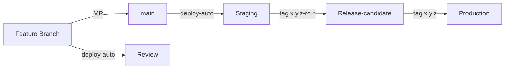
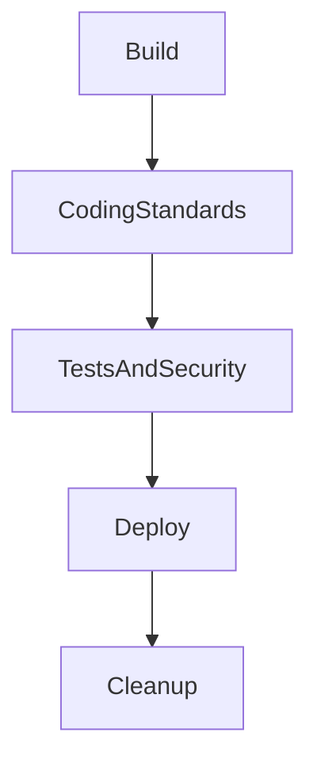

# Deployment Policy

This document describes the deployment strategy and CI/CD pipeline for the Target project.

## Overview

Target uses a **GitLab CI/CD** pipeline with automated deployments to multiple environments. The deployment strategy
follows **GitLab Flow** principles with environment-based releases.



## Environments

| Environment           | Trigger               | URL Pattern                         | Lifecycle                 |
| --------------------- | --------------------- | ----------------------------------- | ------------------------- |
| **Review**            | MR opened (non-draft) | `mr-{mrId}.staging.target.localnet` | Auto-cleanup after 7 days |
| **Staging**           | Merge to `main`       | `main.staging.target.localnet`      | Permanent                 |
| **Release-candidate** | Tag `x.y.z-rc.n`      | `release-candidate.target.localnet` | Permanent                 |
| **Production**        | Tag `x.y.z`           | `xxxx-target.chapsmind.com`         | Manual deployment         |

## Branch Strategy

### Branch Naming Convention

All branches must follow this naming pattern:

```text
{type}/{ticket}-{description}
```

**Types:**

- `feature/` - New features
- `fix/` - Bug fixes
- `hotfix/` - Critical production fixes
- `refactor/` - Code refactoring
- `docs/` - Documentation updates
- `chore/` - Maintenance tasks

**Examples:**

```bash
feature/TAR-123-user-authentication
fix/TAR-456-login-error
hotfix/TAR-789-security-patch
```

### Protected Branches

| Branch | Push        | Merge                | Force Push |
| ------ | ----------- | -------------------- | ---------- |
| `main` | Maintainers | Maintainers (via MR) | Never      |

## Pipeline Stages

The CI/CD pipeline consists of the following stages:



### 1. Build Stage

Builds all project artifacts:

| Job                    | Description                  | Artifacts           |
| ---------------------- | ---------------------------- | ------------------- |
| `build-vendors-back`   | Install PHP dependencies     | `api/vendor/`       |
| `build-vendors-front`  | Install Node.js dependencies | `pwa/node_modules/` |
| `build-vendors-tools`  | Install root tools           | `node_modules/`     |
| `build-front`          | Build PWA application        | -                   |
| `build-api`            | Build API Docker image       | Docker image        |
| `build-pwa`            | Build PWA Docker image       | Docker image        |
| `build-keycloak-theme` | Build Keycloak theme JAR     | JAR package         |

### 2. Coding Standards Stage

Ensures code quality:

| Job         | Tool                 | Configuration          |
| ----------- | -------------------- | ---------------------- |
| `ecs`       | Easy Coding Standard | `api/ecs.php`          |
| `phpstan`   | PHPStan (level 9)    | `api/phpstan.neon`     |
| `eslint`    | ESLint 9             | `pwa/eslint.config.js` |
| `prettier`  | Prettier             | `.prettierrc`          |
| `stylelint` | Stylelint            | `stylelint.config.js`  |

### 3. Tests and Security Stage

Validates functionality and security:

| Job                       | Description                   | Reports         |
| ------------------------- | ----------------------------- | --------------- |
| `phpunit-unit`            | PHP unit tests                | JUnit, Coverage |
| `phpunit-integration`     | API integration tests         | JUnit, Coverage |
| `test-front`              | Vue.js component tests        | JUnit, Coverage |
| `n8n-workflow-validation` | N8N workflow validation       | JUnit           |
| `trivy-api`               | Container security scan (API) | SARIF, HTML     |
| `trivy-pwa`               | Container security scan (PWA) | SARIF, HTML     |
| `composer-audit`          | PHP dependency audit          | -               |
| `yarn-front-audit`        | Node.js dependency audit      | -               |

### 4. Deploy Stage

Deploys to target environments:

| Job              | Environment   | Trigger           |
| ---------------- | ------------- | ----------------- |
| `staging-deploy` | Staging       | MR or main branch |
| `build-docs`     | Documentation | MR or main branch |

## Deployment Process

### Review Environment (MR)

When a Merge Request is opened:

1. Pipeline runs all quality checks
2. Docker images are built and tagged with branch slug
3. Environment is deployed to `{ticket}.staging.target.localnet`
4. Trivy security report is posted as MR comment
5. Environment URL is displayed in MR

**Exclusions:**

- Draft MRs are not deployed
- Renovate branches (`renovate/*`) are not deployed

### Staging Environment

When code is merged to `main`:

1. Docker images are tagged as `latest`
2. Deployment to `main.staging.target.localnet`
3. Environment persists until next deployment

### Release Process

#### Creating a Release Candidate

```bash
# Create release candidate tag (semantic versioning)
git tag 1.2.0-rc.1
git push origin 1.2.0-rc.1
```

This triggers:

1. Pre-production deployment
2. Smoke tests execution
3. Notification to team

#### Creating a Production Release

```bash
# Create production release tag (semantic versioning)
git tag 1.2.0
git push origin 1.2.0
```

This triggers:

1. Production deployment (manual approval required)
2. Release notes generation
3. Notification to stakeholders

## Quality Gates

### Merge Request Requirements

Before a MR can be merged:

- [ ] Pipeline passes (all jobs green)
- [ ] Code review approved
- [ ] No unresolved threads
- [ ] Branch is up to date with `main`

### Deployment Requirements

| Environment       | Requirements                                   |
| ----------------- | ---------------------------------------------- |
| Review            | Pipeline green                                 |
| Staging           | Pipeline green, merged to main                 |
| Release-candidate | Pipeline green, tag `x.y.z-rc.n`               |
| Production        | Pipeline green, tag `x.y.z`, manual deployment |

## Rollback Procedures

### When to Rollback

A rollback is needed when a release candidate (`x.y.z-rc.n`) deployed to Release-candidate environment causes critical
issues that cannot be quickly fixed.

### How Rollback Works

The rollback mechanism uses the `+rollback` build metadata suffix (SemVer compliant) to redeploy a previous stable
version:

1. **Identify the last stable version** - Find the previous working release candidate
2. **Create a rollback tag** - Tag the stable commit with `+rollback` suffix
3. **Push the tag** - This triggers the CI/CD pipeline to redeploy

### Rollback Tag Format

```text
x.y.z-rc.n+rollback
```

- `x.y.z` - The version number
- `rc.n` - Release candidate number
- `+rollback` - Build metadata indicating this is a rollback deployment

### Step-by-Step Rollback

```bash
# 1. List recent release candidates
git tag -l --sort=-v:refname | grep -E '^[0-9]+\.[0-9]+\.[0-9]+-rc\.[0-9]+$' | head -10

# 2. Identify the last stable version (e.g., 1.1.0-rc.2 was stable, 1.1.0-rc.3 broke)
# 3. Checkout the stable version
git checkout 1.1.0-rc.2

# 4. Create rollback tag
git tag 1.1.0-rc.2+rollback

# 5. Push to trigger redeployment
git push origin 1.1.0-rc.2+rollback
```

### Example Scenario

| Timeline | Tag                   | Status                                          |
| -------- | --------------------- | ----------------------------------------------- |
| Day 1    | `1.2.0-rc.1`          | Deployed to Integration, tested OK              |
| Day 2    | `1.2.0-rc.2`          | Deployed to Integration, **critical bug found** |
| Day 2    | `1.2.0-rc.1+rollback` | Rollback to stable rc.1                         |
| Day 3    | `1.2.0-rc.3`          | Bug fixed, new RC deployed                      |
